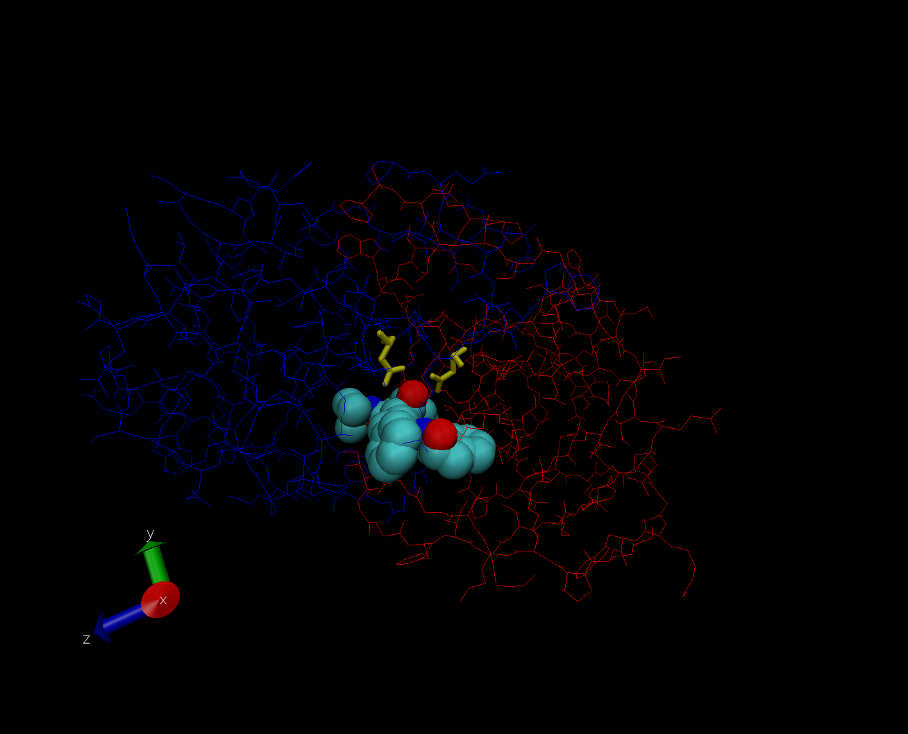

```{r setup, include=FALSE}
knitr::opts_chunk$set(echo = TRUE)
```

```{r}
dp <- read.csv("Data Export Summary.csv", row.names = 1)
head(dp)
sum(dp$X.ray)/sum(dp$Total)
sum(dp$EM)/sum(dp$Total)
dp$Total[1]/sum(dp$Total)
```

Do this over every method
```{r}
(colSums(dp) / sum(dp$Total)) * 100
```

Q1: What percentage of structures in the PDB are solved by X-Ray and Electron Microscopy.
87.5% for X-ray and 4.9% for Electron

Q2: What proportion of structures in the PDB are protein?
87.3%

Q3: Type HIV in the PDB website search box on the home page and determine how many HIV-1 protease structures are in the current PDB?
4411

Insert image


Q4: Water molecules normally have 3 atoms. Why do we see just one atom per water molecule in this structure?
Because the resolution is too low to see hydrogen.

Q5: There is a conserved water molecule in the binding site. Can you identify this water molecule? What residue number does this water molecule have (see note below)?
The residue number is 308.

Using Bio3D in R for Structural bioinformatics
```{r}
library(bio3d)
pdb <-read.pdb("1hel")
pdb
pdb$atom
```


```{r}
m <- nma(pdb)
plot(m)
```
Make a movie (trajectory) for veiwing in VMD.
```{r}
mktrj(m, file="nma.pdb")
```

