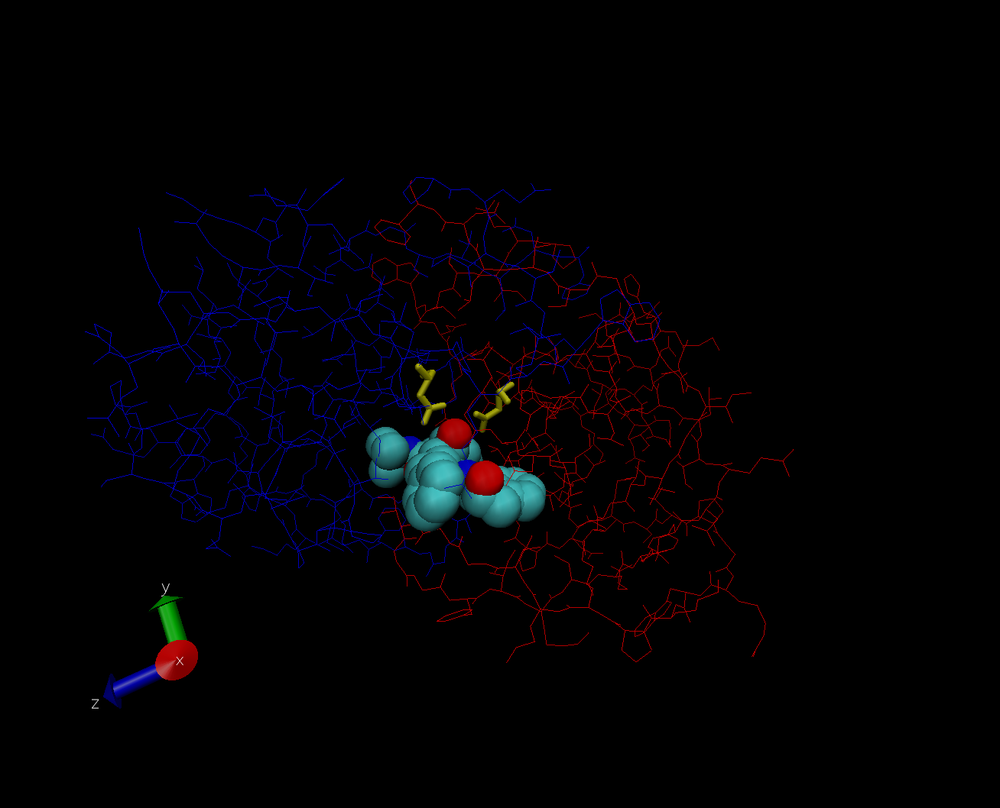

Untitled
================

``` r
dp <- read.csv("Data Export Summary.csv", row.names = 1)
head(dp)
```

    ##                          X.ray   NMR   EM Multiple.methods Neutron Other  Total
    ## Protein (only)          142419 11807 6038              177      70    32 160543
    ## Protein/Oligosaccharide   8426    31  991                5       0     0   9453
    ## Protein/NA                7498   274 2000                3       0     0   9775
    ## Nucleic acid (only)       2368  1378   60                8       2     1   3817
    ## Other                      149    31    3                0       0     0    183
    ## Oligosaccharide (only)      11     6    0                1       0     4     22

``` r
sum(dp$X.ray)/sum(dp$Total)
```

    ## [1] 0.8752836

``` r
sum(dp$EM)/sum(dp$Total)
```

    ## [1] 0.0494687

``` r
dp$Total[1]/sum(dp$Total)
```

    ## [1] 0.873499

Do this over every method

``` r
(colSums(dp) / sum(dp$Total)) * 100
```

    ##            X.ray              NMR               EM Multiple.methods 
    ##      87.52836071       7.35991033       4.94686958       0.10555353 
    ##          Neutron            Other            Total 
    ##       0.03917451       0.02013134     100.00000000

Q1: What percentage of structures in the PDB are solved by X-Ray and
Electron Microscopy. 87.5% for X-ray and 4.9% for Electron

Q2: What proportion of structures in the PDB are protein? 87.3%

Q3: Type HIV in the PDB website search box on the home page and
determine how many HIV-1 protease structures are in the current PDB?
4411

Insert image 

Q4: Water molecules normally have 3 atoms. Why do we see just one atom
per water molecule in this structure? Because the resolution is too low
to see hydrogen.

Q5: There is a conserved water molecule in the binding site. Can you
identify this water molecule? What residue number does this water
molecule have (see note below)? The residue number is 308.

Using Bio3D in R for Structural bioinformatics

``` r
library(bio3d)
pdb <-read.pdb("1hel")
```

    ##   Note: Accessing on-line PDB file

``` r
pdb
```

    ## 
    ##  Call:  read.pdb(file = "1hel")
    ## 
    ##    Total Models#: 1
    ##      Total Atoms#: 1186,  XYZs#: 3558  Chains#: 1  (values: A)
    ## 
    ##      Protein Atoms#: 1001  (residues/Calpha atoms#: 129)
    ##      Nucleic acid Atoms#: 0  (residues/phosphate atoms#: 0)
    ## 
    ##      Non-protein/nucleic Atoms#: 185  (residues: 185)
    ##      Non-protein/nucleic resid values: [ HOH (185) ]
    ## 
    ##    Protein sequence:
    ##       KVFGRCELAAAMKRHGLDNYRGYSLGNWVCAAKFESNFNTQATNRNTDGSTDYGILQINS
    ##       RWWCNDGRTPGSRNLCNIPCSALLSSDITASVNCAKKIVSDGNGMNAWVAWRNRCKGTDV
    ##       QAWIRGCRL
    ## 
    ## + attr: atom, xyz, seqres, helix, sheet,
    ##         calpha, remark, call

``` r
pdb$atom
```

    ##        type eleno elety  alt resid chain resno insert       x      y      z   o
    ## 1      ATOM     1     N <NA>   LYS     A     1   <NA>   3.294 10.164 10.266 1.0
    ## 2      ATOM     2    CA <NA>   LYS     A     1   <NA>   2.388 10.533  9.168 1.0
    ## 3      ATOM     3     C <NA>   LYS     A     1   <NA>   2.438 12.049  8.889 1.0
    ## 4      ATOM     4     O <NA>   LYS     A     1   <NA>   2.406 12.898  9.815 1.0
    ## 5      ATOM     5    CB <NA>   LYS     A     1   <NA>   0.949 10.101  9.559 1.0
    ## 6      ATOM     6    CG <NA>   LYS     A     1   <NA>  -0.050 10.621  8.573 1.0
    ## 7      ATOM     7    CD <NA>   LYS     A     1   <NA>  -1.425 10.081  8.720 1.0
    ## 8      ATOM     8    CE <NA>   LYS     A     1   <NA>  -2.370 10.773  7.722 1.0
    ## 9      ATOM     9    NZ <NA>   LYS     A     1   <NA>  -3.776 10.439  7.933 1.0
    ## 10     ATOM    10     N <NA>   VAL     A     2   <NA>   2.552 12.428  7.626 1.0
    ## 11     ATOM    11    CA <NA>   VAL     A     2   <NA>   2.524 13.840  7.282 1.0
    ## 12     ATOM    12     C <NA>   VAL     A     2   <NA>   1.120 14.180  6.770 1.0
    ## 13     ATOM    13     O <NA>   VAL     A     2   <NA>   0.737 13.798  5.675 1.0
    ## 14     ATOM    14    CB <NA>   VAL     A     2   <NA>   3.529 14.264  6.240 1.0
    ## 15     ATOM    15   CG1 <NA>   VAL     A     2   <NA>   3.313 15.765  5.983 1.0
    ## 16     ATOM    16   CG2 <NA>   VAL     A     2   <NA>   4.928 14.016  6.810 1.0
    ## 17     ATOM    17     N <NA>   PHE     A     3   <NA>   0.333 14.851  7.573 1.0
    ## 18     ATOM    18    CA <NA>   PHE     A     3   <NA>  -1.021 15.173  7.169 1.0
    ## 19     ATOM    19     C <NA>   PHE     A     3   <NA>  -1.097 16.285  6.126 1.0
    ## 20     ATOM    20     O <NA>   PHE     A     3   <NA>  -0.261 17.203  6.054 1.0
    ## 21     ATOM    21    CB <NA>   PHE     A     3   <NA>  -1.867 15.710  8.361 1.0
    ## 22     ATOM    22    CG <NA>   PHE     A     3   <NA>  -2.412 14.638  9.295 1.0
    ## 23     ATOM    23   CD1 <NA>   PHE     A     3   <NA>  -1.575 14.049 10.240 1.0
    ## 24     ATOM    24   CD2 <NA>   PHE     A     3   <NA>  -3.757 14.285  9.274 1.0
    ## 25     ATOM    25   CE1 <NA>   PHE     A     3   <NA>  -2.065 13.116 11.135 1.0
    ## 26     ATOM    26   CE2 <NA>   PHE     A     3   <NA>  -4.263 13.332 10.178 1.0
    ## 27     ATOM    27    CZ <NA>   PHE     A     3   <NA>  -3.413 12.758 11.132 1.0
    ## 28     ATOM    28     N <NA>   GLY     A     4   <NA>  -2.229 16.228  5.393 1.0
    ## 29     ATOM    29    CA <NA>   GLY     A     4   <NA>  -2.645 17.273  4.511 1.0
    ## 30     ATOM    30     C <NA>   GLY     A     4   <NA>  -3.456 18.261  5.350 1.0
    ## 31     ATOM    31     O <NA>   GLY     A     4   <NA>  -4.070 17.876  6.282 1.0
    ## 32     ATOM    32     N <NA>   ARG     A     5   <NA>  -3.414 19.518  5.009 1.0
    ## 33     ATOM    33    CA <NA>   ARG     A     5   <NA>  -4.106 20.560  5.674 1.0
    ## 34     ATOM    34     C <NA>   ARG     A     5   <NA>  -5.540 20.226  5.992 1.0
    ## 35     ATOM    35     O <NA>   ARG     A     5   <NA>  -5.963 20.258  7.138 1.0
    ## 36     ATOM    36    CB <NA>   ARG     A     5   <NA>  -3.952 21.857  4.900 1.0
    ## 37     ATOM    37    CG <NA>   ARG     A     5   <NA>  -4.508 23.053  5.610 1.0
    ## 38     ATOM    38    CD <NA>   ARG     A     5   <NA>  -4.414 24.335  4.775 1.0
    ## 39     ATOM    39    NE <NA>   ARG     A     5   <NA>  -5.013 24.223  3.447 1.0
    ## 40     ATOM    40    CZ <NA>   ARG     A     5   <NA>  -6.287 24.522  3.048 1.0
    ## 41     ATOM    41   NH1 <NA>   ARG     A     5   <NA>  -7.248 25.009  3.841 1.0
    ## 42     ATOM    42   NH2 <NA>   ARG     A     5   <NA>  -6.619 24.303  1.767 1.0
    ## 43     ATOM    43     N <NA>   CYS     A     6   <NA>  -6.327 19.866  4.967 1.0
    ## 44     ATOM    44    CA <NA>   CYS     A     6   <NA>  -7.767 19.572  5.189 1.0
    ## 45     ATOM    45     C <NA>   CYS     A     6   <NA>  -7.997 18.269  5.916 1.0
    ## 46     ATOM    46     O <NA>   CYS     A     6   <NA>  -8.992 18.125  6.630 1.0
    ## 47     ATOM    47    CB <NA>   CYS     A     6   <NA>  -8.607 19.637  3.859 1.0
    ## 48     ATOM    48    SG <NA>   CYS     A     6   <NA>  -8.669 21.273  3.104 1.0
    ## 49     ATOM    49     N <NA>   GLU     A     7   <NA>  -7.142 17.274  5.653 1.0
    ## 50     ATOM    50    CA <NA>   GLU     A     7   <NA>  -7.309 15.981  6.323 1.0
    ## 51     ATOM    51     C <NA>   GLU     A     7   <NA>  -7.129 16.181  7.848 1.0
    ## 52     ATOM    52     O <NA>   GLU     A     7   <NA>  -7.835 15.638  8.657 1.0
    ## 53     ATOM    53    CB <NA>   GLU     A     7   <NA>  -6.187 15.048  5.880 1.0
    ## 54     ATOM    54    CG <NA>   GLU     A     7   <NA>  -6.206 13.614  6.496 1.0
    ## 55     ATOM    55    CD <NA>   GLU     A     7   <NA>  -4.952 12.864  6.030 1.0
    ## 56     ATOM    56   OE1 <NA>   GLU     A     7   <NA>  -4.003 13.411  5.480 1.0
    ## 57     ATOM    57   OE2 <NA>   GLU     A     7   <NA>  -4.992 11.578  6.219 1.0
    ## 58     ATOM    58     N <NA>   LEU     A     8   <NA>  -6.148 16.987  8.221 1.0
    ## 59     ATOM    59    CA <NA>   LEU     A     8   <NA>  -5.919 17.285  9.637 1.0
    ## 60     ATOM    60     C <NA>   LEU     A     8   <NA>  -7.068 18.103 10.254 1.0
    ## 61     ATOM    61     O <NA>   LEU     A     8   <NA>  -7.500 17.827 11.353 1.0
    ## 62     ATOM    62    CB <NA>   LEU     A     8   <NA>  -4.607 18.084  9.809 1.0
    ## 63     ATOM    63    CG <NA>   LEU     A     8   <NA>  -4.384 18.432 11.299 1.0
    ## 64     ATOM    64   CD1 <NA>   LEU     A     8   <NA>  -4.110 17.104 12.053 1.0
    ## 65     ATOM    65   CD2 <NA>   LEU     A     8   <NA>  -3.147 19.299 11.372 1.0
    ## 66     ATOM    66     N <NA>   ALA     A     9   <NA>  -7.524 19.122  9.561 1.0
    ## 67     ATOM    67    CA <NA>   ALA     A     9   <NA>  -8.664 19.896  9.982 1.0
    ## 68     ATOM    68     C <NA>   ALA     A     9   <NA>  -9.841 18.971 10.304 1.0
    ## 69     ATOM    69     O <NA>   ALA     A     9   <NA> -10.469 19.046 11.359 1.0
    ## 70     ATOM    70    CB <NA>   ALA     A     9   <NA>  -9.039 21.012  8.954 1.0
    ## 71     ATOM    71     N <NA>   ALA     A    10   <NA> -10.124 18.049  9.425 1.0
    ## 72     ATOM    72    CA <NA>   ALA     A    10   <NA> -11.262 17.129  9.595 1.0
    ## 73     ATOM    73     C <NA>   ALA     A    10   <NA> -11.034 16.206 10.780 1.0
    ## 74     ATOM    74     O <NA>   ALA     A    10   <NA> -11.932 15.902 11.522 1.0
    ## 75     ATOM    75    CB <NA>   ALA     A    10   <NA> -11.457 16.297  8.313 1.0
    ## 76     ATOM    76     N <NA>   ALA     A    11   <NA>  -9.815 15.771 10.988 1.0
    ## 77     ATOM    77    CA <NA>   ALA     A    11   <NA>  -9.544 14.908 12.136 1.0
    ## 78     ATOM    78     C <NA>   ALA     A    11   <NA>  -9.651 15.641 13.494 1.0
    ## 79     ATOM    79     O <NA>   ALA     A    11   <NA> -10.088 15.066 14.457 1.0
    ## 80     ATOM    80    CB <NA>   ALA     A    11   <NA>  -8.153 14.250 12.041 1.0
    ## 81     ATOM    81     N <NA>   MET     A    12   <NA>  -9.107 16.884 13.529 1.0
    ## 82     ATOM    82    CA <NA>   MET     A    12   <NA>  -9.160 17.683 14.710 1.0
    ## 83     ATOM    83     C <NA>   MET     A    12   <NA> -10.599 17.988 15.028 1.0
    ## 84     ATOM    84     O <NA>   MET     A    12   <NA> -10.964 17.966 16.195 1.0
    ## 85     ATOM    85    CB <NA>   MET     A    12   <NA>  -8.385 18.996 14.563 1.0
    ## 86     ATOM    86    CG <NA>   MET     A    12   <NA>  -6.872 18.717 14.593 1.0
    ## 87     ATOM    87    SD <NA>   MET     A    12   <NA>  -5.971 20.286 14.351 1.0
    ## 88     ATOM    88    CE <NA>   MET     A    12   <NA>  -4.392 19.972 15.137 1.0
    ## 89     ATOM    89     N <NA>   LYS     A    13   <NA> -11.421 18.239 13.985 1.0
    ## 90     ATOM    90    CA <NA>   LYS     A    13   <NA> -12.844 18.554 14.146 1.0
    ## 91     ATOM    91     C <NA>   LYS     A    13   <NA> -13.552 17.402 14.762 1.0
    ## 92     ATOM    92     O <NA>   LYS     A    13   <NA> -14.278 17.533 15.704 1.0
    ## 93     ATOM    93    CB <NA>   LYS     A    13   <NA> -13.505 18.908 12.852 1.0
    ## 94     ATOM    94    CG <NA>   LYS     A    13   <NA> -14.874 19.457 13.096 1.0
    ## 95     ATOM    95    CD <NA>   LYS     A    13   <NA> -15.519 20.062 11.867 1.0
    ## 96     ATOM    96    CE <NA>   LYS     A    13   <NA> -17.062 20.060 11.971 1.0
    ## 97     ATOM    97    NZ <NA>   LYS     A    13   <NA> -17.725 20.836 10.899 1.0
    ## 98     ATOM    98     N <NA>   ARG     A    14   <NA> -13.273 16.240 14.220 1.0
    ## 99     ATOM    99    CA <NA>   ARG     A    14   <NA> -13.878 15.021 14.667 1.0
    ## 100    ATOM   100     C <NA>   ARG     A    14   <NA> -13.480 14.746 16.099 1.0
    ## 101    ATOM   101     O <NA>   ARG     A    14   <NA> -14.217 14.129 16.823 1.0
    ## 102    ATOM   102    CB <NA>   ARG     A    14   <NA> -13.448 13.876 13.756 1.0
    ## 103    ATOM   103    CG <NA>   ARG     A    14   <NA> -14.102 12.553 14.162 1.0
    ## 104    ATOM   104    CD <NA>   ARG     A    14   <NA> -13.875 11.424 13.160 1.0
    ## 105    ATOM   105    NE <NA>   ARG     A    14   <NA> -12.616 10.730 13.354 1.0
    ## 106    ATOM   106    CZ <NA>   ARG     A    14   <NA> -12.406  9.681 14.156 1.0
    ## 107    ATOM   107   NH1 <NA>   ARG     A    14   <NA> -13.357  9.121 14.898 1.0
    ## 108    ATOM   108   NH2 <NA>   ARG     A    14   <NA> -11.177  9.169 14.196 1.0
    ## 109    ATOM   109     N <NA>   HIS     A    15   <NA> -12.300 15.219 16.498 1.0
    ## 110    ATOM   110    CA <NA>   HIS     A    15   <NA> -11.791 15.016 17.846 1.0
    ## 111    ATOM   111     C <NA>   HIS     A    15   <NA> -12.221 16.074 18.888 1.0
    ## 112    ATOM   112     O <NA>   HIS     A    15   <NA> -11.689 16.060 19.970 1.0
    ## 113    ATOM   113    CB <NA>   HIS     A    15   <NA> -10.268 14.799 17.851 1.0
    ## 114    ATOM   114    CG <NA>   HIS     A    15   <NA>  -9.906 13.364 17.563 1.0
    ## 115    ATOM   115   ND1 <NA>   HIS     A    15   <NA>  -9.721 12.896 16.256 1.0
    ## 116    ATOM   116   CD2 <NA>   HIS     A    15   <NA>  -9.723 12.308 18.413 1.0
    ## 117    ATOM   117   CE1 <NA>   HIS     A    15   <NA>  -9.422 11.580 16.350 1.0
    ## 118    ATOM   118   NE2 <NA>   HIS     A    15   <NA>  -9.412 11.213 17.627 1.0
    ## 119    ATOM   119     N <NA>   GLY     A    16   <NA> -13.146 16.952 18.551 1.0
    ## 120    ATOM   120    CA <NA>   GLY     A    16   <NA> -13.687 17.956 19.401 1.0
    ## 121    ATOM   121     C <NA>   GLY     A    16   <NA> -12.871 19.227 19.554 1.0
    ## 122    ATOM   122     O <NA>   GLY     A    16   <NA> -13.121 20.016 20.460 1.0
    ## 123    ATOM   123     N <NA>   LEU     A    17   <NA> -11.922 19.491 18.685 1.0
    ## 124    ATOM   124    CA <NA>   LEU     A    17   <NA> -11.134 20.695 18.826 1.0
    ## 125    ATOM   125     C <NA>   LEU     A    17   <NA> -11.728 21.961 18.295 1.0
    ## 126    ATOM   126     O <NA>   LEU     A    17   <NA> -11.276 23.016 18.657 1.0
    ## 127    ATOM   127    CB <NA>   LEU     A    17   <NA>  -9.749 20.538 18.218 1.0
    ## 128    ATOM   128    CG <NA>   LEU     A    17   <NA>  -8.792 19.745 19.031 1.0
    ## 129    ATOM   129   CD1 <NA>   LEU     A    17   <NA>  -7.483 19.876 18.293 1.0
    ## 130    ATOM   130   CD2 <NA>   LEU     A    17   <NA>  -8.675 20.282 20.474 1.0
    ## 131    ATOM   131     N <NA>   ASP     A    18   <NA> -12.704 21.930 17.405 1.0
    ## 132    ATOM   132    CA <NA>   ASP     A    18   <NA> -13.261 23.178 16.884 1.0
    ## 133    ATOM   133     C <NA>   ASP     A    18   <NA> -13.986 23.912 17.979 1.0
    ## 134    ATOM   134     O <NA>   ASP     A    18   <NA> -14.952 23.375 18.512 1.0
    ## 135    ATOM   135    CB <NA>   ASP     A    18   <NA> -14.275 23.002 15.717 1.0
    ## 136    ATOM   136    CG <NA>   ASP     A    18   <NA> -14.712 24.288 15.010 1.0
    ## 137    ATOM   137   OD1 <NA>   ASP     A    18   <NA> -14.134 25.393 15.038 1.0
    ## 138    ATOM   138   OD2 <NA>   ASP     A    18   <NA> -15.751 24.055 14.248 1.0
    ## 139    ATOM   139     N <NA>   ASN     A    19   <NA> -13.542 25.130 18.229 1.0
    ## 140    ATOM   140    CA <NA>   ASN     A    19   <NA> -14.046 26.010 19.253 1.0
    ## 141    ATOM   141     C <NA>   ASN     A    19   <NA> -13.851 25.507 20.671 1.0
    ## 142    ATOM   142     O <NA>   ASN     A    19   <NA> -14.534 25.975 21.595 1.0
    ## 143    ATOM   143    CB <NA>   ASN     A    19   <NA> -15.518 26.259 19.032 1.0
    ## 144    ATOM   144    CG <NA>   ASN     A    19   <NA> -15.706 27.052 17.774 1.0
    ## 145    ATOM   145   OD1 <NA>   ASN     A    19   <NA> -15.227 28.183 17.693 1.0
    ## 146    ATOM   146   ND2 <NA>   ASN     A    19   <NA> -16.402 26.456 16.811 1.0
    ## 147    ATOM   147     N <NA>   TYR     A    20   <NA> -12.956 24.552 20.827 1.0
    ## 148    ATOM   148    CA <NA>   TYR     A    20   <NA> -12.652 24.027 22.106 1.0
    ## 149    ATOM   149     C <NA>   TYR     A    20   <NA> -12.037 25.159 22.929 1.0
    ## 150    ATOM   150     O <NA>   TYR     A    20   <NA> -10.978 25.687 22.602 1.0
    ## 151    ATOM   151    CB <NA>   TYR     A    20   <NA> -11.717 22.810 22.005 1.0
    ## 152    ATOM   152    CG <NA>   TYR     A    20   <NA> -11.532 22.151 23.355 1.0
    ## 153    ATOM   153   CD1 <NA>   TYR     A    20   <NA> -12.444 21.206 23.832 1.0
    ## 154    ATOM   154   CD2 <NA>   TYR     A    20   <NA> -10.475 22.556 24.184 1.0
    ## 155    ATOM   155   CE1 <NA>   TYR     A    20   <NA> -12.311 20.657 25.111 1.0
    ## 156    ATOM   156   CE2 <NA>   TYR     A    20   <NA> -10.331 22.023 25.461 1.0
    ## 157    ATOM   157    CZ <NA>   TYR     A    20   <NA> -11.259 21.078 25.922 1.0
    ## 158    ATOM   158    OH <NA>   TYR     A    20   <NA> -11.104 20.560 27.183 1.0
    ## 159    ATOM   159     N <NA>   ARG     A    21   <NA> -12.721 25.593 23.977 1.0
    ## 160    ATOM   160    CA <NA>   ARG     A    21   <NA> -12.250 26.715 24.791 1.0
    ## 161    ATOM   161     C <NA>   ARG     A    21   <NA> -12.264 27.987 24.017 1.0
    ## 162    ATOM   162     O <NA>   ARG     A    21   <NA> -11.450 28.877 24.295 1.0
    ## 163    ATOM   163    CB <NA>   ARG     A    21   <NA> -10.847 26.601 25.387 1.0
    ## 164    ATOM   164    CG <NA>   ARG     A    21   <NA> -10.694 25.514 26.442 1.0
    ## 165    ATOM   165    CD <NA>   ARG     A    21   <NA> -11.577 25.864 27.598 1.0
    ## 166    ATOM   166    NE <NA>   ARG     A    21   <NA> -11.597 24.902 28.676 1.0
    ## 167    ATOM   167    CZ <NA>   ARG     A    21   <NA> -11.253 25.330 29.884 1.0
    ## 168    ATOM   168   NH1 <NA>   ARG     A    21   <NA> -10.859 26.593 30.049 1.0
    ## 169    ATOM   169   NH2 <NA>   ARG     A    21   <NA> -11.283 24.508 30.937 1.0
    ## 170    ATOM   170     N <NA>   GLY     A    22   <NA> -13.173 28.076 23.045 1.0
    ## 171    ATOM   171    CA <NA>   GLY     A    22   <NA> -13.290 29.312 22.253 1.0
    ## 172    ATOM   172     C <NA>   GLY     A    22   <NA> -12.276 29.499 21.125 1.0
    ## 173    ATOM   173     O <NA>   GLY     A    22   <NA> -12.274 30.537 20.508 1.0
    ## 174    ATOM   174     N <NA>   TYR     A    23   <NA> -11.414 28.511 20.863 1.0
    ## 175    ATOM   175    CA <NA>   TYR     A    23   <NA> -10.419 28.584 19.787 1.0
    ## 176    ATOM   176     C <NA>   TYR     A    23   <NA> -10.964 27.832 18.564 1.0
    ## 177    ATOM   177     O <NA>   TYR     A    23   <NA> -11.097 26.573 18.581 1.0
    ## 178    ATOM   178    CB <NA>   TYR     A    23   <NA>  -9.059 27.910 20.217 1.0
    ## 179    ATOM   179    CG <NA>   TYR     A    23   <NA>  -8.358 28.702 21.299 1.0
    ## 180    ATOM   180   CD1 <NA>   TYR     A    23   <NA>  -7.560 29.766 20.910 1.0
    ## 181    ATOM   181   CD2 <NA>   TYR     A    23   <NA>  -8.534 28.427 22.652 1.0
    ## 182    ATOM   182   CE1 <NA>   TYR     A    23   <NA>  -6.879 30.557 21.846 1.0
    ## 183    ATOM   183   CE2 <NA>   TYR     A    23   <NA>  -7.907 29.219 23.612 1.0
    ## 184    ATOM   184    CZ <NA>   TYR     A    23   <NA>  -7.061 30.276 23.207 1.0
    ## 185    ATOM   185    OH <NA>   TYR     A    23   <NA>  -6.411 31.069 24.111 1.0
    ## 186    ATOM   186     N <NA>   SER     A    24   <NA> -11.219 28.590 17.517 1.0
    ## 187    ATOM   187    CA <NA>   SER     A    24   <NA> -11.730 28.032 16.253 1.0
    ## 188    ATOM   188     C <NA>   SER     A    24   <NA> -10.726 27.075 15.616 1.0
    ## 189    ATOM   189     O <NA>   SER     A    24   <NA>  -9.487 27.191 15.841 1.0
    ## 190    ATOM   190    CB <NA>   SER     A    24   <NA> -12.060 29.179 15.305 1.0
    ## 191    ATOM   191    OG <NA>   SER     A    24   <NA> -10.830 29.750 14.853 1.0
    ## 192    ATOM   192     N <NA>   LEU     A    25   <NA> -11.267 26.110 14.822 1.0
    ## 193    ATOM   193    CA <NA>   LEU     A    25   <NA> -10.460 25.111 14.092 1.0
    ## 194    ATOM   194     C <NA>   LEU     A    25   <NA>  -9.205 25.683 13.438 1.0
    ## 195    ATOM   195     O <NA>   LEU     A    25   <NA>  -8.145 25.073 13.536 1.0
    ## 196    ATOM   196    CB <NA>   LEU     A    25   <NA> -11.293 24.412 12.993 1.0
    ## 197    ATOM   197    CG <NA>   LEU     A    25   <NA> -10.826 23.089 12.491 1.0
    ## 198    ATOM   198   CD1 <NA>   LEU     A    25   <NA> -10.359 22.212 13.644 1.0
    ## 199    ATOM   199   CD2 <NA>   LEU     A    25   <NA> -12.018 22.437 11.805 1.0
    ## 200    ATOM   200     N <NA>   GLY     A    26   <NA>  -9.311 26.836 12.758 1.0
    ## 201    ATOM   201    CA <NA>   GLY     A    26   <NA>  -8.169 27.388 12.084 1.0
    ## 202    ATOM   202     C <NA>   GLY     A    26   <NA>  -6.984 27.643 12.997 1.0
    ## 203    ATOM   203     O <NA>   GLY     A    26   <NA>  -5.854 27.610 12.555 1.0
    ## 204    ATOM   204     N <NA>   ASN     A    27   <NA>  -7.232 27.928 14.280 1.0
    ## 205    ATOM   205    CA <NA>   ASN     A    27   <NA>  -6.132 28.159 15.255 1.0
    ## 206    ATOM   206     C <NA>   ASN     A    27   <NA>  -5.317 26.889 15.464 1.0
    ## 207    ATOM   207     O <NA>   ASN     A    27   <NA>  -4.057 26.899 15.477 1.0
    ## 208    ATOM   208    CB <NA>   ASN     A    27   <NA>  -6.688 28.636 16.631 1.0
    ## 209    ATOM   209    CG <NA>   ASN     A    27   <NA>  -7.131 30.092 16.624 1.0
    ## 210    ATOM   210   OD1 <NA>   ASN     A    27   <NA>  -6.292 30.979 16.582 1.0
    ## 211    ATOM   211   ND2 <NA>   ASN     A    27   <NA>  -8.466 30.324 16.587 1.0
    ## 212    ATOM   212     N <NA>   TRP     A    28   <NA>  -6.033 25.791 15.639 1.0
    ## 213    ATOM   213    CA <NA>   TRP     A    28   <NA>  -5.402 24.497 15.879 1.0
    ## 214    ATOM   214     C <NA>   TRP     A    28   <NA>  -4.584 24.047 14.657 1.0
    ## 215    ATOM   215     O <NA>   TRP     A    28   <NA>  -3.510 23.501 14.767 1.0
    ## 216    ATOM   216    CB <NA>   TRP     A    28   <NA>  -6.482 23.490 16.237 1.0
    ## 217    ATOM   217    CG <NA>   TRP     A    28   <NA>  -7.149 23.849 17.539 1.0
    ## 218    ATOM   218   CD1 <NA>   TRP     A    28   <NA>  -8.351 24.415 17.748 1.0
    ## 219    ATOM   219   CD2 <NA>   TRP     A    28   <NA>  -6.540 23.691 18.841 1.0
    ## 220    ATOM   220   NE1 <NA>   TRP     A    28   <NA>  -8.575 24.567 19.117 1.0
    ## 221    ATOM   221   CE2 <NA>   TRP     A    28   <NA>  -7.475 24.139 19.807 1.0
    ## 222    ATOM   222   CE3 <NA>   TRP     A    28   <NA>  -5.321 23.121 19.249 1.0
    ## 223    ATOM   223   CZ2 <NA>   TRP     A    28   <NA>  -7.187 24.066 21.210 1.0
    ## 224    ATOM   224   CZ3 <NA>   TRP     A    28   <NA>  -5.059 23.060 20.609 1.0
    ## 225    ATOM   225   CH2 <NA>   TRP     A    28   <NA>  -5.985 23.551 21.560 1.0
    ## 226    ATOM   226     N <NA>   VAL     A    29   <NA>  -5.166 24.262 13.469 1.0
    ## 227    ATOM   227    CA <NA>   VAL     A    29   <NA>  -4.458 23.870 12.217 1.0
    ## 228    ATOM   228     C <NA>   VAL     A    29   <NA>  -3.242 24.746 11.972 1.0
    ## 229    ATOM   229     O <NA>   VAL     A    29   <NA>  -2.170 24.273 11.571 1.0
    ## 230    ATOM   230    CB <NA>   VAL     A    29   <NA>  -5.456 23.881 11.020 1.0
    ## 231    ATOM   231   CG1 <NA>   VAL     A    29   <NA>  -4.630 23.646  9.743 1.0
    ## 232    ATOM   232   CG2 <NA>   VAL     A    29   <NA>  -6.516 22.751 11.149 1.0
    ## 233    ATOM   233     N <NA>   CYS     A    30   <NA>  -3.372 26.060 12.262 1.0
    ## 234    ATOM   234    CA <NA>   CYS     A    30   <NA>  -2.281 26.976 12.125 1.0
    ## 235    ATOM   235     C <NA>   CYS     A    30   <NA>  -1.151 26.582 13.072 1.0
    ## 236    ATOM   236     O <NA>   CYS     A    30   <NA>   0.054 26.552 12.766 1.0
    ## 237    ATOM   237    CB <NA>   CYS     A    30   <NA>  -2.756 28.428 12.303 1.0
    ## 238    ATOM   238    SG <NA>   CYS     A    30   <NA>  -1.467 29.667 12.134 1.0
    ## 239    ATOM   239     N <NA>   ALA     A    31   <NA>  -1.521 26.283 14.306 1.0
    ## 240    ATOM   240    CA <NA>   ALA     A    31   <NA>  -0.491 25.884 15.276 1.0
    ## 241    ATOM   241     C <NA>   ALA     A    31   <NA>   0.235 24.607 14.849 1.0
    ## 242    ATOM   242     O <NA>   ALA     A    31   <NA>   1.464 24.554 14.987 1.0
    ## 243    ATOM   243    CB <NA>   ALA     A    31   <NA>  -1.089 25.781 16.704 1.0
    ## 244    ATOM   244     N <NA>   ALA     A    32   <NA>  -0.483 23.609 14.315 1.0
    ## 245    ATOM   245    CA <NA>   ALA     A    32   <NA>   0.162 22.357 13.855 1.0
    ## 246    ATOM   246     C <NA>   ALA     A    32   <NA>   1.085 22.594 12.673 1.0
    ## 247    ATOM   247     O <NA>   ALA     A    32   <NA>   2.197 22.050 12.585 1.0
    ## 248    ATOM   248    CB <NA>   ALA     A    32   <NA>  -0.823 21.268 13.540 1.0
    ## 249    ATOM   249     N <NA>   LYS     A    33   <NA>   0.653 23.463 11.786 1.0
    ## 250    ATOM   250    CA <NA>   LYS     A    33   <NA>   1.542 23.795 10.635 1.0
    ## 251    ATOM   251     C <NA>   LYS     A    33   <NA>   2.867 24.333 11.097 1.0
    ## 252    ATOM   252     O <NA>   LYS     A    33   <NA>   3.936 23.889 10.727 1.0
    ## 253    ATOM   253    CB <NA>   LYS     A    33   <NA>   0.863 24.886  9.776 1.0
    ## 254    ATOM   254    CG <NA>   LYS     A    33   <NA>   1.793 25.437  8.676 1.0
    ## 255    ATOM   255    CD <NA>   LYS     A    33   <NA>   1.927 24.485  7.491 1.0
    ## 256    ATOM   256    CE <NA>   LYS     A    33   <NA>   3.138 24.764  6.621 1.0
    ## 257    ATOM   257    NZ <NA>   LYS     A    33   <NA>   3.217 23.793  5.511 1.0
    ## 258    ATOM   258     N <NA>   PHE     A    34   <NA>   2.807 25.345 11.961 1.0
    ## 259    ATOM   259    CA <NA>   PHE     A    34   <NA>   4.029 25.958 12.436 1.0
    ## 260    ATOM   260     C <NA>   PHE     A    34   <NA>   4.846 25.192 13.455 1.0
    ## 261    ATOM   261     O <NA>   PHE     A    34   <NA>   6.039 25.360 13.540 1.0
    ## 262    ATOM   262    CB <NA>   PHE     A    34   <NA>   3.856 27.469 12.721 1.0
    ## 263    ATOM   263    CG <NA>   PHE     A    34   <NA>   3.417 28.201 11.426 1.0
    ## 264    ATOM   264   CD1 <NA>   PHE     A    34   <NA>   4.231 28.189 10.282 1.0
    ## 265    ATOM   265   CD2 <NA>   PHE     A    34   <NA>   2.212 28.933 11.385 1.0
    ## 266    ATOM   266   CE1 <NA>   PHE     A    34   <NA>   3.830 28.854  9.136 1.0
    ## 267    ATOM   267   CE2 <NA>   PHE     A    34   <NA>   1.803 29.618 10.224 1.0
    ## 268    ATOM   268    CZ <NA>   PHE     A    34   <NA>   2.627 29.554  9.090 1.0
    ## 269    ATOM   269     N <NA>   GLU     A    35   <NA>   4.201 24.324 14.225 1.0
    ## 270    ATOM   270    CA <NA>   GLU     A    35   <NA>   4.889 23.543 15.263 1.0
    ## 271    ATOM   271     C <NA>   GLU     A    35   <NA>   5.641 22.352 14.706 1.0
    ## 272    ATOM   272     O <NA>   GLU     A    35   <NA>   6.781 22.129 15.054 1.0
    ## 273    ATOM   273    CB <NA>   GLU     A    35   <NA>   3.839 23.026 16.259 1.0
    ## 274    ATOM   274    CG <NA>   GLU     A    35   <NA>   3.409 24.107 17.322 1.0
    ## 275    ATOM   275    CD <NA>   GLU     A    35   <NA>   4.516 24.690 18.200 1.0
    ## 276    ATOM   276   OE1 <NA>   GLU     A    35   <NA>   5.640 24.296 18.226 1.0
    ## 277    ATOM   277   OE2 <NA>   GLU     A    35   <NA>   4.167 25.730 18.876 1.0
    ## 278    ATOM   278     N <NA>   SER     A    36   <NA>   4.983 21.591 13.819 1.0
    ## 279    ATOM   279    CA <NA>   SER     A    36   <NA>   5.541 20.369 13.283 1.0
    ## 280    ATOM   280     C <NA>   SER     A    36   <NA>   5.483 20.189 11.756 1.0
    ## 281    ATOM   281     O <NA>   SER     A    36   <NA>   5.800 19.070 11.251 1.0
    ## 282    ATOM   282    CB <NA>   SER     A    36   <NA>   4.684 19.256 13.831 1.0
    ## 283    ATOM   283    OG <NA>   SER     A    36   <NA>   3.330 19.336 13.297 1.0
    ## 284    ATOM   284     N <NA>   ASN     A    37   <NA>   4.975 21.223 11.050 1.0
    ## 285    ATOM   285    CA <NA>   ASN     A    37   <NA>   4.752 21.103  9.605 1.0
    ## 286    ATOM   286     C <NA>   ASN     A    37   <NA>   3.825 19.918  9.321 1.0
    ## 287    ATOM   287     O <NA>   ASN     A    37   <NA>   3.972 19.215  8.320 1.0
    ## 288    ATOM   288    CB <NA>   ASN     A    37   <NA>   6.061 21.002  8.788 1.0
    ## 289    ATOM   289    CG <NA>   ASN     A    37   <NA>   5.851 21.458  7.334 1.0
    ## 290    ATOM   290   OD1 <NA>   ASN     A    37   <NA>   5.061 22.365  7.057 1.0
    ## 291    ATOM   291   ND2 <NA>   ASN     A    37   <NA>   6.474 20.759  6.397 1.0
    ## 292    ATOM   292     N <NA>   PHE     A    38   <NA>   2.864 19.696 10.220 1.0
    ## 293    ATOM   293    CA <NA>   PHE     A    38   <NA>   1.862 18.625 10.075 1.0
    ## 294    ATOM   294     C <NA>   PHE     A    38   <NA>   2.411 17.214 10.168 1.0
    ## 295    ATOM   295     O <NA>   PHE     A    38   <NA>   1.747 16.276  9.742 1.0
    ## 296    ATOM   296    CB <NA>   PHE     A    38   <NA>   1.092 18.696  8.696 1.0
    ## 297    ATOM   297    CG <NA>   PHE     A    38   <NA>   0.280 19.956  8.505 1.0
    ## 298    ATOM   298   CD1 <NA>   PHE     A    38   <NA>  -0.367 20.558  9.597 1.0
    ## 299    ATOM   299   CD2 <NA>   PHE     A    38   <NA>   0.112 20.532  7.255 1.0
    ## 300    ATOM   300   CE1 <NA>   PHE     A    38   <NA>  -1.146 21.685  9.432 1.0
    ## 301    ATOM   301   CE2 <NA>   PHE     A    38   <NA>  -0.664 21.687  7.081 1.0
    ## 302    ATOM   302    CZ <NA>   PHE     A    38   <NA>  -1.316 22.268  8.162 1.0
    ## 303    ATOM   303     N <NA>   ASN     A    39   <NA>   3.667 17.073 10.600 1.0
    ## 304    ATOM   304    CA <NA>   ASN     A    39   <NA>   4.271 15.737 10.699 1.0
    ## 305    ATOM   305     C <NA>   ASN     A    39   <NA>   4.101 15.211 12.158 1.0
    ## 306    ATOM   306     O <NA>   ASN     A    39   <NA>   4.597 15.858 13.147 1.0
    ## 307    ATOM   307    CB <NA>   ASN     A    39   <NA>   5.776 15.925 10.373 1.0
    ## 308    ATOM   308    CG <NA>   ASN     A    39   <NA>   6.552 14.636 10.450 1.0
    ## 309    ATOM   309   OD1 <NA>   ASN     A    39   <NA>   5.992 13.541 10.684 1.0
    ## 310    ATOM   310   ND2 <NA>   ASN     A    39   <NA>   7.832 14.764 10.100 1.0
    ## 311    ATOM   311     N <NA>   THR     A    40   <NA>   3.430 14.054 12.314 1.0
    ## 312    ATOM   312    CA <NA>   THR     A    40   <NA>   3.222 13.509 13.676 1.0
    ## 313    ATOM   313     C <NA>   THR     A    40   <NA>   4.525 13.041 14.358 1.0
    ## 314    ATOM   314     O <NA>   THR     A    40   <NA>   4.546 12.831 15.542 1.0
    ## 315    ATOM   315    CB <NA>   THR     A    40   <NA>   2.279 12.302 13.663 1.0
    ## 316    ATOM   316   OG1 <NA>   THR     A    40   <NA>   2.862 11.250 12.880 1.0
    ## 317    ATOM   317   CG2 <NA>   THR     A    40   <NA>   0.843 12.666 13.219 1.0
    ## 318    ATOM   318     N <NA>   GLN     A    41   <NA>   5.594 12.819 13.559 1.0
    ## 319    ATOM   319    CA <NA>   GLN     A    41   <NA>   6.860 12.308 14.019 1.0
    ## 320    ATOM   320     C <NA>   GLN     A    41   <NA>   7.861 13.372 14.433 1.0
    ## 321    ATOM   321     O <NA>   GLN     A    41   <NA>   8.986 13.051 14.864 1.0
    ## 322    ATOM   322    CB <NA>   GLN     A    41   <NA>   7.463 11.344 12.979 1.0
    ## 323    ATOM   323    CG <NA>   GLN     A    41   <NA>   6.598 10.100 12.797 1.0
    ## 324    ATOM   324    CD <NA>   GLN     A    41   <NA>   7.402  8.999 12.104 1.0
    ## 325    ATOM   325   OE1 <NA>   GLN     A    41   <NA>   8.254  8.393 12.763 1.0
    ## 326    ATOM   326   NE2 <NA>   GLN     A    41   <NA>   7.257  8.847 10.744 1.0
    ## 327    ATOM   327     N <NA>   ALA     A    42   <NA>   7.460 14.657 14.305 1.0
    ## 328    ATOM   328    CA <NA>   ALA     A    42   <NA>   8.376 15.748 14.672 1.0
    ## 329    ATOM   329     C <NA>   ALA     A    42   <NA>   8.824 15.710 16.237 1.0
    ## 330    ATOM   330     O <NA>   ALA     A    42   <NA>   8.005 15.547 17.165 1.0
    ## 331    ATOM   331    CB <NA>   ALA     A    42   <NA>   7.744 17.108 14.349 1.0
    ## 332    ATOM   332     N <NA>   THR     A    43   <NA>  10.132 15.865 16.445 1.0
    ## 333    ATOM   333    CA <NA>   THR     A    43   <NA>  10.705 15.992 17.773 1.0
    ## 334    ATOM   334     C <NA>   THR     A    43   <NA>  11.694 17.112 17.692 1.0
    ## 335    ATOM   335     O <NA>   THR     A    43   <NA>  12.280 17.411 16.646 1.0
    ## 336    ATOM   336    CB <NA>   THR     A    43   <NA>  11.362 14.748 18.354 1.0
    ## 337    ATOM   337   OG1 <NA>   THR     A    43   <NA>  12.360 14.429 17.435 1.0
    ## 338    ATOM   338   CG2 <NA>   THR     A    43   <NA>  10.420 13.567 18.530 1.0
    ## 339    ATOM   339     N <NA>   ASN     A    44   <NA>  11.894 17.801 18.808 1.0
    ## 340    ATOM   340    CA <NA>   ASN     A    44   <NA>  12.828 18.909 18.863 1.0
    ## 341    ATOM   341     C <NA>   ASN     A    44   <NA>  13.258 19.036 20.281 1.0
    ## 342    ATOM   342     O <NA>   ASN     A    44   <NA>  12.426 19.127 21.185 1.0
    ## 343    ATOM   343    CB <NA>   ASN     A    44   <NA>  12.171 20.225 18.473 1.0
    ## 344    ATOM   344    CG <NA>   ASN     A    44   <NA>  11.932 20.272 16.966 1.0
    ## 345    ATOM   345   OD1 <NA>   ASN     A    44   <NA>  12.883 20.299 16.146 1.0
    ## 346    ATOM   346   ND2 <NA>   ASN     A    44   <NA>  10.659 20.233 16.594 1.0
    ## 347    ATOM   347     N <NA>   ARG     A    45   <NA>  14.545 19.035 20.479 1.0
    ## 348    ATOM   348    CA <NA>   ARG     A    45   <NA>  15.061 19.112 21.827 1.0
    ## 349    ATOM   349     C <NA>   ARG     A    45   <NA>  15.250 20.555 22.252 1.0
    ## 350    ATOM   350     O <NA>   ARG     A    45   <NA>  15.601 21.418 21.435 1.0
    ## 351    ATOM   351    CB <NA>   ARG     A    45   <NA>  16.408 18.438 21.953 1.0
    ## 352    ATOM   352    CG <NA>   ARG     A    45   <NA>  16.935 18.714 23.338 1.0
    ## 353    ATOM   353    CD <NA>   ARG     A    45   <NA>  16.730 17.468 24.141 1.0
    ## 354    ATOM   354    NE <NA>   ARG     A    45   <NA>  17.249 16.408 23.330 1.0
    ## 355    ATOM   355    CZ <NA>   ARG     A    45   <NA>  18.249 15.588 23.641 1.0
    ## 356    ATOM   356   NH1 <NA>   ARG     A    45   <NA>  18.868 15.589 24.830 1.0
    ## 357    ATOM   357   NH2 <NA>   ARG     A    45   <NA>  18.624 14.698 22.716 1.0
    ## 358    ATOM   358     N <NA>   ASN     A    46   <NA>  15.056 20.796 23.543 1.0
    ## 359    ATOM   359    CA <NA>   ASN     A    46   <NA>  15.247 22.135 24.062 1.0
    ## 360    ATOM   360     C <NA>   ASN     A    46   <NA>  16.508 22.245 24.900 1.0
    ## 361    ATOM   361     O <NA>   ASN     A    46   <NA>  17.149 21.253 25.274 1.0
    ## 362    ATOM   362    CB <NA>   ASN     A    46   <NA>  13.989 22.699 24.735 1.0
    ## 363    ATOM   363    CG <NA>   ASN     A    46   <NA>  12.659 22.418 24.007 1.0
    ## 364    ATOM   364   OD1 <NA>   ASN     A    46   <NA>  11.762 21.669 24.459 1.0
    ## 365    ATOM   365   ND2 <NA>   ASN     A    46   <NA>  12.508 23.062 22.886 1.0
    ## 366    ATOM   366     N <NA>   THR     A    47   <NA>  16.906 23.489 25.146 1.0
    ## 367    ATOM   367    CA <NA>   THR     A    47   <NA>  18.108 23.768 25.931 1.0
    ## 368    ATOM   368     C <NA>   THR     A    47   <NA>  17.996 23.269 27.358 1.0
    ## 369    ATOM   369     O <NA>   THR     A    47   <NA>  18.958 22.798 27.923 1.0
    ## 370    ATOM   370    CB <NA>   THR     A    47   <NA>  18.506 25.250 25.905 1.0
    ## 371    ATOM   371   OG1 <NA>   THR     A    47   <NA>  17.376 26.053 26.142 1.0
    ## 372    ATOM   372   CG2 <NA>   THR     A    47   <NA>  19.115 25.572 24.552 1.0
    ## 373    ATOM   373     N <NA>   ASP     A    48   <NA>  16.797 23.339 27.935 1.0
    ## 374    ATOM   374    CA <NA>   ASP     A    48   <NA>  16.626 22.832 29.261 1.0
    ## 375    ATOM   375     C <NA>   ASP     A    48   <NA>  16.700 21.306 29.306 1.0
    ## 376    ATOM   376     O <NA>   ASP     A    48   <NA>  16.586 20.723 30.361 1.0
    ## 377    ATOM   377    CB <NA>   ASP     A    48   <NA>  15.349 23.377 29.887 1.0
    ## 378    ATOM   378    CG <NA>   ASP     A    48   <NA>  14.119 22.821 29.267 1.0
    ## 379    ATOM   379   OD1 <NA>   ASP     A    48   <NA>  14.160 21.981 28.422 1.0
    ## 380    ATOM   380   OD2 <NA>   ASP     A    48   <NA>  13.002 23.315 29.717 1.0
    ## 381    ATOM   381     N <NA>   GLY     A    49   <NA>  16.883 20.637 28.166 1.0
    ## 382    ATOM   382    CA <NA>   GLY     A    49   <NA>  16.950 19.205 28.182 1.0
    ## 383    ATOM   383     C <NA>   GLY     A    49   <NA>  15.608 18.534 27.977 1.0
    ## 384    ATOM   384     O <NA>   GLY     A    49   <NA>  15.499 17.291 27.852 1.0
    ## 385    ATOM   385     N <NA>   SER     A    50   <NA>  14.564 19.331 27.973 1.0
    ## 386    ATOM   386    CA <NA>   SER     A    50   <NA>  13.311 18.716 27.712 1.0
    ## 387    ATOM   387     C <NA>   SER     A    50   <NA>  13.217 18.531 26.131 1.0
    ## 388    ATOM   388     O <NA>   SER     A    50   <NA>  14.085 19.016 25.374 1.0
    ## 389    ATOM   389    CB <NA>   SER     A    50   <NA>  12.113 19.490 28.182 1.0
    ## 390    ATOM   390    OG <NA>   SER     A    50   <NA>  12.074 20.716 27.461 1.0
    ## 391    ATOM   391     N <NA>   THR     A    51   <NA>  12.150 17.857 25.646 1.0
    ## 392    ATOM   392    CA <NA>   THR     A    51   <NA>  11.958 17.610 24.179 1.0
    ## 393    ATOM   393     C <NA>   THR     A    51   <NA>  10.485 17.806 23.917 1.0
    ## 394    ATOM   394     O <NA>   THR     A    51   <NA>   9.677 17.499 24.825 1.0
    ## 395    ATOM   395    CB <NA>   THR     A    51   <NA>  12.363 16.177 23.757 1.0
    ## 396    ATOM   396   OG1 <NA>   THR     A    51   <NA>  13.711 15.986 24.120 1.0
    ## 397    ATOM   397   CG2 <NA>   THR     A    51   <NA>  12.234 15.930 22.227 1.0
    ## 398    ATOM   398     N <NA>   ASP     A    52   <NA>  10.158 18.354 22.701 1.0
    ## 399    ATOM   399    CA <NA>   ASP     A    52   <NA>   8.767 18.608 22.181 1.0
    ## 400    ATOM   400     C <NA>   ASP     A    52   <NA>   8.451 17.463 21.198 1.0
    ## 401    ATOM   401     O <NA>   ASP     A    52   <NA>   9.311 17.033 20.476 1.0
    ## 402    ATOM   402    CB <NA>   ASP     A    52   <NA>   8.717 19.972 21.485 1.0
    ## 403    ATOM   403    CG <NA>   ASP     A    52   <NA>   9.014 21.046 22.449 1.0
    ## 404    ATOM   404   OD1 <NA>   ASP     A    52   <NA>   8.778 20.978 23.593 1.0
    ## 405    ATOM   405   OD2 <NA>   ASP     A    52   <NA>   9.531 22.065 21.923 1.0
    ## 406    ATOM   406     N <NA>   TYR     A    53   <NA>   7.279 16.908 21.280 1.0
    ## 407    ATOM   407    CA <NA>   TYR     A    53   <NA>   6.899 15.745 20.548 1.0
    ## 408    ATOM   408     C <NA>   TYR     A    53   <NA>   5.580 15.922 19.790 1.0
    ## 409    ATOM   409     O <NA>   TYR     A    53   <NA>   4.554 16.399 20.326 1.0
    ## 410    ATOM   410    CB <NA>   TYR     A    53   <NA>   6.630 14.562 21.517 1.0
    ## 411    ATOM   411    CG <NA>   TYR     A    53   <NA>   7.865 14.099 22.242 1.0
    ## 412    ATOM   412   CD1 <NA>   TYR     A    53   <NA>   8.335 14.742 23.399 1.0
    ## 413    ATOM   413   CD2 <NA>   TYR     A    53   <NA>   8.618 13.027 21.749 1.0
    ## 414    ATOM   414   CE1 <NA>   TYR     A    53   <NA>   9.548 14.382 24.006 1.0
    ## 415    ATOM   415   CE2 <NA>   TYR     A    53   <NA>   9.846 12.646 22.351 1.0
    ## 416    ATOM   416    CZ <NA>   TYR     A    53   <NA>  10.229 13.264 23.534 1.0
    ## 417    ATOM   417    OH <NA>   TYR     A    53   <NA>  11.374 12.889 24.151 1.0
    ## 418    ATOM   418     N <NA>   GLY     A    54   <NA>   5.598 15.446 18.516 1.0
    ## 419    ATOM   419    CA <NA>   GLY     A    54   <NA>   4.390 15.347 17.710 1.0
    ## 420    ATOM   420     C <NA>   GLY     A    54   <NA>   3.939 16.599 17.020 1.0
    ## 421    ATOM   421     O <NA>   GLY     A    54   <NA>   4.535 17.621 17.017 1.0
    ## 422    ATOM   422     N <NA>   ILE     A    55   <NA>   2.748 16.458 16.496 1.0
    ## 423    ATOM   423    CA <NA>   ILE     A    55   <NA>   2.096 17.435 15.686 1.0
    ## 424    ATOM   424     C <NA>   ILE     A    55   <NA>   1.893 18.749 16.386 1.0
    ## 425    ATOM   425     O <NA>   ILE     A    55   <NA>   1.904 19.805 15.761 1.0
    ## 426    ATOM   426    CB <NA>   ILE     A    55   <NA>   0.838 16.805 15.068 1.0
    ## 427    ATOM   427   CG1 <NA>   ILE     A    55   <NA>   0.390 17.438 13.734 1.0
    ## 428    ATOM   428   CG2 <NA>   ILE     A    55   <NA>  -0.262 16.528 16.106 1.0
    ## 429    ATOM   429   CD1 <NA>   ILE     A    55   <NA>  -0.353 16.483 12.846 1.0
    ## 430    ATOM   430     N <NA>   LEU     A    56   <NA>   1.765 18.677 17.706 1.0
    ## 431    ATOM   431    CA <NA>   LEU     A    56   <NA>   1.584 19.877 18.488 1.0
    ## 432    ATOM   432     C <NA>   LEU     A    56   <NA>   2.735 20.173 19.390 1.0
    ## 433    ATOM   433     O <NA>   LEU     A    56   <NA>   2.660 21.074 20.200 1.0
    ## 434    ATOM   434    CB <NA>   LEU     A    56   <NA>   0.216 19.957 19.205 1.0
    ## 435    ATOM   435    CG <NA>   LEU     A    56   <NA>  -0.990 20.157 18.283 1.0
    ## 436    ATOM   436   CD1 <NA>   LEU     A    56   <NA>  -2.255 19.795 19.036 1.0
    ## 437    ATOM   437   CD2 <NA>   LEU     A    56   <NA>  -1.074 21.607 17.850 1.0
    ## 438    ATOM   438     N <NA>   GLN     A    57   <NA>   3.804 19.441 19.202 1.0
    ## 439    ATOM   439    CA <NA>   GLN     A    57   <NA>   5.029 19.733 19.898 1.0
    ## 440    ATOM   440     C <NA>   GLN     A    57   <NA>   4.883 19.918 21.451 1.0
    ## 441    ATOM   441     O <NA>   GLN     A    57   <NA>   5.272 20.968 22.020 1.0
    ## 442    ATOM   442    CB <NA>   GLN     A    57   <NA>   5.767 20.937 19.263 1.0
    ## 443    ATOM   443    CG <NA>   GLN     A    57   <NA>   6.362 20.658 17.863 1.0
    ## 444    ATOM   444    CD <NA>   GLN     A    57   <NA>   7.544 19.747 17.936 1.0
    ## 445    ATOM   445   OE1 <NA>   GLN     A    57   <NA>   8.676 20.257 18.147 1.0
    ## 446    ATOM   446   NE2 <NA>   GLN     A    57   <NA>   7.279 18.413 17.746 1.0
    ## 447    ATOM   447     N <NA>   ILE     A    58   <NA>   4.303 18.898 22.061 1.0
    ## 448    ATOM   448    CA <NA>   ILE     A    58   <NA>   4.031 18.814 23.487 1.0
    ## 449    ATOM   449     C <NA>   ILE     A    58   <NA>   5.301 18.482 24.282 1.0
    ## 450    ATOM   450     O <NA>   ILE     A    58   <NA>   6.055 17.583 23.982 1.0
    ## 451    ATOM   451    CB <NA>   ILE     A    58   <NA>   2.839 17.923 23.711 1.0
    ## 452    ATOM   452   CG1 <NA>   ILE     A    58   <NA>   1.599 18.614 23.110 1.0
    ## 453    ATOM   453   CG2 <NA>   ILE     A    58   <NA>   2.704 17.544 25.215 1.0
    ## 454    ATOM   454   CD1 <NA>   ILE     A    58   <NA>   0.329 17.770 23.138 1.0
    ## 455    ATOM   455     N <NA>   ASN     A    59   <NA>   5.556 19.297 25.282 1.0
    ## 456    ATOM   456    CA <NA>   ASN     A    59   <NA>   6.797 19.305 26.034 1.0
    ## 457    ATOM   457     C <NA>   ASN     A    59   <NA>   6.893 18.239 27.099 1.0
    ## 458    ATOM   458     O <NA>   ASN     A    59   <NA>   5.904 18.002 27.761 1.0
    ## 459    ATOM   459    CB <NA>   ASN     A    59   <NA>   7.045 20.721 26.565 1.0
    ## 460    ATOM   460    CG <NA>   ASN     A    59   <NA>   8.434 20.839 27.178 1.0
    ## 461    ATOM   461   OD1 <NA>   ASN     A    59   <NA>   8.578 20.809 28.411 1.0
    ## 462    ATOM   462   ND2 <NA>   ASN     A    59   <NA>   9.469 20.939 26.342 1.0
    ## 463    ATOM   463     N <NA>   SER     A    60   <NA>   8.096 17.590 27.218 1.0
    ## 464    ATOM   464    CA <NA>   SER     A    60   <NA>   8.333 16.496 28.162 1.0
    ## 465    ATOM   465     C <NA>   SER     A    60   <NA>   8.586 17.015 29.647 1.0
    ## 466    ATOM   466     O <NA>   SER     A    60   <NA>   8.559 16.218 30.620 1.0
    ## 467    ATOM   467    CB <NA>   SER     A    60   <NA>   9.448 15.619 27.698 1.0
    ## 468    ATOM   468    OG <NA>   SER     A    60   <NA>  10.642 16.390 27.790 1.0
    ## 469    ATOM   469     N <NA>   ARG     A    61   <NA>   8.806 18.347 29.787 1.0
    ## 470    ATOM   470    CA <NA>   ARG     A    61   <NA>   8.981 18.933 31.125 1.0
    ## 471    ATOM   471     C <NA>   ARG     A    61   <NA>   7.701 18.806 31.935 1.0
    ## 472    ATOM   472     O <NA>   ARG     A    61   <NA>   7.730 18.363 33.063 1.0
    ## 473    ATOM   473    CB <NA>   ARG     A    61   <NA>   9.507 20.347 31.068 1.0
    ## 474    ATOM   474    CG <NA>   ARG     A    61   <NA>   9.259 21.125 32.338 1.0
    ## 475    ATOM   475    CD <NA>   ARG     A    61   <NA>  10.511 21.648 33.063 1.0
    ## 476    ATOM   476    NE <NA>   ARG     A    61   <NA>  11.777 21.523 32.353 1.0
    ## 477    ATOM   477    CZ <NA>   ARG     A    61   <NA>  12.722 20.587 32.539 1.0
    ## 478    ATOM   478   NH1 <NA>   ARG     A    61   <NA>  12.610 19.570 33.413 1.0
    ## 479    ATOM   479   NH2 <NA>   ARG     A    61   <NA>  13.829 20.673 31.795 1.0
    ## 480    ATOM   480     N <NA>   TRP     A    62   <NA>   6.542 19.071 31.329 1.0
    ## 481    ATOM   481    CA <NA>   TRP     A    62   <NA>   5.279 18.955 32.026 1.0
    ## 482    ATOM   482     C <NA>   TRP     A    62   <NA>   4.281 17.916 31.682 1.0
    ## 483    ATOM   483     O <NA>   TRP     A    62   <NA>   3.526 17.478 32.563 1.0
    ## 484    ATOM   484    CB <NA>   TRP     A    62   <NA>   4.455 20.234 31.875 1.0
    ## 485    ATOM   485    CG <NA>   TRP     A    62   <NA>   5.346 21.376 31.920 1.0
    ## 486    ATOM   486   CD1 <NA>   TRP     A    62   <NA>   5.937 21.965 30.857 1.0
    ## 487    ATOM   487   CD2 <NA>   TRP     A    62   <NA>   5.859 21.980 33.091 1.0
    ## 488    ATOM   488   NE1 <NA>   TRP     A    62   <NA>   6.753 22.970 31.303 1.0
    ## 489    ATOM   489   CE2 <NA>   TRP     A    62   <NA>   6.730 22.995 32.671 1.0
    ## 490    ATOM   490   CE3 <NA>   TRP     A    62   <NA>   5.619 21.790 34.443 1.0
    ## 491    ATOM   491   CZ2 <NA>   TRP     A    62   <NA>   7.373 23.823 33.582 1.0
    ## 492    ATOM   492   CZ3 <NA>   TRP     A    62   <NA>   6.254 22.606 35.347 1.0
    ## 493    ATOM   493   CH2 <NA>   TRP     A    62   <NA>   7.122 23.609 34.923 1.0
    ## 494    ATOM   494     N <NA>   TRP     A    63   <NA>   4.152 17.600 30.385 1.0
    ## 495    ATOM   495    CA <NA>   TRP     A    63   <NA>   3.036 16.858 29.848 1.0
    ## 496    ATOM   496     C <NA>   TRP     A    63   <NA>   3.155 15.396 29.592 1.0
    ## 497    ATOM   497     O <NA>   TRP     A    63   <NA>   2.183 14.725 29.581 1.0
    ## 498    ATOM   498    CB <NA>   TRP     A    63   <NA>   2.652 17.635 28.566 1.0
    ## 499    ATOM   499    CG <NA>   TRP     A    63   <NA>   2.429 19.101 28.874 1.0
    ## 500    ATOM   500   CD1 <NA>   TRP     A    63   <NA>   3.223 20.140 28.615 1.0
    ## 501    ATOM   501   CD2 <NA>   TRP     A    63   <NA>   1.364 19.632 29.695 1.0
    ## 502    ATOM   502   NE1 <NA>   TRP     A    63   <NA>   2.675 21.309 29.075 1.0
    ## 503    ATOM   503   CE2 <NA>   TRP     A    63   <NA>   1.567 21.028 29.780 1.0
    ## 504    ATOM   504   CE3 <NA>   TRP     A    63   <NA>   0.230 19.055 30.324 1.0
    ## 505    ATOM   505   CZ2 <NA>   TRP     A    63   <NA>   0.682 21.862 30.488 1.0
    ## 506    ATOM   506   CZ3 <NA>   TRP     A    63   <NA>  -0.678 19.891 30.985 1.0
    ## 507    ATOM   507   CH2 <NA>   TRP     A    63   <NA>  -0.421 21.271 31.057 1.0
    ## 508    ATOM   508     N <NA>   CYS     A    64   <NA>   4.324 14.905 29.353 1.0
    ## 509    ATOM   509    CA <NA>   CYS     A    64   <NA>   4.448 13.469 29.032 1.0
    ## 510    ATOM   510     C <NA>   CYS     A    64   <NA>   5.785 12.968 29.569 1.0
    ## 511    ATOM   511     O <NA>   CYS     A    64   <NA>   6.694 13.742 29.793 1.0
    ## 512    ATOM   512    CB <NA>   CYS     A    64   <NA>   4.366 13.241 27.432 1.0
    ## 513    ATOM   513    SG <NA>   CYS     A    64   <NA>   5.695 14.086 26.427 1.0
    ## 514    ATOM   514     N <NA>   ASN     A    65   <NA>   5.913 11.651 29.720 1.0
    ## 515    ATOM   515    CA <NA>   ASN     A    65   <NA>   7.127 11.114 30.200 1.0
    ## 516    ATOM   516     C <NA>   ASN     A    65   <NA>   7.999 10.547 29.073 1.0
    ## 517    ATOM   517     O <NA>   ASN     A    65   <NA>   7.529  9.623 28.435 1.0
    ## 518    ATOM   518    CB <NA>   ASN     A    65   <NA>   6.809  9.953 31.188 1.0
    ## 519    ATOM   519    CG <NA>   ASN     A    65   <NA>   8.120  9.322 31.715 1.0
    ## 520    ATOM   520   OD1 <NA>   ASN     A    65   <NA>   9.033 10.017 32.182 1.0
    ## 521    ATOM   521   ND2 <NA>   ASN     A    65   <NA>   8.276  8.015 31.524 1.0
    ## 522    ATOM   522     N <NA>   ASP     A    66   <NA>   9.254 10.993 28.982 1.0
    ## 523    ATOM   523    CA <NA>   ASP     A    66   <NA>  10.153 10.434 27.995 1.0
    ## 524    ATOM   524     C <NA>   ASP     A    66   <NA>  11.354  9.742 28.601 1.0
    ## 525    ATOM   525     O <NA>   ASP     A    66   <NA>  12.237  9.341 27.867 1.0
    ## 526    ATOM   526    CB <NA>   ASP     A    66   <NA>  10.641 11.448 26.948 1.0
    ## 527    ATOM   527    CG <NA>   ASP     A    66   <NA>  11.480 12.554 27.535 1.0
    ## 528    ATOM   528   OD1 <NA>   ASP     A    66   <NA>  11.787 12.613 28.717 1.0
    ## 529    ATOM   529   OD2 <NA>   ASP     A    66   <NA>  11.850 13.432 26.659 1.0
    ## 530    ATOM   530     N <NA>   GLY     A    67   <NA>  11.395  9.644 29.920 1.0
    ## 531    ATOM   531    CA <NA>   GLY     A    67   <NA>  12.449  8.941 30.665 1.0
    ## 532    ATOM   532     C <NA>   GLY     A    67   <NA>  13.738  9.677 30.697 1.0
    ## 533    ATOM   533     O <NA>   GLY     A    67   <NA>  14.726  9.165 31.164 1.0
    ## 534    ATOM   534     N <NA>   ARG     A    68   <NA>  13.787 10.891 30.194 1.0
    ## 535    ATOM   535    CA <NA>   ARG     A    68   <NA>  15.089 11.512 30.237 1.0
    ## 536    ATOM   536     C <NA>   ARG     A    68   <NA>  15.046 12.949 30.560 1.0
    ## 537    ATOM   537     O <NA>   ARG     A    68   <NA>  15.995 13.645 30.281 1.0
    ## 538    ATOM   538    CB <NA>   ARG     A    68   <NA>  15.872 11.277 28.959 1.0
    ## 539    ATOM   539    CG <NA>   ARG     A    68   <NA>  15.218 11.867 27.707 1.0
    ## 540    ATOM   540    CD <NA>   ARG     A    68   <NA>  16.251 12.103 26.592 1.0
    ## 541    ATOM   541    NE <NA>   ARG     A    68   <NA>  15.790 12.984 25.527 1.0
    ## 542    ATOM   542    CZ <NA>   ARG     A    68   <NA>  16.264 12.978 24.248 1.0
    ## 543    ATOM   543   NH1 <NA>   ARG     A    68   <NA>  17.253 12.102 23.926 1.0
    ## 544    ATOM   544   NH2 <NA>   ARG     A    68   <NA>  15.787 13.865 23.293 1.0
    ## 545    ATOM   545     N <NA>   THR     A    69   <NA>  13.937 13.376 31.145 1.0
    ## 546    ATOM   546    CA <NA>   THR     A    69   <NA>  13.674 14.782 31.586 1.0
    ## 547    ATOM   547     C <NA>   THR     A    69   <NA>  13.372 14.770 33.144 1.0
    ## 548    ATOM   548     O <NA>   THR     A    69   <NA>  12.260 14.526 33.618 1.0
    ## 549    ATOM   549    CB <NA>   THR     A    69   <NA>  12.464 15.410 30.798 1.0
    ## 550    ATOM   550   OG1 <NA>   THR     A    69   <NA>  12.589 15.107 29.412 1.0
    ## 551    ATOM   551   CG2 <NA>   THR     A    69   <NA>  12.392 16.932 30.990 1.0
    ## 552    ATOM   552     N <NA>   PRO     A    70   <NA>  14.431 14.960 33.874 1.0
    ## 553    ATOM   553    CA <NA>   PRO     A    70   <NA>  14.563 14.964 35.315 1.0
    ## 554    ATOM   554     C <NA>   PRO     A    70   <NA>  13.654 16.003 35.904 1.0
    ## 555    ATOM   555     O <NA>   PRO     A    70   <NA>  13.699 17.188 35.594 1.0
    ## 556    ATOM   556    CB <NA>   PRO     A    70   <NA>  16.056 15.221 35.541 1.0
    ## 557    ATOM   557    CG <NA>   PRO     A    70   <NA>  16.728 15.203 34.148 1.0
    ## 558    ATOM   558    CD <NA>   PRO     A    70   <NA>  15.635 15.319 33.119 1.0
    ## 559    ATOM   559     N <NA>   GLY     A    71   <NA>  12.698 15.573 36.672 1.0
    ## 560    ATOM   560    CA <NA>   GLY     A    71   <NA>  11.785 16.609 37.130 1.0
    ## 561    ATOM   561     C <NA>   GLY     A    71   <NA>  10.547 16.728 36.220 1.0
    ## 562    ATOM   562     O <NA>   GLY     A    71   <NA>   9.750 17.644 36.328 1.0
    ## 563    ATOM   563     N <NA>   SER     A    72   <NA>  10.339 15.797 35.324 1.0
    ## 564    ATOM   564    CA <NA>   SER     A    72   <NA>   9.157 15.860 34.502 1.0
    ## 565    ATOM   565     C <NA>   SER     A    72   <NA>   7.906 15.615 35.374 1.0
    ## 566    ATOM   566     O <NA>   SER     A    72   <NA>   7.914 14.715 36.197 1.0
    ## 567    ATOM   567    CB <NA>   SER     A    72   <NA>   9.249 14.700 33.473 1.0
    ## 568    ATOM   568    OG <NA>   SER     A    72   <NA>   8.038 14.552 32.612 1.0
    ## 569    ATOM   569     N <NA>   ARG     A    73   <NA>   6.801 16.311 35.113 1.0
    ## 570    ATOM   570    CA <NA>   ARG     A    73   <NA>   5.550 16.055 35.819 1.0
    ## 571    ATOM   571     C <NA>   ARG     A    73   <NA>   4.564 15.081 35.174 1.0
    ## 572    ATOM   572     O <NA>   ARG     A    73   <NA>   3.662 14.597 35.845 1.0
    ## 573    ATOM   573    CB <NA>   ARG     A    73   <NA>   4.830 17.322 36.128 1.0
    ## 574    ATOM   574    CG <NA>   ARG     A    73   <NA>   5.605 18.165 37.124 1.0
    ## 575    ATOM   575    CD <NA>   ARG     A    73   <NA>   4.864 19.471 37.396 1.0
    ## 576    ATOM   576    NE <NA>   ARG     A    73   <NA>   4.736 19.744 38.823 1.0
    ## 577    ATOM   577    CZ <NA>   ARG     A    73   <NA>   4.227 20.854 39.398 1.0
    ## 578    ATOM   578   NH1 <NA>   ARG     A    73   <NA>   3.742 21.891 38.705 1.0
    ## 579    ATOM   579   NH2 <NA>   ARG     A    73   <NA>   4.215 20.930 40.739 1.0
    ## 580    ATOM   580     N <NA>   ASN     A    74   <NA>   4.668 14.781 33.896 1.0
    ## 581    ATOM   581    CA <NA>   ASN     A    74   <NA>   3.715 13.833 33.313 1.0
    ## 582    ATOM   582     C <NA>   ASN     A    74   <NA>   2.194 14.147 33.501 1.0
    ## 583    ATOM   583     O <NA>   ASN     A    74   <NA>   1.355 13.278 33.697 1.0
    ## 584    ATOM   584    CB <NA>   ASN     A    74   <NA>   4.053 12.334 33.426 1.0
    ## 585    ATOM   585    CG <NA>   ASN     A    74   <NA>   3.479 11.413 32.309 1.0
    ## 586    ATOM   586   OD1 <NA>   ASN     A    74   <NA>   2.928 11.864 31.297 1.0
    ## 587    ATOM   587   ND2 <NA>   ASN     A    74   <NA>   3.593 10.101 32.490 1.0
    ## 588    ATOM   588     N <NA>   LEU     A    75   <NA>   1.851 15.405 33.334 1.0
    ## 589    ATOM   589    CA <NA>   LEU     A    75   <NA>   0.471 15.774 33.458 1.0
    ## 590    ATOM   590     C <NA>   LEU     A    75   <NA>  -0.505 15.089 32.565 1.0
    ## 591    ATOM   591     O <NA>   LEU     A    75   <NA>  -1.654 14.976 32.957 1.0
    ## 592    ATOM   592    CB <NA>   LEU     A    75   <NA>   0.245 17.277 33.466 1.0
    ## 593    ATOM   593    CG <NA>   LEU     A    75   <NA>   0.919 17.845 34.715 1.0
    ## 594    ATOM   594   CD1 <NA>   LEU     A    75   <NA>   0.889 19.358 34.725 1.0
    ## 595    ATOM   595   CD2 <NA>   LEU     A    75   <NA>   0.238 17.306 35.969 1.0
    ## 596    ATOM   596     N <NA>   CYS     A    76   <NA>  -0.146 14.663 31.359 1.0
    ## 597    ATOM   597    CA <NA>   CYS     A    76   <NA>  -1.153 13.970 30.513 1.0
    ## 598    ATOM   598     C <NA>   CYS     A    76   <NA>  -1.137 12.463 30.738 1.0
    ## 599    ATOM   599     O <NA>   CYS     A    76   <NA>  -1.935 11.725 30.131 1.0
    ## 600    ATOM   600    CB <NA>   CYS     A    76   <NA>  -1.094 14.295 28.984 1.0
    ## 601    ATOM   601    SG <NA>   CYS     A    76   <NA>  -1.329 16.050 28.713 1.0
    ## 602    ATOM   602     N <NA>   ASN     A    77   <NA>  -0.194 12.038 31.586 1.0
    ## 603    ATOM   603    CA <NA>   ASN     A    77   <NA>  -0.117 10.607 31.926 1.0
    ## 604    ATOM   604     C <NA>   ASN     A    77   <NA>   0.099  9.697 30.747 1.0
    ## 605    ATOM   605     O <NA>   ASN     A    77   <NA>  -0.626  8.715 30.538 1.0
    ## 606    ATOM   606    CB <NA>   ASN     A    77   <NA>  -1.421 10.174 32.620 1.0
    ## 607    ATOM   607    CG <NA>   ASN     A    77   <NA>  -1.361  8.783 33.215 1.0
    ## 608    ATOM   608   OD1 <NA>   ASN     A    77   <NA>  -2.358  8.042 33.188 1.0
    ## 609    ATOM   609   ND2 <NA>   ASN     A    77   <NA>  -0.186  8.412 33.715 1.0
    ## 610    ATOM   610     N <NA>   ILE     A    78   <NA>   1.114 10.006 29.979 1.0
    ## 611    ATOM   611    CA <NA>   ILE     A    78   <NA>   1.373  9.191 28.838 1.0
    ## 612    ATOM   612     C <NA>   ILE     A    78   <NA>   2.873  9.258 28.499 1.0
    ## 613    ATOM   613     O <NA>   ILE     A    78   <NA>   3.568 10.265 28.718 1.0
    ## 614    ATOM   614    CB <NA>   ILE     A    78   <NA>   0.764  9.855 27.598 1.0
    ## 615    ATOM   615   CG1 <NA>   ILE     A    78   <NA>   0.764 11.376 27.743 1.0
    ## 616    ATOM   616   CG2 <NA>   ILE     A    78   <NA>  -0.461  9.195 26.985 1.0
    ## 617    ATOM   617   CD1 <NA>   ILE     A    78   <NA>   0.735 12.094 26.406 1.0
    ## 618    ATOM   618     N <NA>   PRO     A    79   <NA>   3.343  8.210 27.843 1.0
    ## 619    ATOM   619    CA <NA>   PRO     A    79   <NA>   4.715  8.229 27.362 1.0
    ## 620    ATOM   620     C <NA>   PRO     A    79   <NA>   4.738  9.234 26.187 1.0
    ## 621    ATOM   621     O <NA>   PRO     A    79   <NA>   3.762  9.304 25.359 1.0
    ## 622    ATOM   622    CB <NA>   PRO     A    79   <NA>   4.962  6.830 26.843 1.0
    ## 623    ATOM   623    CG <NA>   PRO     A    79   <NA>   3.631  6.096 26.844 1.0
    ## 624    ATOM   624    CD <NA>   PRO     A    79   <NA>   2.621  6.951 27.581 1.0
    ## 625    ATOM   625     N <NA>   CYS     A    80   <NA>   5.798 10.020 26.078 1.0
    ## 626    ATOM   626    CA <NA>   CYS     A    80   <NA>   5.870 11.003 24.969 1.0
    ## 627    ATOM   627     C <NA>   CYS     A    80   <NA>   5.782 10.359 23.546 1.0
    ## 628    ATOM   628     O <NA>   CYS     A    80   <NA>   5.284 10.950 22.568 1.0
    ## 629    ATOM   629    CB <NA>   CYS     A    80   <NA>   7.126 11.894 25.061 1.0
    ## 630    ATOM   630    SG <NA>   CYS     A    80   <NA>   7.251 12.847 26.592 1.0
    ## 631    ATOM   631     N <NA>   SER     A    81   <NA>   6.259  9.115 23.442 1.0
    ## 632    ATOM   632    CA <NA>   SER     A    81   <NA>   6.242  8.432 22.154 1.0
    ## 633    ATOM   633     C <NA>   SER     A    81   <NA>   4.815  8.223 21.687 1.0
    ## 634    ATOM   634     O <NA>   SER     A    81   <NA>   4.554  8.156 20.510 1.0
    ## 635    ATOM   635    CB <NA>   SER     A    81   <NA>   6.995  7.111 22.234 1.0
    ## 636    ATOM   636    OG <NA>   SER     A    81   <NA>   6.295  6.245 23.119 1.0
    ## 637    ATOM   637     N <NA>   ALA     A    82   <NA>   3.857  8.169 22.598 1.0
    ## 638    ATOM   638    CA <NA>   ALA     A    82   <NA>   2.452  8.033 22.185 1.0
    ## 639    ATOM   639     C <NA>   ALA     A    82   <NA>   2.000  9.216 21.325 1.0
    ## 640    ATOM   640     O <NA>   ALA     A    82   <NA>   1.033  9.113 20.571 1.0
    ## 641    ATOM   641    CB <NA>   ALA     A    82   <NA>   1.481  8.009 23.384 1.0
    ## 642    ATOM   642     N <NA>   LEU     A    83   <NA>   2.659 10.349 21.528 1.0
    ## 643    ATOM   643    CA <NA>   LEU     A    83   <NA>   2.329 11.589 20.867 1.0
    ## 644    ATOM   644     C <NA>   LEU     A    83   <NA>   2.834 11.627 19.385 1.0
    ## 645    ATOM   645     O <NA>   LEU     A    83   <NA>   2.626 12.620 18.685 1.0
    ## 646    ATOM   646    CB <NA>   LEU     A    83   <NA>   2.986 12.761 21.651 1.0
    ## 647    ATOM   647    CG <NA>   LEU     A    83   <NA>   2.370 12.966 23.055 1.0
    ## 648    ATOM   648   CD1 <NA>   LEU     A    83   <NA>   3.076 14.069 23.849 1.0
    ## 649    ATOM   649   CD2 <NA>   LEU     A    83   <NA>   0.843 13.174 22.965 1.0
    ## 650    ATOM   650     N <NA>   LEU     A    84   <NA>   3.542 10.556 18.940 1.0
    ## 651    ATOM   651    CA <NA>   LEU     A    84   <NA>   4.131 10.512 17.618 1.0
    ## 652    ATOM   652     C <NA>   LEU     A    84   <NA>   3.361  9.657 16.630 1.0
    ## 653    ATOM   653     O <NA>   LEU     A    84   <NA>   3.704  9.570 15.475 1.0
    ## 654    ATOM   654    CB <NA>   LEU     A    84   <NA>   5.630 10.044 17.645 1.0
    ## 655    ATOM   655    CG <NA>   LEU     A    84   <NA>   6.546 10.859 18.552 1.0
    ## 656    ATOM   656   CD1 <NA>   LEU     A    84   <NA>   7.978 10.414 18.359 1.0
    ## 657    ATOM   657   CD2 <NA>   LEU     A    84   <NA>   6.513 12.306 18.116 1.0
    ## 658    ATOM   658     N <NA>   SER     A    85   <NA>   2.332  9.023 17.096 1.0
    ## 659    ATOM   659    CA <NA>   SER     A    85   <NA>   1.485  8.148 16.333 1.0
    ## 660    ATOM   660     C <NA>   SER     A    85   <NA>   0.792  8.827 15.194 1.0
    ## 661    ATOM   661     O <NA>   SER     A    85   <NA>   0.519 10.007 15.280 1.0
    ## 662    ATOM   662    CB <NA>   SER     A    85   <NA>   0.376  7.776 17.295 1.0
    ## 663    ATOM   663    OG <NA>   SER     A    85   <NA>  -0.373  6.761 16.741 1.0
    ## 664    ATOM   664     N <NA>   SER     A    86   <NA>   0.371  8.039 14.186 1.0
    ## 665    ATOM   665    CA <NA>   SER     A    86   <NA>  -0.430  8.505 13.025 1.0
    ## 666    ATOM   666     C <NA>   SER     A    86   <NA>  -1.827  8.884 13.487 1.0
    ## 667    ATOM   667     O <NA>   SER     A    86   <NA>  -2.481  9.696 12.857 1.0
    ## 668    ATOM   668    CB <NA>   SER     A    86   <NA>  -0.584  7.358 12.026 1.0
    ## 669    ATOM   669    OG <NA>   SER     A    86   <NA>   0.687  7.146 11.467 1.0
    ## 670    ATOM   670     N <NA>   ASP     A    87   <NA>  -2.288  8.227 14.575 1.0
    ## 671    ATOM   671    CA <NA>   ASP     A    87   <NA>  -3.611  8.483 15.195 1.0
    ## 672    ATOM   672     C <NA>   ASP     A    87   <NA>  -3.426  9.673 16.162 1.0
    ## 673    ATOM   673     O <NA>   ASP     A    87   <NA>  -2.640  9.585 17.147 1.0
    ## 674    ATOM   674    CB <NA>   ASP     A    87   <NA>  -4.025  7.244 15.987 1.0
    ## 675    ATOM   675    CG <NA>   ASP     A    87   <NA>  -5.365  7.435 16.676 1.0
    ## 676    ATOM   676   OD1 <NA>   ASP     A    87   <NA>  -5.875  8.512 16.868 1.0
    ## 677    ATOM   677   OD2 <NA>   ASP     A    87   <NA>  -5.952  6.315 17.005 1.0
    ## 678    ATOM   678     N <NA>   ILE     A    88   <NA>  -4.037 10.803 15.879 1.0
    ## 679    ATOM   679    CA <NA>   ILE     A    88   <NA>  -3.749 11.974 16.722 1.0
    ## 680    ATOM   680     C <NA>   ILE     A    88   <NA>  -4.490 12.067 18.055 1.0
    ## 681    ATOM   681     O <NA>   ILE     A    88   <NA>  -4.393 13.081 18.780 1.0
    ## 682    ATOM   682    CB <NA>   ILE     A    88   <NA>  -4.014 13.293 15.954 1.0
    ## 683    ATOM   683   CG1 <NA>   ILE     A    88   <NA>  -5.565 13.392 15.634 1.0
    ## 684    ATOM   684   CG2 <NA>   ILE     A    88   <NA>  -3.104 13.384 14.694 1.0
    ## 685    ATOM   685   CD1 <NA>   ILE     A    88   <NA>  -6.065 14.738 15.196 1.0
    ## 686    ATOM   686     N <NA>   THR     A    89   <NA>  -5.257 11.069 18.381 1.0
    ## 687    ATOM   687    CA <NA>   THR     A    89   <NA>  -6.058 11.103 19.584 1.0
    ## 688    ATOM   688     C <NA>   THR     A    89   <NA>  -5.326 11.520 20.907 1.0
    ## 689    ATOM   689     O <NA>   THR     A    89   <NA>  -5.777 12.403 21.614 1.0
    ## 690    ATOM   690    CB <NA>   THR     A    89   <NA>  -6.717  9.735 19.716 1.0
    ## 691    ATOM   691   OG1 <NA>   THR     A    89   <NA>  -7.492  9.539 18.564 1.0
    ## 692    ATOM   692   CG2 <NA>   THR     A    89   <NA>  -7.642  9.724 20.953 1.0
    ## 693    ATOM   693     N <NA>   ALA     A    90   <NA>  -4.186 10.900 21.216 1.0
    ## 694    ATOM   694    CA <NA>   ALA     A    90   <NA>  -3.483 11.250 22.444 1.0
    ## 695    ATOM   695     C <NA>   ALA     A    90   <NA>  -2.971 12.685 22.412 1.0
    ## 696    ATOM   696     O <NA>   ALA     A    90   <NA>  -2.981 13.344 23.413 1.0
    ## 697    ATOM   697    CB <NA>   ALA     A    90   <NA>  -2.331 10.290 22.751 1.0
    ## 698    ATOM   698     N <NA>   SER     A    91   <NA>  -2.504 13.185 21.257 1.0
    ## 699    ATOM   699    CA <NA>   SER     A    91   <NA>  -2.032 14.567 21.163 1.0
    ## 700    ATOM   700     C <NA>   SER     A    91   <NA>  -3.155 15.522 21.418 1.0
    ## 701    ATOM   701     O <NA>   SER     A    91   <NA>  -3.033 16.547 22.059 1.0
    ## 702    ATOM   702    CB <NA>   SER     A    91   <NA>  -1.445 14.870 19.783 1.0
    ## 703    ATOM   703    OG <NA>   SER     A    91   <NA>  -0.111 14.402 19.670 1.0
    ## 704    ATOM   704     N <NA>   VAL     A    92   <NA>  -4.289 15.234 20.839 1.0
    ## 705    ATOM   705    CA <NA>   VAL     A    92   <NA>  -5.449 16.101 21.004 1.0
    ## 706    ATOM   706     C <NA>   VAL     A    92   <NA>  -5.938 16.148 22.488 1.0
    ## 707    ATOM   707     O <NA>   VAL     A    92   <NA>  -6.254 17.195 23.018 1.0
    ## 708    ATOM   708    CB <NA>   VAL     A    92   <NA>  -6.523 15.597 19.994 1.0
    ## 709    ATOM   709   CG1 <NA>   VAL     A    92   <NA>  -7.936 16.117 20.303 1.0
    ## 710    ATOM   710   CG2 <NA>   VAL     A    92   <NA>  -6.110 15.987 18.555 1.0
    ## 711    ATOM   711     N <NA>   ASN     A    93   <NA>  -6.047 14.973 23.140 1.0
    ## 712    ATOM   712    CA <NA>   ASN     A    93   <NA>  -6.511 14.862 24.536 1.0
    ## 713    ATOM   713     C <NA>   ASN     A    93   <NA>  -5.602 15.647 25.472 1.0
    ## 714    ATOM   714     O <NA>   ASN     A    93   <NA>  -6.049 16.390 26.310 1.0
    ## 715    ATOM   715    CB <NA>   ASN     A    93   <NA>  -6.580 13.395 24.989 1.0
    ## 716    ATOM   716    CG <NA>   ASN     A    93   <NA>  -7.781 12.668 24.406 1.0
    ## 717    ATOM   717   OD1 <NA>   ASN     A    93   <NA>  -7.842 11.422 24.426 1.0
    ## 718    ATOM   718   ND2 <NA>   ASN     A    93   <NA>  -8.682 13.436 23.835 1.0
    ## 719    ATOM   719     N <NA>   CYS     A    94   <NA>  -4.284 15.477 25.249 1.0
    ## 720    ATOM   720    CA <NA>   CYS     A    94   <NA>  -3.267 16.178 25.984 1.0
    ## 721    ATOM   721     C <NA>   CYS     A    94   <NA>  -3.353 17.649 25.690 1.0
    ## 722    ATOM   722     O <NA>   CYS     A    94   <NA>  -3.298 18.462 26.598 1.0
    ## 723    ATOM   723    CB <NA>   CYS     A    94   <NA>  -1.875 15.620 25.709 1.0
    ## 724    ATOM   724    SG <NA>   CYS     A    94   <NA>  -0.613 16.312 26.762 1.0
    ## 725    ATOM   725     N <NA>   ALA     A    95   <NA>  -3.546 18.041 24.407 1.0
    ## 726    ATOM   726    CA <NA>   ALA     A    95   <NA>  -3.656 19.481 24.142 1.0
    ## 727    ATOM   727     C <NA>   ALA     A    95   <NA>  -4.864 20.156 24.849 1.0
    ## 728    ATOM   728     O <NA>   ALA     A    95   <NA>  -4.867 21.353 25.215 1.0
    ## 729    ATOM   729    CB <NA>   ALA     A    95   <NA>  -3.774 19.698 22.627 1.0
    ## 730    ATOM   730     N <NA>   LYS     A    96   <NA>  -5.932 19.405 24.966 1.0
    ## 731    ATOM   731    CA <NA>   LYS     A    96   <NA>  -7.108 19.927 25.596 1.0
    ## 732    ATOM   732     C <NA>   LYS     A    96   <NA>  -6.804 20.229 27.091 1.0
    ## 733    ATOM   733     O <NA>   LYS     A    96   <NA>  -7.271 21.199 27.627 1.0
    ## 734    ATOM   734    CB <NA>   LYS     A    96   <NA>  -8.195 18.868 25.472 1.0
    ## 735    ATOM   735    CG <NA>   LYS     A    96   <NA>  -8.927 18.820 24.137 1.0
    ## 736    ATOM   736    CD <NA>   LYS     A    96   <NA>  -9.976 17.699 24.147 1.0
    ## 737    ATOM   737    CE <NA>   LYS     A    96   <NA> -10.973 17.784 22.960 1.0
    ## 738    ATOM   738    NZ <NA>   LYS     A    96   <NA> -11.641 16.485 22.720 1.0
    ## 739    ATOM   739     N <NA>   LYS     A    97   <NA>  -5.944 19.447 27.750 1.0
    ## 740    ATOM   740    CA <NA>   LYS     A    97   <NA>  -5.538 19.706 29.158 1.0
    ## 741    ATOM   741     C <NA>   LYS     A    97   <NA>  -4.672 20.981 29.209 1.0
    ## 742    ATOM   742     O <NA>   LYS     A    97   <NA>  -4.809 21.878 30.014 1.0
    ## 743    ATOM   743    CB <NA>   LYS     A    97   <NA>  -4.710 18.544 29.689 1.0
    ## 744    ATOM   744    CG <NA>   LYS     A    97   <NA>  -5.493 17.342 30.140 1.0
    ## 745    ATOM   745    CD <NA>   LYS     A    97   <NA>  -6.434 17.637 31.297 1.0
    ## 746    ATOM   746    CE <NA>   LYS     A    97   <NA>  -7.073 16.369 31.886 1.0
    ## 747    ATOM   747    NZ <NA>   LYS     A    97   <NA>  -8.523 16.232 31.620 1.0
    ## 748    ATOM   748     N <NA>   ILE     A    98   <NA>  -3.760 21.072 28.264 1.0
    ## 749    ATOM   749    CA <NA>   ILE     A    98   <NA>  -2.856 22.204 28.161 1.0
    ## 750    ATOM   750     C <NA>   ILE     A    98   <NA>  -3.607 23.536 27.991 1.0
    ## 751    ATOM   751     O <NA>   ILE     A    98   <NA>  -3.322 24.532 28.701 1.0
    ## 752    ATOM   752    CB <NA>   ILE     A    98   <NA>  -1.778 22.026 27.022 1.0
    ## 753    ATOM   753   CG1 <NA>   ILE     A    98   <NA>  -0.899 20.798 27.234 1.0
    ## 754    ATOM   754   CG2 <NA>   ILE     A    98   <NA>  -0.932 23.292 26.811 1.0
    ## 755    ATOM   755   CD1 <NA>   ILE     A    98   <NA>  -0.035 20.440 26.059 1.0
    ## 756    ATOM   756     N <NA>   VAL     A    99   <NA>  -4.497 23.570 26.973 1.0
    ## 757    ATOM   757    CA <NA>   VAL     A    99   <NA>  -5.194 24.822 26.643 1.0
    ## 758    ATOM   758     C <NA>   VAL     A    99   <NA>  -6.158 25.244 27.757 1.0
    ## 759    ATOM   759     O <NA>   VAL     A    99   <NA>  -6.529 26.431 27.844 1.0
    ## 760    ATOM   760    CB <NA>   VAL     A    99   <NA>  -5.863 24.788 25.223 1.0
    ## 761    ATOM   761   CG1 <NA>   VAL     A    99   <NA>  -7.102 23.930 25.230 1.0
    ## 762    ATOM   762   CG2 <NA>   VAL     A    99   <NA>  -6.203 26.159 24.648 1.0
    ## 763    ATOM   763     N <NA>   SER     A   100   <NA>  -6.529 24.274 28.623 1.0
    ## 764    ATOM   764    CA <NA>   SER     A   100   <NA>  -7.469 24.559 29.728 1.0
    ## 765    ATOM   765     C <NA>   SER     A   100   <NA>  -6.810 25.233 30.952 1.0
    ## 766    ATOM   766     O <NA>   SER     A   100   <NA>  -7.460 25.872 31.759 1.0
    ## 767    ATOM   767    CB <NA>   SER     A   100   <NA>  -8.109 23.250 30.148 1.0
    ## 768    ATOM   768    OG <NA>   SER     A   100   <NA>  -9.019 22.837 29.120 1.0
    ## 769    ATOM   769     N <NA>   ASP     A   101   <NA>  -5.495 25.061 30.981 1.0
    ## 770    ATOM   770    CA <NA>   ASP     A   101   <NA>  -4.485 25.414 31.955 1.0
    ## 771    ATOM   771     C <NA>   ASP     A   101   <NA>  -4.239 26.879 32.265 1.0
    ## 772    ATOM   772     O <NA>   ASP     A   101   <NA>  -3.422 27.194 33.137 1.0
    ## 773    ATOM   773    CB <NA>   ASP     A   101   <NA>  -3.173 24.648 31.624 1.0
    ## 774    ATOM   774    CG <NA>   ASP     A   101   <NA>  -2.133 24.566 32.715 1.0
    ## 775    ATOM   775   OD1 <NA>   ASP     A   101   <NA>  -2.482 23.821 33.747 1.0
    ## 776    ATOM   776   OD2 <NA>   ASP     A   101   <NA>  -1.045 25.095 32.609 1.0
    ## 777    ATOM   777     N <NA>   GLY     A   102   <NA>  -4.876 27.820 31.617 1.0
    ## 778    ATOM   778    CA <NA>   GLY     A   102   <NA>  -4.525 29.170 32.093 1.0
    ## 779    ATOM   779     C <NA>   GLY     A   102   <NA>  -4.082 30.192 31.049 1.0
    ## 780    ATOM   780     O <NA>   GLY     A   102   <NA>  -4.713 31.264 30.990 1.0
    ## 781    ATOM   781     N <NA>   ASN     A   103   <NA>  -2.979 29.915 30.284 1.0
    ## 782    ATOM   782    CA <NA>   ASN     A   103   <NA>  -2.573 30.864 29.246 1.0
    ## 783    ATOM   783     C <NA>   ASN     A   103   <NA>  -3.176 30.497 27.876 1.0
    ## 784    ATOM   784     O <NA>   ASN     A   103   <NA>  -2.905 31.106 26.860 1.0
    ## 785    ATOM   785    CB <NA>   ASN     A   103   <NA>  -1.070 31.114 29.177 1.0
    ## 786    ATOM   786    CG <NA>   ASN     A   103   <NA>  -0.638 31.476 30.587 1.0
    ## 787    ATOM   787   OD1 <NA>   ASN     A   103   <NA>   0.384 30.993 31.105 1.0
    ## 788    ATOM   788   ND2 <NA>   ASN     A   103   <NA>  -1.509 32.224 31.271 1.0
    ## 789    ATOM   789     N <NA>   GLY     A   104   <NA>  -4.070 29.522 27.865 1.0
    ## 790    ATOM   790    CA <NA>   GLY     A   104   <NA>  -4.733 29.138 26.601 1.0
    ## 791    ATOM   791     C <NA>   GLY     A   104   <NA>  -3.725 28.668 25.570 1.0
    ## 792    ATOM   792     O <NA>   GLY     A   104   <NA>  -2.766 27.947 25.892 1.0
    ## 793    ATOM   793     N <NA>   MET     A   105   <NA>  -3.906 29.119 24.313 1.0
    ## 794    ATOM   794    CA <NA>   MET     A   105   <NA>  -3.014 28.684 23.198 1.0
    ## 795    ATOM   795     C <NA>   MET     A   105   <NA>  -1.637 29.372 23.232 1.0
    ## 796    ATOM   796     O <NA>   MET     A   105   <NA>  -0.727 29.013 22.506 1.0
    ## 797    ATOM   797    CB <NA>   MET     A   105   <NA>  -3.739 28.882 21.838 1.0
    ## 798    ATOM   798    CG <NA>   MET     A   105   <NA>  -4.790 27.788 21.646 1.0
    ## 799    ATOM   799    SD <NA>   MET     A   105   <NA>  -5.184 27.455 19.852 1.0
    ## 800    ATOM   800    CE <NA>   MET     A   105   <NA>  -3.617 26.757 19.326 1.0
    ## 801    ATOM   801     N <NA>   ASN     A   106   <NA>  -1.509 30.373 24.105 1.0
    ## 802    ATOM   802    CA <NA>   ASN     A   106   <NA>  -0.270 31.037 24.269 1.0
    ## 803    ATOM   803     C <NA>   ASN     A   106   <NA>   0.809 30.046 24.765 1.0
    ## 804    ATOM   804     O <NA>   ASN     A   106   <NA>   2.030 30.336 24.608 1.0
    ## 805    ATOM   805    CB <NA>   ASN     A   106   <NA>  -0.396 32.190 25.241 1.0
    ## 806    ATOM   806    CG <NA>   ASN     A   106   <NA>  -1.239 33.309 24.682 1.0
    ## 807    ATOM   807   OD1 <NA>   ASN     A   106   <NA>  -0.864 33.972 23.658 1.0
    ## 808    ATOM   808   ND2 <NA>   ASN     A   106   <NA>  -2.372 33.492 25.355 1.0
    ## 809    ATOM   809     N <NA>   ALA     A   107   <NA>   0.360 28.870 25.250 1.0
    ## 810    ATOM   810    CA <NA>   ALA     A   107   <NA>   1.308 27.840 25.625 1.0
    ## 811    ATOM   811     C <NA>   ALA     A   107   <NA>   2.113 27.450 24.395 1.0
    ## 812    ATOM   812     O <NA>   ALA     A   107   <NA>   3.191 26.948 24.511 1.0
    ## 813    ATOM   813    CB <NA>   ALA     A   107   <NA>   0.585 26.599 26.143 1.0
    ## 814    ATOM   814     N <NA>   TRP     A   108   <NA>   1.577 27.639 23.205 1.0
    ## 815    ATOM   815    CA <NA>   TRP     A   108   <NA>   2.303 27.285 21.966 1.0
    ## 816    ATOM   816     C <NA>   TRP     A   108   <NA>   2.970 28.504 21.404 1.0
    ## 817    ATOM   817     O <NA>   TRP     A   108   <NA>   2.312 29.428 20.865 1.0
    ## 818    ATOM   818    CB <NA>   TRP     A   108   <NA>   1.398 26.569 20.912 1.0
    ## 819    ATOM   819    CG <NA>   TRP     A   108   <NA>   1.005 25.176 21.256 1.0
    ## 820    ATOM   820   CD1 <NA>   TRP     A   108   <NA>   1.760 24.069 21.021 1.0
    ## 821    ATOM   821   CD2 <NA>   TRP     A   108   <NA>  -0.146 24.722 21.926 1.0
    ## 822    ATOM   822   NE1 <NA>   TRP     A   108   <NA>   1.131 22.972 21.471 1.0
    ## 823    ATOM   823   CE2 <NA>   TRP     A   108   <NA>  -0.048 23.321 22.045 1.0
    ## 824    ATOM   824   CE3 <NA>   TRP     A   108   <NA>  -1.256 25.348 22.436 1.0
    ## 825    ATOM   825   CZ2 <NA>   TRP     A   108   <NA>  -1.038 22.520 22.626 1.0
    ## 826    ATOM   826   CZ3 <NA>   TRP     A   108   <NA>  -2.220 24.549 23.074 1.0
    ## 827    ATOM   827   CH2 <NA>   TRP     A   108   <NA>  -2.156 23.123 23.101 1.0
    ## 828    ATOM   828     N <NA>   VAL     A   109   <NA>   4.320 28.523 21.508 1.0
    ## 829    ATOM   829    CA <NA>   VAL     A   109   <NA>   5.046 29.672 21.044 1.0
    ## 830    ATOM   830     C <NA>   VAL     A   109   <NA>   4.800 30.025 19.545 1.0
    ## 831    ATOM   831     O <NA>   VAL     A   109   <NA>   4.617 31.199 19.228 1.0
    ## 832    ATOM   832    CB <NA>   VAL     A   109   <NA>   6.549 29.491 21.342 1.0
    ## 833    ATOM   833   CG1 <NA>   VAL     A   109   <NA>   7.068 28.242 20.605 1.0
    ## 834    ATOM   834   CG2 <NA>   VAL     A   109   <NA>   7.327 30.751 20.898 1.0
    ## 835    ATOM   835     N <NA>   ALA     A   110   <NA>   4.761 28.998 18.662 1.0
    ## 836    ATOM   836    CA <NA>   ALA     A   110   <NA>   4.506 29.281 17.232 1.0
    ## 837    ATOM   837     C <NA>   ALA     A   110   <NA>   3.122 29.845 17.031 1.0
    ## 838    ATOM   838     O <NA>   ALA     A   110   <NA>   2.902 30.659 16.125 1.0
    ## 839    ATOM   839    CB <NA>   ALA     A   110   <NA>   4.783 28.117 16.262 1.0
    ## 840    ATOM   840     N <NA>   TRP     A   111   <NA>   2.190 29.398 17.892 1.0
    ## 841    ATOM   841    CA <NA>   TRP     A   111   <NA>   0.821 29.901 17.789 1.0
    ## 842    ATOM   842     C <NA>   TRP     A   111   <NA>   0.815 31.399 18.100 1.0
    ## 843    ATOM   843     O <NA>   TRP     A   111   <NA>   0.249 32.308 17.369 1.0
    ## 844    ATOM   844    CB <NA>   TRP     A   111   <NA>  -0.240 29.136 18.618 1.0
    ## 845    ATOM   845    CG <NA>   TRP     A   111   <NA>  -1.589 29.763 18.461 1.0
    ## 846    ATOM   846   CD1 <NA>   TRP     A   111   <NA>  -2.510 29.517 17.447 1.0
    ## 847    ATOM   847   CD2 <NA>   TRP     A   111   <NA>  -2.190 30.781 19.295 1.0
    ## 848    ATOM   848   NE1 <NA>   TRP     A   111   <NA>  -3.642 30.322 17.597 1.0
    ## 849    ATOM   849   CE2 <NA>   TRP     A   111   <NA>  -3.471 31.090 18.728 1.0
    ## 850    ATOM   850   CE3 <NA>   TRP     A   111   <NA>  -1.805 31.432 20.511 1.0
    ## 851    ATOM   851   CZ2 <NA>   TRP     A   111   <NA>  -4.306 32.057 19.314 1.0
    ## 852    ATOM   852   CZ3 <NA>   TRP     A   111   <NA>  -2.658 32.382 21.061 1.0
    ## 853    ATOM   853   CH2 <NA>   TRP     A   111   <NA>  -3.906 32.666 20.489 1.0
    ## 854    ATOM   854     N <NA>   ARG     A   112   <NA>   1.497 31.701 19.218 1.0
    ## 855    ATOM   855    CA <NA>   ARG     A   112   <NA>   1.527 33.107 19.659 1.0
    ## 856    ATOM   856     C <NA>   ARG     A   112   <NA>   2.221 34.013 18.630 1.0
    ## 857    ATOM   857     O <NA>   ARG     A   112   <NA>   1.746 35.118 18.330 1.0
    ## 858    ATOM   858    CB <NA>   ARG     A   112   <NA>   2.215 33.175 21.040 1.0
    ## 859    ATOM   859    CG <NA>   ARG     A   112   <NA>   2.053 34.513 21.722 1.0
    ## 860    ATOM   860    CD <NA>   ARG     A   112   <NA>   2.813 34.593 23.056 1.0
    ## 861    ATOM   861    NE <NA>   ARG     A   112   <NA>   3.479 33.351 23.413 1.0
    ## 862    ATOM   862    CZ <NA>   ARG     A   112   <NA>   4.785 33.247 23.639 1.0
    ## 863    ATOM   863   NH1 <NA>   ARG     A   112   <NA>   5.612 34.286 23.535 1.0
    ## 864    ATOM   864   NH2 <NA>   ARG     A   112   <NA>   5.274 32.058 23.981 1.0
    ## 865    ATOM   865     N <NA>   ASN     A   113   <NA>   3.331 33.501 18.078 1.0
    ## 866    ATOM   866    CA <NA>   ASN     A   113   <NA>   4.132 34.283 17.152 1.0
    ## 867    ATOM   867     C <NA>   ASN     A   113   <NA>   3.657 34.303 15.695 1.0
    ## 868    ATOM   868     O <NA>   ASN     A   113   <NA>   3.919 35.261 14.974 1.0
    ## 869    ATOM   869    CB <NA>   ASN     A   113   <NA>   5.657 33.938 17.244 1.0
    ## 870    ATOM   870    CG <NA>   ASN     A   113   <NA>   6.192 34.297 18.636 1.0
    ## 871    ATOM   871   OD1 <NA>   ASN     A   113   <NA>   5.714 35.228 19.278 1.0
    ## 872    ATOM   872   ND2 <NA>   ASN     A   113   <NA>   7.179 33.595 19.091 1.0
    ## 873    ATOM   873     N <NA>   ARG     A   114   <NA>   2.964 33.273 15.287 1.0
    ## 874    ATOM   874    CA <NA>   ARG     A   114   <NA>   2.604 33.129 13.873 1.0
    ## 875    ATOM   875     C <NA>   ARG     A   114   <NA>   1.171 33.002 13.552 1.0
    ## 876    ATOM   876     O <NA>   ARG     A   114   <NA>   0.827 33.118 12.375 1.0
    ## 877    ATOM   877    CB <NA>   ARG     A   114   <NA>   3.309 31.830 13.395 1.0
    ## 878    ATOM   878    CG <NA>   ARG     A   114   <NA>   4.766 31.877 13.898 1.0
    ## 879    ATOM   879    CD <NA>   ARG     A   114   <NA>   5.833 31.132 13.125 1.0
    ## 880    ATOM   880    NE <NA>   ARG     A   114   <NA>   5.898 31.278 11.660 1.0
    ## 881    ATOM   881    CZ <NA>   ARG     A   114   <NA>   6.631 30.413 10.970 1.0
    ## 882    ATOM   882   NH1 <NA>   ARG     A   114   <NA>   7.271 29.439 11.649 1.0
    ## 883    ATOM   883   NH2 <NA>   ARG     A   114   <NA>   6.744 30.477  9.659 1.0
    ## 884    ATOM   884     N <NA>   CYS     A   115   <NA>   0.351 32.723 14.572 1.0
    ## 885    ATOM   885    CA <NA>   CYS     A   115   <NA>  -1.055 32.487 14.333 1.0
    ## 886    ATOM   886     C <NA>   CYS     A   115   <NA>  -1.937 33.541 14.914 1.0
    ## 887    ATOM   887     O <NA>   CYS     A   115   <NA>  -2.914 34.024 14.264 1.0
    ## 888    ATOM   888    CB <NA>   CYS     A   115   <NA>  -1.488 31.114 14.872 1.0
    ## 889    ATOM   889    SG <NA>   CYS     A   115   <NA>  -0.553 29.849 14.022 1.0
    ## 890    ATOM   890     N <NA>   LYS     A   116   <NA>  -1.630 33.796 16.196 1.0
    ## 891    ATOM   891    CA <NA>   LYS     A   116   <NA>  -2.372 34.723 16.976 1.0
    ## 892    ATOM   892     C <NA>   LYS     A   116   <NA>  -2.562 36.032 16.228 1.0
    ## 893    ATOM   893     O <NA>   LYS     A   116   <NA>  -1.583 36.599 15.729 1.0
    ## 894    ATOM   894    CB <NA>   LYS     A   116   <NA>  -1.716 34.948 18.335 1.0
    ## 895    ATOM   895    CG <NA>   LYS     A   116   <NA>  -2.557 35.791 19.284 1.0
    ## 896    ATOM   896    CD <NA>   LYS     A   116   <NA>  -1.809 35.938 20.635 1.0
    ## 897    ATOM   897    CE <NA>   LYS     A   116   <NA>  -2.607 36.597 21.773 1.0
    ## 898    ATOM   898    NZ <NA>   LYS     A   116   <NA>  -1.889 36.524 23.073 1.0
    ## 899    ATOM   899     N <NA>   GLY     A   117   <NA>  -3.862 36.462 16.131 1.0
    ## 900    ATOM   900    CA <NA>   GLY     A   117   <NA>  -4.213 37.737 15.493 1.0
    ## 901    ATOM   901     C <NA>   GLY     A   117   <NA>  -4.091 37.759 13.972 1.0
    ## 902    ATOM   902     O <NA>   GLY     A   117   <NA>  -4.044 38.799 13.371 1.0
    ## 903    ATOM   903     N <NA>   THR     A   118   <NA>  -4.019 36.612 13.340 1.0
    ## 904    ATOM   904    CA <NA>   THR     A   118   <NA>  -3.940 36.537 11.885 1.0
    ## 905    ATOM   905     C <NA>   THR     A   118   <NA>  -5.285 35.977 11.407 1.0
    ## 906    ATOM   906     O <NA>   THR     A   118   <NA>  -6.080 35.563 12.249 1.0
    ## 907    ATOM   907    CB <NA>   THR     A   118   <NA>  -2.747 35.680 11.439 1.0
    ## 908    ATOM   908   OG1 <NA>   THR     A   118   <NA>  -3.060 34.321 11.639 1.0
    ## 909    ATOM   909   CG2 <NA>   THR     A   118   <NA>  -1.455 36.072 12.193 1.0
    ## 910    ATOM   910     N <NA>   ASP     A   119   <NA>  -5.573 35.973 10.102 1.0
    ## 911    ATOM   911    CA <NA>   ASP     A   119   <NA>  -6.848 35.408  9.620 1.0
    ## 912    ATOM   912     C <NA>   ASP     A   119   <NA>  -6.693 33.892  9.567 1.0
    ## 913    ATOM   913     O <NA>   ASP     A   119   <NA>  -6.430 33.280  8.509 1.0
    ## 914    ATOM   914    CB <NA>   ASP     A   119   <NA>  -7.228 35.933  8.234 1.0
    ## 915    ATOM   915    CG <NA>   ASP     A   119   <NA>  -8.359 35.154  7.625 1.0
    ## 916    ATOM   916   OD1 <NA>   ASP     A   119   <NA>  -9.168 34.529  8.288 1.0
    ## 917    ATOM   917   OD2 <NA>   ASP     A   119   <NA>  -8.349 35.190  6.315 1.0
    ## 918    ATOM   918     N <NA>   VAL     A   120   <NA>  -6.836 33.291 10.750 1.0
    ## 919    ATOM   919    CA <NA>   VAL     A   120   <NA>  -6.637 31.835 10.895 1.0
    ## 920    ATOM   920     C <NA>   VAL     A   120   <NA>  -7.664 31.011 10.149 1.0
    ## 921    ATOM   921     O <NA>   VAL     A   120   <NA>  -7.486 29.777  9.914 1.0
    ## 922    ATOM   922    CB <NA>   VAL     A   120   <NA>  -6.476 31.372 12.367 1.0
    ## 923    ATOM   923   CG1 <NA>   VAL     A   120   <NA>  -5.271 32.055 13.060 1.0
    ## 924    ATOM   924   CG2 <NA>   VAL     A   120   <NA>  -7.761 31.691 13.097 1.0
    ## 925    ATOM   925     N <NA>   GLN     A   121   <NA>  -8.761 31.679  9.776 1.0
    ## 926    ATOM   926    CA <NA>   GLN     A   121   <NA>  -9.808 30.981  9.039 1.0
    ## 927    ATOM   927     C <NA>   GLN     A   121   <NA>  -9.285 30.499  7.694 1.0
    ## 928    ATOM   928     O <NA>   GLN     A   121   <NA>  -9.831 29.566  7.093 1.0
    ## 929    ATOM   929    CB <NA>   GLN     A   121   <NA> -10.896 31.993  8.746 1.0
    ## 930    ATOM   930    CG <NA>   GLN     A   121   <NA> -12.076 31.743  9.628 1.0
    ## 931    ATOM   931    CD <NA>   GLN     A   121   <NA> -13.286 31.887  8.785 1.0
    ## 932    ATOM   932   OE1 <NA>   GLN     A   121   <NA> -13.734 30.908  8.174 1.0
    ## 933    ATOM   933   NE2 <NA>   GLN     A   121   <NA> -13.757 33.131  8.683 1.0
    ## 934    ATOM   934     N <NA>   ALA     A   122   <NA>  -8.222 31.161  7.229 1.0
    ## 935    ATOM   935    CA <NA>   ALA     A   122   <NA>  -7.588 30.777  5.964 1.0
    ## 936    ATOM   936     C <NA>   ALA     A   122   <NA>  -7.152 29.312  5.955 1.0
    ## 937    ATOM   937     O <NA>   ALA     A   122   <NA>  -7.123 28.622  4.924 1.0
    ## 938    ATOM   938    CB <NA>   ALA     A   122   <NA>  -6.378 31.657  5.724 1.0
    ## 939    ATOM   939     N <NA>   TRP     A   123   <NA>  -6.792 28.829  7.138 1.0
    ## 940    ATOM   940    CA <NA>   TRP     A   123   <NA>  -6.304 27.460  7.305 1.0
    ## 941    ATOM   941     C <NA>   TRP     A   123   <NA>  -7.326 26.369  7.031 1.0
    ## 942    ATOM   942     O <NA>   TRP     A   123   <NA>  -6.976 25.209  6.736 1.0
    ## 943    ATOM   943    CB <NA>   TRP     A   123   <NA>  -5.545 27.274  8.649 1.0
    ## 944    ATOM   944    CG <NA>   TRP     A   123   <NA>  -4.302 28.098  8.663 1.0
    ## 945    ATOM   945   CD1 <NA>   TRP     A   123   <NA>  -4.115 29.310  9.238 1.0
    ## 946    ATOM   946   CD2 <NA>   TRP     A   123   <NA>  -3.066 27.733  8.045 1.0
    ## 947    ATOM   947   NE1 <NA>   TRP     A   123   <NA>  -2.826 29.737  8.996 1.0
    ## 948    ATOM   948   CE2 <NA>   TRP     A   123   <NA>  -2.184 28.799  8.248 1.0
    ## 949    ATOM   949   CE3 <NA>   TRP     A   123   <NA>  -2.680 26.618  7.323 1.0
    ## 950    ATOM   950   CZ2 <NA>   TRP     A   123   <NA>  -0.873 28.742  7.761 1.0
    ## 951    ATOM   951   CZ3 <NA>   TRP     A   123   <NA>  -1.413 26.574  6.804 1.0
    ## 952    ATOM   952   CH2 <NA>   TRP     A   123   <NA>  -0.520 27.623  7.023 1.0
    ## 953    ATOM   953     N <NA>   ILE     A   124   <NA>  -8.590 26.696  7.126 1.0
    ## 954    ATOM   954    CA <NA>   ILE     A   124   <NA>  -9.573 25.659  6.831 1.0
    ## 955    ATOM   955     C <NA>   ILE     A   124   <NA> -10.353 25.927  5.530 1.0
    ## 956    ATOM   956     O <NA>   ILE     A   124   <NA> -11.277 25.213  5.172 1.0
    ## 957    ATOM   957    CB <NA>   ILE     A   124   <NA> -10.480 25.421  8.019 1.0
    ## 958    ATOM   958   CG1 <NA>   ILE     A   124   <NA> -11.016 26.778  8.456 1.0
    ## 959    ATOM   959   CG2 <NA>   ILE     A   124   <NA>  -9.624 24.846  9.164 1.0
    ## 960    ATOM   960   CD1 <NA>   ILE     A   124   <NA> -12.489 26.742  8.908 1.0
    ## 961    ATOM   961     N <NA>   ARG     A   125   <NA>  -9.977 27.003  4.848 1.0
    ## 962    ATOM   962    CA <NA>   ARG     A   125   <NA> -10.598 27.366  3.586 1.0
    ## 963    ATOM   963     C <NA>   ARG     A   125   <NA> -10.424 26.259  2.569 1.0
    ## 964    ATOM   964     O <NA>   ARG     A   125   <NA>  -9.339 25.658  2.433 1.0
    ## 965    ATOM   965    CB <NA>   ARG     A   125   <NA> -10.123 28.708  3.068 1.0
    ## 966    ATOM   966    CG <NA>   ARG     A   125   <NA> -10.586 29.089  1.669 1.0
    ## 967    ATOM   967    CD <NA>   ARG     A   125   <NA> -10.321 30.571  1.370 1.0
    ## 968    ATOM   968    NE <NA>   ARG     A   125   <NA>  -8.921 30.857  1.669 1.0
    ## 969    ATOM   969    CZ <NA>   ARG     A   125   <NA>  -7.924 30.424  0.892 1.0
    ## 970    ATOM   970   NH1 <NA>   ARG     A   125   <NA>  -8.167 29.752 -0.234 1.0
    ## 971    ATOM   971   NH2 <NA>   ARG     A   125   <NA>  -6.657 30.677  1.239 1.0
    ## 972    ATOM   972     N <NA>   GLY     A   126   <NA> -11.581 25.957  1.917 1.0
    ## 973    ATOM   973    CA <NA>   GLY     A   126   <NA> -11.741 24.959  0.858 1.0
    ## 974    ATOM   974     C <NA>   GLY     A   126   <NA> -11.903 23.570  1.356 1.0
    ## 975    ATOM   975     O <NA>   GLY     A   126   <NA> -11.988 22.638  0.564 1.0
    ## 976    ATOM   976     N <NA>   CYS     A   127   <NA> -11.912 23.409  2.685 1.0
    ## 977    ATOM   977    CA <NA>   CYS     A   127   <NA> -12.009 22.059  3.164 1.0
    ## 978    ATOM   978     C <NA>   CYS     A   127   <NA> -13.442 21.578  3.291 1.0
    ## 979    ATOM   979     O <NA>   CYS     A   127   <NA> -14.383 22.316  3.676 1.0
    ## 980    ATOM   980    CB <NA>   CYS     A   127   <NA> -11.259 21.795  4.516 1.0
    ## 981    ATOM   981    SG <NA>   CYS     A   127   <NA>  -9.562 22.365  4.503 1.0
    ## 982    ATOM   982     N <NA>   ARG     A   128   <NA> -13.609 20.299  3.023 1.0
    ## 983    ATOM   983    CA <NA>   ARG     A   128   <NA> -14.929 19.757  3.200 1.0
    ## 984    ATOM   984     C <NA>   ARG     A   128   <NA> -15.116 19.387  4.645 1.0
    ## 985    ATOM   985     O <NA>   ARG     A   128   <NA> -14.626 18.345  5.078 1.0
    ## 986    ATOM   986    CB <NA>   ARG     A   128   <NA> -15.159 18.511  2.363 1.0
    ## 987    ATOM   987    CG <NA>   ARG     A   128   <NA> -16.602 18.043  2.481 1.0
    ## 988    ATOM   988    CD <NA>   ARG     A   128   <NA> -16.961 17.187  1.277 1.0
    ## 989    ATOM   989    NE <NA>   ARG     A   128   <NA> -15.779 16.498  0.721 1.0
    ## 990    ATOM   990    CZ <NA>   ARG     A   128   <NA> -15.503 16.208 -0.581 1.0
    ## 991    ATOM   991   NH1 <NA>   ARG     A   128   <NA> -16.293 16.551 -1.610 1.0
    ## 992    ATOM   992   NH2 <NA>   ARG     A   128   <NA> -14.377 15.541 -0.856 1.0
    ## 993    ATOM   993     N <NA>   LEU     A   129   <NA> -15.775 20.226  5.404 1.0
    ## 994    ATOM   994    CA <NA>   LEU     A   129   <NA> -15.976 19.869  6.811 1.0
    ## 995    ATOM   995     C <NA>   LEU     A   129   <NA> -17.449 19.906  7.141 1.0
    ## 996    ATOM   996     O <NA>   LEU     A   129   <NA> -18.191 20.465  6.277 1.0
    ## 997    ATOM   997    CB <NA>   LEU     A   129   <NA> -15.235 20.742  7.845 1.0
    ## 998    ATOM   998    CG <NA>   LEU     A   129   <NA> -13.711 20.917  7.641 1.0
    ## 999    ATOM   999   CD1 <NA>   LEU     A   129   <NA> -13.308 22.315  8.150 1.0
    ## 1000   ATOM  1000   CD2 <NA>   LEU     A   129   <NA> -12.970 19.868  8.434 1.0
    ## 1001   ATOM  1001   OXT <NA>   LEU     A   129   <NA> -17.769 19.416  8.251 1.0
    ## 1002 HETATM  1003     O <NA>   HOH     A   131   <NA>  10.467 23.310 29.307 1.0
    ## 1003 HETATM  1004     O <NA>   HOH     A   132   <NA>  -1.176 15.339  1.263 1.0
    ## 1004 HETATM  1005     O <NA>   HOH     A   133   <NA>  -2.951 23.272  0.888 1.0
    ## 1005 HETATM  1006     O <NA>   HOH     A   134   <NA>   1.217 11.752 36.245 1.0
    ## 1006 HETATM  1007     O <NA>   HOH     A   135   <NA>  -5.565 19.565  2.145 1.0
    ## 1007 HETATM  1008     O <NA>   HOH     A   136   <NA>  -8.561 15.857  2.186 1.0
    ## 1008 HETATM  1009     O <NA>   HOH     A   137   <NA> -11.371 18.534  1.797 1.0
    ## 1009 HETATM  1010     O <NA>   HOH     A   138   <NA>  -5.769 17.371  2.752 1.0
    ## 1010 HETATM  1011     O <NA>   HOH     A   139   <NA>  -1.154 20.600  3.261 1.0
    ## 1011 HETATM  1012     O <NA>   HOH     A   140   <NA> -14.391 27.317  2.971 1.0
    ## 1012 HETATM  1013     O <NA>   HOH     A   141   <NA>   9.925 21.314  4.349 1.0
    ## 1013 HETATM  1014     O <NA>   HOH     A   142   <NA>  -3.255 29.381  4.245 1.0
    ## 1014 HETATM  1015     O <NA>   HOH     A   143   <NA>  -1.469 12.396  4.494 1.0
    ## 1015 HETATM  1016     O <NA>   HOH     A   144   <NA>   1.369 18.410  4.770 1.0
    ## 1016 HETATM  1017     O <NA>   HOH     A   145   <NA> -13.995 24.766  5.080 1.0
    ## 1017 HETATM  1018     O <NA>   HOH     A   146   <NA> -11.877 17.908  5.201 1.0
    ## 1018 HETATM  1019     O <NA>   HOH     A   147   <NA>   3.579 19.755  5.269 1.0
    ## 1019 HETATM  1020     O <NA>   HOH     A   148   <NA>  -0.938 23.757  3.720 1.0
    ## 1020 HETATM  1021     O <NA>   HOH     A   149   <NA>   2.851 10.418  5.675 1.0
    ## 1021 HETATM  1022     O <NA>   HOH     A   150   <NA>   6.153 10.387  6.792 1.0
    ## 1022 HETATM  1023     O <NA>   HOH     A   151   <NA>  -4.154 33.433  7.551 1.0
    ## 1023 HETATM  1024     O <NA>   HOH     A   152   <NA>  -2.892 31.523  5.422 1.0
    ## 1024 HETATM  1025     O <NA>   HOH     A   153   <NA>   8.184 17.799  8.234 1.0
    ## 1025 HETATM  1026     O <NA>   HOH     A   154   <NA>   7.851 28.286  8.261 1.0
    ## 1026 HETATM  1027     O <NA>   HOH     A   155   <NA>  -0.327 32.726  8.576 1.0
    ## 1027 HETATM  1028     O <NA>   HOH     A   156   <NA>  -7.096 11.131  8.405 1.0
    ## 1028 HETATM  1029     O <NA>   HOH     A   157   <NA>  -3.462 37.549  8.393 1.0
    ## 1029 HETATM  1030     O <NA>   HOH     A   158   <NA>  -8.809 13.307  8.142 1.0
    ## 1030 HETATM  1031     O <NA>   HOH     A   159   <NA>  -0.082 35.568  8.883 1.0
    ## 1031 HETATM  1032     O <NA>   HOH     A   160   <NA>   5.759 11.110  9.448 1.0
    ## 1032 HETATM  1033     O <NA>   HOH     A   161   <NA>   1.655 33.826  9.694 1.0
    ## 1033 HETATM  1034     O <NA>   HOH     A   162   <NA>  -2.547 32.477  9.746 1.0
    ## 1034 HETATM  1035     O <NA>   HOH     A   163   <NA>   4.474 33.152  9.881 1.0
    ## 1035 HETATM  1036     O <NA>   HOH     A   164   <NA>   3.338  7.494 10.654 1.0
    ## 1036 HETATM  1037     O <NA>   HOH     A   165   <NA>   8.193 18.034 10.710 1.0
    ## 1037 HETATM  1038     O <NA>   HOH     A   166   <NA>   7.329 25.034 11.046 1.0
    ## 1038 HETATM  1039     O <NA>   HOH     A   167   <NA> -14.609 15.459 10.822 1.0
    ## 1039 HETATM  1040     O <NA>   HOH     A   168   <NA> -10.475 34.131 10.612 1.0
    ## 1040 HETATM  1041     O <NA>   HOH     A   169   <NA>   2.254  4.105 11.205 1.0
    ## 1041 HETATM  1042     O <NA>   HOH     A   170   <NA>   8.719 22.583 10.964 1.0
    ## 1042 HETATM  1043     O <NA>   HOH     A   171   <NA> -11.115 29.055 11.946 1.0
    ## 1043 HETATM  1044     O <NA>   HOH     A   172   <NA> -13.874 27.050 11.990 1.0
    ## 1044 HETATM  1045     O <NA>   HOH     A   173   <NA>  -5.674 10.727 13.313 1.0
    ## 1045 HETATM  1046     O <NA>   HOH     A   174   <NA> -11.999 31.072 12.630 1.0
    ## 1046 HETATM  1047     O <NA>   HOH     A   175   <NA> -17.134 26.536 21.794 1.0
    ## 1047 HETATM  1048     O <NA>   HOH     A   176   <NA>  10.318 19.087 12.648 1.0
    ## 1048 HETATM  1049     O <NA>   HOH     A   177   <NA>  -6.214  5.635 13.140 1.0
    ## 1049 HETATM  1050     O <NA>   HOH     A   178   <NA>   4.038  7.633 13.524 1.0
    ## 1050 HETATM  1051     O <NA>   HOH     A   179   <NA>  -3.450  4.975 13.407 1.0
    ## 1051 HETATM  1052     O <NA>   HOH     A   180   <NA>  -7.339 10.569 14.831 1.0
    ## 1052 HETATM  1053     O <NA>   HOH     A   181   <NA>   7.627 28.588 14.215 1.0
    ## 1053 HETATM  1054     O <NA>   HOH     A   182   <NA>   1.193  5.002 14.601 1.0
    ## 1054 HETATM  1055     O <NA>   HOH     A   183   <NA>  -8.623  6.412 17.116 1.0
    ## 1055 HETATM  1056     O <NA>   HOH     A   184   <NA>   9.260 21.322 13.868 1.0
    ## 1056 HETATM  1057     O <NA>   HOH     A   185   <NA> -16.033 21.080 23.763 1.0
    ## 1057 HETATM  1058     O <NA>   HOH     A   186   <NA>  11.590 13.479 14.940 1.0
    ## 1058 HETATM  1059     O <NA>   HOH     A   187   <NA>  -6.668 35.428 15.178 1.0
    ## 1059 HETATM  1060     O <NA>   HOH     A   188   <NA>  -4.892 -0.201 15.033 1.0
    ## 1060 HETATM  1061     O <NA>   HOH     A   189   <NA>   1.858 30.674  4.862 1.0
    ## 1061 HETATM  1062     O <NA>   HOH     A   190   <NA> -10.895 36.814 14.982 1.0
    ## 1062 HETATM  1063     O <NA>   HOH     A   191   <NA>   0.992 36.275 15.433 1.0
    ## 1063 HETATM  1064     O <NA>   HOH     A   192   <NA>   4.392  4.463 15.873 1.0
    ## 1064 HETATM  1065     O <NA>   HOH     A   193   <NA>  -9.880 33.178 15.826 1.0
    ## 1065 HETATM  1066     O <NA>   HOH     A   194   <NA>   9.025 23.955 15.613 1.0
    ## 1066 HETATM  1067     O <NA>   HOH     A   195   <NA>  -7.206 38.395 16.256 1.0
    ## 1067 HETATM  1068     O <NA>   HOH     A   196   <NA>  -0.377 36.589 25.905 1.0
    ## 1068 HETATM  1069     O <NA>   HOH     A   197   <NA> -14.982 19.034 22.737 1.0
    ## 1069 HETATM  1070     O <NA>   HOH     A   198   <NA>  -0.223 12.099 16.607 1.0
    ## 1070 HETATM  1071     O <NA>   HOH     A   199   <NA>  -6.317 33.838 16.796 1.0
    ## 1071 HETATM  1072     O <NA>   HOH     A   200   <NA>   8.078 31.375 16.915 1.0
    ## 1072 HETATM  1073     O <NA>   HOH     A   201   <NA>   1.489 13.820 17.020 1.0
    ## 1073 HETATM  1074     O <NA>   HOH     A   202   <NA>   9.131 28.844 17.354 1.0
    ## 1074 HETATM  1075     O <NA>   HOH     A   203   <NA>  14.994 15.102 18.263 1.0
    ## 1075 HETATM  1076     O <NA>   HOH     A   204   <NA>  15.333 22.227 18.703 1.0
    ## 1076 HETATM  1077     O <NA>   HOH     A   205   <NA>  16.093 18.390 18.034 1.0
    ## 1077 HETATM  1078     O <NA>   HOH     A   206   <NA>   3.768  6.469 18.636 1.0
    ## 1078 HETATM  1079     O <NA>   HOH     A   207   <NA> -13.347 18.342 27.796 1.0
    ## 1079 HETATM  1080     O <NA>   HOH     A   208   <NA> -14.200  9.443 18.914 1.0
    ## 1080 HETATM  1081     O <NA>   HOH     A   209   <NA>   9.257 22.574 18.988 1.0
    ## 1081 HETATM  1082     O <NA>   HOH     A   210   <NA>   4.907 37.823 19.024 1.0
    ## 1082 HETATM  1083     O <NA>   HOH     A   211   <NA>  -1.433  4.723 19.249 1.0
    ## 1083 HETATM  1084     O <NA>   HOH     A   212   <NA>  -1.071 11.315 19.089 1.0
    ## 1084 HETATM  1085     O <NA>   HOH     A   213   <NA>  -3.235  8.498 19.677 1.0
    ## 1085 HETATM  1086     O <NA>   HOH     A   214   <NA>   7.620 25.081 19.861 1.0
    ## 1086 HETATM  1087     O <NA>   HOH     A   215   <NA>   1.711 16.542 19.779 1.0
    ## 1087 HETATM  1088     O <NA>   HOH     A   216   <NA>  11.204 23.310 20.531 1.0
    ## 1088 HETATM  1089     O <NA>   HOH     A   217   <NA>  -0.792  7.051 20.523 1.0
    ## 1089 HETATM  1090     O <NA>   HOH     A   219   <NA> -11.306 12.254 20.909 1.0
    ## 1090 HETATM  1091     O <NA>   HOH     A   220   <NA> -15.497 22.071 20.968 1.0
    ## 1091 HETATM  1092     O <NA>   HOH     A   221   <NA> -14.046 13.904 22.148 1.0
    ## 1092 HETATM  1093     O <NA>   HOH     A   222   <NA>   5.919 23.529 21.973 1.0
    ## 1093 HETATM  1094     O <NA>   HOH     A   223   <NA>   5.611 26.207 22.382 1.0
    ## 1094 HETATM  1095     O <NA>   HOH     A   224   <NA>   8.793 23.775 23.737 1.0
    ## 1095 HETATM  1096     O <NA>   HOH     A   225   <NA> -14.958 24.195 25.086 1.0
    ## 1096 HETATM  1097     O <NA>   HOH     A   226   <NA> -14.258 17.077 24.576 1.0
    ## 1097 HETATM  1098     O <NA>   HOH     A   227   <NA>   3.901 21.949 25.503 1.0
    ## 1098 HETATM  1099     O <NA>   HOH     A   228   <NA> -17.138 15.370 26.017 1.0
    ## 1099 HETATM  1100     O <NA>   HOH     A   229   <NA>   1.041 39.543 25.118 1.0
    ## 1100 HETATM  1101     O <NA>   HOH     A   230   <NA> -18.171 19.097 19.147 1.0
    ## 1101 HETATM  1102     O <NA>   HOH     A   231   <NA>  19.800 18.720 25.766 1.0
    ## 1102 HETATM  1103     O <NA>   HOH     A   232   <NA>  13.910 14.986 26.681 1.0
    ## 1103 HETATM  1104     O <NA>   HOH     A   233   <NA>   4.284 26.127 26.885 1.0
    ## 1104 HETATM  1105     O <NA>   HOH     A   234   <NA>  14.969 25.124 27.122 1.0
    ## 1105 HETATM  1106     O <NA>   HOH     A   235   <NA>  19.235 28.375 27.869 1.0
    ## 1106 HETATM  1107     O <NA>   HOH     A   236   <NA>  -8.227 15.787 27.736 1.0
    ## 1107 HETATM  1108     O <NA>   HOH     A   237   <NA>  11.129 29.398 26.784 1.0
    ## 1108 HETATM  1109     O <NA>   HOH     A   238   <NA>  -2.152 26.984 28.613 1.0
    ## 1109 HETATM  1110     O <NA>   HOH     A   239   <NA> -12.126 14.584 29.332 1.0
    ## 1110 HETATM  1111     O <NA>   HOH     A   240   <NA>  -6.410 28.639 29.739 1.0
    ## 1111 HETATM  1112     O <NA>   HOH     A   241   <NA>  -9.363 18.929 29.236 1.0
    ## 1112 HETATM  1113     O <NA>   HOH     A   242   <NA>   7.290  6.035 29.744 1.0
    ## 1113 HETATM  1114     O <NA>   HOH     A   243   <NA>   0.532  4.323 25.856 1.0
    ## 1114 HETATM  1115     O <NA>   HOH     A   244   <NA>  -5.527 11.769 31.278 1.0
    ## 1115 HETATM  1116     O <NA>   HOH     A   245   <NA>   9.709 13.211 30.865 1.0
    ## 1116 HETATM  1117     O <NA>   HOH     A   246   <NA>  -5.539 14.098 29.938 1.0
    ## 1117 HETATM  1118     O <NA>   HOH     A   247   <NA>   2.285  7.164 31.744 1.0
    ## 1118 HETATM  1119     O <NA>   HOH     A   249   <NA>   2.557 37.778 32.502 1.0
    ## 1119 HETATM  1120     O <NA>   HOH     A   250   <NA>  11.653 11.933 32.683 1.0
    ## 1120 HETATM  1121     O <NA>   HOH     A   251   <NA>  -2.007  6.140 23.286 1.0
    ## 1121 HETATM  1122     O <NA>   HOH     A   252   <NA>   7.578 12.160 33.759 1.0
    ## 1122 HETATM  1123     O <NA>   HOH     A   253   <NA>  14.454  7.531 33.771 1.0
    ## 1123 HETATM  1124     O <NA>   HOH     A   254   <NA>  -3.513 31.619 34.652 1.0
    ## 1124 HETATM  1125     O <NA>   HOH     A   255   <NA>  13.552 10.709 34.982 1.0
    ## 1125 HETATM  1126     O <NA>   HOH     A   256   <NA>  -0.456 24.995 36.970 1.0
    ## 1126 HETATM  1127     O <NA>   HOH     A   257   <NA>  -2.238  9.934  2.797 1.0
    ## 1127 HETATM  1128     O <NA>   HOH     A   258   <NA>  -7.483 20.739 37.397 1.0
    ## 1128 HETATM  1129     O <NA>   HOH     A   259   <NA>  16.885 30.334 28.147 1.0
    ## 1129 HETATM  1130     O <NA>   HOH     A   260   <NA>  -2.189 19.144  1.123 1.0
    ## 1130 HETATM  1131     O <NA>   HOH     A   263   <NA>   5.554 35.805 21.621 1.0
    ## 1131 HETATM  1132     O <NA>   HOH     A   264   <NA>   0.167 38.321 22.074 1.0
    ## 1132 HETATM  1133     O <NA>   HOH     A   265   <NA>   2.643 23.311 24.222 1.0
    ## 1133 HETATM  1134     O <NA>   HOH     A   266   <NA>  -3.261 12.368 26.079 1.0
    ## 1134 HETATM  1135     O <NA>   HOH     A   267   <NA>  -8.163 28.523 28.227 1.0
    ## 1135 HETATM  1136     O <NA>   HOH     A   268   <NA>  11.314 34.308 29.649 1.0
    ## 1136 HETATM  1137     O <NA>   HOH     A   269   <NA>  -8.925 18.710 -0.425 1.0
    ## 1137 HETATM  1138     O <NA>   HOH     A   270   <NA>   1.106  7.975  2.503 1.0
    ## 1138 HETATM  1139     O <NA>   HOH     A   271   <NA>   3.658 14.557  2.346 1.0
    ## 1139 HETATM  1140     O <NA>   HOH     A   272   <NA>   5.462 18.910  4.058 1.0
    ## 1140 HETATM  1141     O <NA>   HOH     A   273   <NA> -12.194 34.778  7.299 1.0
    ## 1141 HETATM  1142     O <NA>   HOH     A   274   <NA>  -1.696  6.065  8.495 1.0
    ## 1142 HETATM  1143     O <NA>   HOH     A   275   <NA> -12.182 12.057  9.624 0.5
    ## 1143 HETATM  1144     O <NA>   HOH     A   276   <NA> -17.165 32.342  9.988 1.0
    ## 1144 HETATM  1145     O <NA>   HOH     A   277   <NA>  -0.310  4.774  9.964 1.0
    ## 1145 HETATM  1146     O <NA>   HOH     A   278   <NA> -18.106  6.723 19.155 1.0
    ## 1146 HETATM  1147     O <NA>   HOH     A   279   <NA> -10.523  7.855 18.757 1.0
    ## 1147 HETATM  1148     O <NA>   HOH     A   280   <NA>  -5.786  9.627 24.788 1.0
    ## 1148 HETATM  1149     O <NA>   HOH     A   281   <NA>   4.973 30.366 26.631 1.0
    ## 1149 HETATM  1150     O <NA>   HOH     A   282   <NA> -14.163 23.294 27.041 1.0
    ## 1150 HETATM  1151     O <NA>   HOH     A   283   <NA>   4.190 23.920 28.202 1.0
    ## 1151 HETATM  1152     O <NA>   HOH     A   284   <NA>   1.927 24.235 28.261 1.0
    ## 1152 HETATM  1153     O <NA>   HOH     A   285   <NA>   8.469 24.914 28.323 1.0
    ## 1153 HETATM  1154     O <NA>   HOH     A   286   <NA>   0.504 26.234 30.223 1.0
    ## 1154 HETATM  1155     O <NA>   HOH     A   287   <NA>   4.961  6.376 30.326 1.0
    ## 1155 HETATM  1156     O <NA>   HOH     A   288   <NA>  -9.395 28.233 30.605 1.0
    ## 1156 HETATM  1157     O <NA>   HOH     A   289   <NA>  -7.403 29.010 31.768 1.0
    ## 1157 HETATM  1158     O <NA>   HOH     A   290   <NA>  17.262 22.252 32.977 1.0
    ## 1158 HETATM  1159     O <NA>   HOH     A   291   <NA> -13.958 24.749 32.936 1.0
    ## 1159 HETATM  1160     O <NA>   HOH     A   292   <NA>  11.050  6.576 33.893 1.0
    ## 1160 HETATM  1161     O <NA>   HOH     A   293   <NA>  -6.940 30.679 34.967 1.0
    ## 1161 HETATM  1162     O <NA>   HOH     A   294   <NA>  -7.751 19.631 32.932 1.0
    ## 1162 HETATM  1163     O <NA>   HOH     A   295   <NA> -11.917 25.473 35.232 1.0
    ## 1163 HETATM  1164     O <NA>   HOH     A   296   <NA>  -0.614 22.162 37.001 1.0
    ## 1164 HETATM  1165     O <NA>   HOH     A   297   <NA>  -5.763 25.243 36.097 1.0
    ## 1165 HETATM  1166     O <NA>   HOH     A   298   <NA>  -0.024 14.493 36.828 1.0
    ## 1166 HETATM  1167     O <NA>   HOH     A   299   <NA>   0.443 17.296  2.028 1.0
    ## 1167 HETATM  1168     O <NA>   HOH     A   300   <NA>   1.738 27.507  3.463 1.0
    ## 1168 HETATM  1169     O <NA>   HOH     A   301   <NA>   3.836 11.760  3.259 1.0
    ## 1169 HETATM  1170     O <NA>   HOH     A   302   <NA>  -9.211  4.115 14.687 1.0
    ## 1170 HETATM  1171     O <NA>   HOH     A   303   <NA>  16.205 21.210 16.009 1.0
    ## 1171 HETATM  1172     O <NA>   HOH     A   304   <NA> -14.845  6.428 21.717 1.0
    ## 1172 HETATM  1173     O <NA>   HOH     A   305   <NA> -13.311  8.488 24.665 1.0
    ## 1173 HETATM  1174     O <NA>   HOH     A   306   <NA>   8.880 27.820 26.816 1.0
    ## 1174 HETATM  1175     O <NA>   HOH     A   307   <NA>   0.932 10.327  2.387 1.0
    ## 1175 HETATM  1176     O <NA>   HOH     A   308   <NA> -32.793  6.518 16.878 1.0
    ## 1176 HETATM  1177     O <NA>   HOH     A   309   <NA> -10.109 33.422  4.951 1.0
    ## 1177 HETATM  1178     O <NA>   HOH     A   310   <NA>  -6.930 35.720  3.927 1.0
    ## 1178 HETATM  1179     O <NA>   HOH     A   311   <NA>  -1.458 29.021 31.741 1.0
    ## 1179 HETATM  1180     O <NA>   HOH     A   312   <NA>  -7.776 27.408 33.976 1.0
    ## 1180 HETATM  1181     O <NA>   HOH     A   313   <NA>   2.002 13.196  3.708 1.0
    ## 1181 HETATM  1182     O <NA>   HOH     A   314   <NA>   7.005 28.792 27.719 1.0
    ## 1182 HETATM  1183     O <NA>   HOH     A   315   <NA> -14.736 20.042 16.788 1.0
    ## 1183 HETATM  1184     O <NA>   HOH     A   316   <NA>  17.457 15.414 26.607 1.0
    ## 1184 HETATM  1185     O <NA>   HOH     A   317   <NA>   1.388 37.676 19.438 1.0
    ## 1185 HETATM  1186     O <NA>   HOH     A   318   <NA>  12.884 12.733 37.805 0.5
    ## 1186 HETATM  1187     O <NA>   HOH     A   319   <NA>   7.795 26.278 15.645 1.0
    ##          b segid elesy charge
    ## 1    11.18  <NA>     N   <NA>
    ## 2     9.68  <NA>     C   <NA>
    ## 3    14.00  <NA>     C   <NA>
    ## 4    14.00  <NA>     O   <NA>
    ## 5    13.29  <NA>     C   <NA>
    ## 6    13.52  <NA>     C   <NA>
    ## 7    22.15  <NA>     C   <NA>
    ## 8    20.23  <NA>     C   <NA>
    ## 9    68.72  <NA>     N   <NA>
    ## 10   10.17  <NA>     N   <NA>
    ## 11   10.02  <NA>     C   <NA>
    ## 12   27.84  <NA>     C   <NA>
    ## 13   22.87  <NA>     O   <NA>
    ## 14    9.00  <NA>     C   <NA>
    ## 15   11.37  <NA>     C   <NA>
    ## 16   10.57  <NA>     C   <NA>
    ## 17   16.35  <NA>     N   <NA>
    ## 18   15.34  <NA>     C   <NA>
    ## 19   14.79  <NA>     C   <NA>
    ## 20   14.99  <NA>     O   <NA>
    ## 21   14.03  <NA>     C   <NA>
    ## 22   16.41  <NA>     C   <NA>
    ## 23   14.44  <NA>     C   <NA>
    ## 24   18.12  <NA>     C   <NA>
    ## 25   11.11  <NA>     C   <NA>
    ## 26   32.24  <NA>     C   <NA>
    ## 27   14.31  <NA>     C   <NA>
    ## 28   15.47  <NA>     N   <NA>
    ## 29   13.97  <NA>     C   <NA>
    ## 30   10.95  <NA>     C   <NA>
    ## 31   16.45  <NA>     O   <NA>
    ## 32   14.28  <NA>     N   <NA>
    ## 33   11.63  <NA>     C   <NA>
    ## 34   21.37  <NA>     C   <NA>
    ## 35    9.74  <NA>     O   <NA>
    ## 36   13.31  <NA>     C   <NA>
    ## 37   13.02  <NA>     C   <NA>
    ## 38   19.72  <NA>     C   <NA>
    ## 39   23.52  <NA>     N   <NA>
    ## 40   40.17  <NA>     C   <NA>
    ## 41   17.54  <NA>     N   <NA>
    ## 42   33.21  <NA>     N   <NA>
    ## 43   15.04  <NA>     N   <NA>
    ## 44   12.93  <NA>     C   <NA>
    ## 45    5.10  <NA>     C   <NA>
    ## 46   13.60  <NA>     O   <NA>
    ## 47   16.72  <NA>     C   <NA>
    ## 48   16.68  <NA>     S   <NA>
    ## 49    7.34  <NA>     N   <NA>
    ## 50   10.86  <NA>     C   <NA>
    ## 51   17.71  <NA>     C   <NA>
    ## 52   14.19  <NA>     O   <NA>
    ## 53   16.19  <NA>     C   <NA>
    ## 54   16.67  <NA>     C   <NA>
    ## 55   32.91  <NA>     C   <NA>
    ## 56   18.18  <NA>     O   <NA>
    ## 57   28.07  <NA>     O   <NA>
    ## 58   14.04  <NA>     N   <NA>
    ## 59    8.65  <NA>     C   <NA>
    ## 60   10.08  <NA>     C   <NA>
    ## 61   15.66  <NA>     O   <NA>
    ## 62   14.88  <NA>     C   <NA>
    ## 63   12.61  <NA>     C   <NA>
    ## 64   12.51  <NA>     C   <NA>
    ## 65   13.98  <NA>     C   <NA>
    ## 66   11.92  <NA>     N   <NA>
    ## 67   10.97  <NA>     C   <NA>
    ## 68   15.73  <NA>     C   <NA>
    ## 69   13.41  <NA>     O   <NA>
    ## 70    8.88  <NA>     C   <NA>
    ## 71   12.11  <NA>     N   <NA>
    ## 72   12.19  <NA>     C   <NA>
    ## 73   18.02  <NA>     C   <NA>
    ## 74   17.70  <NA>     O   <NA>
    ## 75   14.75  <NA>     C   <NA>
    ## 76   14.94  <NA>     N   <NA>
    ## 77   12.19  <NA>     C   <NA>
    ## 78    7.51  <NA>     C   <NA>
    ## 79   12.99  <NA>     O   <NA>
    ## 80   15.76  <NA>     C   <NA>
    ## 81   10.71  <NA>     N   <NA>
    ## 82   12.27  <NA>     C   <NA>
    ## 83   16.76  <NA>     C   <NA>
    ## 84   17.43  <NA>     O   <NA>
    ## 85    6.96  <NA>     C   <NA>
    ## 86    7.53  <NA>     C   <NA>
    ## 87   16.25  <NA>     S   <NA>
    ## 88   11.48  <NA>     C   <NA>
    ## 89   11.66  <NA>     N   <NA>
    ## 90   12.77  <NA>     C   <NA>
    ## 91   17.21  <NA>     C   <NA>
    ## 92   15.75  <NA>     O   <NA>
    ## 93   14.38  <NA>     C   <NA>
    ## 94   16.88  <NA>     C   <NA>
    ## 95   19.73  <NA>     C   <NA>
    ## 96   41.06  <NA>     C   <NA>
    ## 97   61.80  <NA>     N   <NA>
    ## 98   21.68  <NA>     N   <NA>
    ## 99   17.17  <NA>     C   <NA>
    ## 100  27.88  <NA>     C   <NA>
    ## 101  17.70  <NA>     O   <NA>
    ## 102  23.48  <NA>     C   <NA>
    ## 103  51.76  <NA>     C   <NA>
    ## 104  52.15  <NA>     C   <NA>
    ## 105  61.79  <NA>     N   <NA>
    ## 106  47.00  <NA>     C   <NA>
    ## 107  35.04  <NA>     N   <NA>
    ## 108  55.70  <NA>     N   <NA>
    ## 109  20.13  <NA>     N   <NA>
    ## 110  14.58  <NA>     C   <NA>
    ## 111  18.83  <NA>     C   <NA>
    ## 112  22.76  <NA>     O   <NA>
    ## 113  23.09  <NA>     C   <NA>
    ## 114  21.53  <NA>     C   <NA>
    ## 115  28.28  <NA>     N   <NA>
    ## 116  30.99  <NA>     C   <NA>
    ## 117  20.50  <NA>     C   <NA>
    ## 118  42.34  <NA>     N   <NA>
    ## 119  14.90  <NA>     N   <NA>
    ## 120  16.84  <NA>     C   <NA>
    ## 121  23.06  <NA>     C   <NA>
    ## 122  19.24  <NA>     O   <NA>
    ## 123  14.25  <NA>     N   <NA>
    ## 124  10.83  <NA>     C   <NA>
    ## 125  16.61  <NA>     C   <NA>
    ## 126  18.63  <NA>     O   <NA>
    ## 127  14.80  <NA>     C   <NA>
    ## 128  19.84  <NA>     C   <NA>
    ## 129  22.16  <NA>     C   <NA>
    ## 130  15.82  <NA>     C   <NA>
    ## 131  18.32  <NA>     N   <NA>
    ## 132  18.68  <NA>     C   <NA>
    ## 133  19.05  <NA>     C   <NA>
    ## 134  21.74  <NA>     O   <NA>
    ## 135  25.90  <NA>     C   <NA>
    ## 136  37.66  <NA>     C   <NA>
    ## 137  26.98  <NA>     O   <NA>
    ## 138  63.41  <NA>     O   <NA>
    ## 139  12.22  <NA>     N   <NA>
    ## 140   9.99  <NA>     C   <NA>
    ## 141  15.97  <NA>     C   <NA>
    ## 142  18.10  <NA>     O   <NA>
    ## 143  20.32  <NA>     C   <NA>
    ## 144  40.03  <NA>     C   <NA>
    ## 145  57.25  <NA>     O   <NA>
    ## 146  40.09  <NA>     N   <NA>
    ## 147  12.49  <NA>     N   <NA>
    ## 148   8.91  <NA>     C   <NA>
    ## 149  19.06  <NA>     C   <NA>
    ## 150  16.99  <NA>     O   <NA>
    ## 151  17.23  <NA>     C   <NA>
    ## 152  13.76  <NA>     C   <NA>
    ## 153  17.40  <NA>     C   <NA>
    ## 154  24.53  <NA>     C   <NA>
    ## 155  20.84  <NA>     C   <NA>
    ## 156  16.26  <NA>     C   <NA>
    ## 157  35.41  <NA>     C   <NA>
    ## 158  29.68  <NA>     O   <NA>
    ## 159  19.00  <NA>     N   <NA>
    ## 160  15.05  <NA>     C   <NA>
    ## 161   8.63  <NA>     C   <NA>
    ## 162  13.69  <NA>     O   <NA>
    ## 163  18.33  <NA>     C   <NA>
    ## 164  27.37  <NA>     C   <NA>
    ## 165  40.81  <NA>     C   <NA>
    ## 166  57.85  <NA>     N   <NA>
    ## 167  97.15  <NA>     C   <NA>
    ## 168  63.15  <NA>     N   <NA>
    ## 169  68.08  <NA>     N   <NA>
    ## 170  11.97  <NA>     N   <NA>
    ## 171  13.56  <NA>     C   <NA>
    ## 172  15.57  <NA>     C   <NA>
    ## 173  15.13  <NA>     O   <NA>
    ## 174  17.25  <NA>     N   <NA>
    ## 175  12.17  <NA>     C   <NA>
    ## 176   7.69  <NA>     C   <NA>
    ## 177   8.57  <NA>     O   <NA>
    ## 178  11.16  <NA>     C   <NA>
    ## 179  14.01  <NA>     C   <NA>
    ## 180  10.23  <NA>     C   <NA>
    ## 181   6.77  <NA>     C   <NA>
    ## 182   9.23  <NA>     C   <NA>
    ## 183  10.96  <NA>     C   <NA>
    ## 184  12.99  <NA>     C   <NA>
    ## 185  13.78  <NA>     O   <NA>
    ## 186  12.88  <NA>     N   <NA>
    ## 187  14.99  <NA>     C   <NA>
    ## 188  20.42  <NA>     C   <NA>
    ## 189   9.73  <NA>     O   <NA>
    ## 190   9.90  <NA>     C   <NA>
    ## 191  17.68  <NA>     O   <NA>
    ## 192  16.10  <NA>     N   <NA>
    ## 193  11.40  <NA>     C   <NA>
    ## 194  11.44  <NA>     C   <NA>
    ## 195  10.56  <NA>     O   <NA>
    ## 196  13.62  <NA>     C   <NA>
    ## 197  16.00  <NA>     C   <NA>
    ## 198  15.17  <NA>     C   <NA>
    ## 199  15.75  <NA>     C   <NA>
    ## 200  10.18  <NA>     N   <NA>
    ## 201   7.13  <NA>     C   <NA>
    ## 202   9.12  <NA>     C   <NA>
    ## 203  12.61  <NA>     O   <NA>
    ## 204  10.01  <NA>     N   <NA>
    ## 205  10.13  <NA>     C   <NA>
    ## 206   2.57  <NA>     C   <NA>
    ## 207   7.08  <NA>     O   <NA>
    ## 208   9.13  <NA>     C   <NA>
    ## 209   4.84  <NA>     C   <NA>
    ## 210   9.37  <NA>     O   <NA>
    ## 211   8.00  <NA>     N   <NA>
    ## 212   5.40  <NA>     N   <NA>
    ## 213   5.45  <NA>     C   <NA>
    ## 214   6.38  <NA>     C   <NA>
    ## 215   7.31  <NA>     O   <NA>
    ## 216   7.31  <NA>     C   <NA>
    ## 217   7.66  <NA>     C   <NA>
    ## 218  11.80  <NA>     C   <NA>
    ## 219   9.47  <NA>     C   <NA>
    ## 220  11.48  <NA>     N   <NA>
    ## 221   9.56  <NA>     C   <NA>
    ## 222  10.24  <NA>     C   <NA>
    ## 223  11.03  <NA>     C   <NA>
    ## 224  20.66  <NA>     C   <NA>
    ## 225   9.06  <NA>     C   <NA>
    ## 226   3.89  <NA>     N   <NA>
    ## 227   5.65  <NA>     C   <NA>
    ## 228   2.99  <NA>     C   <NA>
    ## 229   7.90  <NA>     O   <NA>
    ## 230   7.66  <NA>     C   <NA>
    ## 231  13.23  <NA>     C   <NA>
    ## 232   6.73  <NA>     C   <NA>
    ## 233   2.63  <NA>     N   <NA>
    ## 234   7.05  <NA>     C   <NA>
    ## 235  10.47  <NA>     C   <NA>
    ## 236   4.93  <NA>     O   <NA>
    ## 237   2.61  <NA>     C   <NA>
    ## 238  10.20  <NA>     S   <NA>
    ## 239   9.82  <NA>     N   <NA>
    ## 240  15.61  <NA>     C   <NA>
    ## 241   5.07  <NA>     C   <NA>
    ## 242   9.27  <NA>     O   <NA>
    ## 243   7.85  <NA>     C   <NA>
    ## 244   7.79  <NA>     N   <NA>
    ## 245   8.61  <NA>     C   <NA>
    ## 246   7.90  <NA>     C   <NA>
    ## 247   9.35  <NA>     O   <NA>
    ## 248  10.83  <NA>     C   <NA>
    ## 249   7.35  <NA>     N   <NA>
    ## 250   6.50  <NA>     C   <NA>
    ## 251   6.89  <NA>     C   <NA>
    ## 252  10.45  <NA>     O   <NA>
    ## 253  10.32  <NA>     C   <NA>
    ## 254  13.52  <NA>     C   <NA>
    ## 255  19.87  <NA>     C   <NA>
    ## 256  27.04  <NA>     C   <NA>
    ## 257  45.44  <NA>     N   <NA>
    ## 258   9.24  <NA>     N   <NA>
    ## 259   8.96  <NA>     C   <NA>
    ## 260  16.48  <NA>     C   <NA>
    ## 261  14.96  <NA>     O   <NA>
    ## 262   9.21  <NA>     C   <NA>
    ## 263  11.78  <NA>     C   <NA>
    ## 264  11.49  <NA>     C   <NA>
    ## 265  12.86  <NA>     C   <NA>
    ## 266  12.74  <NA>     C   <NA>
    ## 267  13.38  <NA>     C   <NA>
    ## 268  13.39  <NA>     C   <NA>
    ## 269   9.90  <NA>     N   <NA>
    ## 270  11.92  <NA>     C   <NA>
    ## 271  13.79  <NA>     C   <NA>
    ## 272   8.23  <NA>     O   <NA>
    ## 273   6.00  <NA>     C   <NA>
    ## 274  11.89  <NA>     C   <NA>
    ## 275  12.03  <NA>     C   <NA>
    ## 276  12.97  <NA>     O   <NA>
    ## 277  13.03  <NA>     O   <NA>
    ## 278   8.49  <NA>     N   <NA>
    ## 279   8.82  <NA>     C   <NA>
    ## 280  10.13  <NA>     C   <NA>
    ## 281  14.88  <NA>     O   <NA>
    ## 282   7.77  <NA>     C   <NA>
    ## 283   8.30  <NA>     O   <NA>
    ## 284  11.55  <NA>     N   <NA>
    ## 285   8.89  <NA>     C   <NA>
    ## 286  14.33  <NA>     C   <NA>
    ## 287  14.19  <NA>     O   <NA>
    ## 288  20.93  <NA>     C   <NA>
    ## 289  25.83  <NA>     C   <NA>
    ## 290  26.84  <NA>     O   <NA>
    ## 291  52.87  <NA>     N   <NA>
    ## 292   7.19  <NA>     N   <NA>
    ## 293  11.76  <NA>     C   <NA>
    ## 294  10.63  <NA>     C   <NA>
    ## 295   9.49  <NA>     O   <NA>
    ## 296   8.56  <NA>     C   <NA>
    ## 297  13.59  <NA>     C   <NA>
    ## 298   8.45  <NA>     C   <NA>
    ## 299  17.61  <NA>     C   <NA>
    ## 300  11.53  <NA>     C   <NA>
    ## 301  17.65  <NA>     C   <NA>
    ## 302  13.17  <NA>     C   <NA>
    ## 303   8.40  <NA>     N   <NA>
    ## 304   6.01  <NA>     C   <NA>
    ## 305   6.81  <NA>     C   <NA>
    ## 306  11.41  <NA>     O   <NA>
    ## 307   6.39  <NA>     C   <NA>
    ## 308   6.34  <NA>     C   <NA>
    ## 309  10.75  <NA>     O   <NA>
    ## 310  13.88  <NA>     N   <NA>
    ## 311   8.05  <NA>     N   <NA>
    ## 312  10.13  <NA>     C   <NA>
    ## 313   8.64  <NA>     C   <NA>
    ## 314  12.11  <NA>     O   <NA>
    ## 315  12.49  <NA>     C   <NA>
    ## 316  10.89  <NA>     O   <NA>
    ## 317   9.90  <NA>     C   <NA>
    ## 318   6.61  <NA>     N   <NA>
    ## 319   3.67  <NA>     C   <NA>
    ## 320   4.66  <NA>     C   <NA>
    ## 321   8.80  <NA>     O   <NA>
    ## 322   9.30  <NA>     C   <NA>
    ## 323  12.21  <NA>     C   <NA>
    ## 324  22.47  <NA>     C   <NA>
    ## 325  16.54  <NA>     O   <NA>
    ## 326  13.11  <NA>     N   <NA>
    ## 327   6.51  <NA>     N   <NA>
    ## 328   8.14  <NA>     C   <NA>
    ## 329  11.70  <NA>     C   <NA>
    ## 330   5.54  <NA>     O   <NA>
    ## 331   8.97  <NA>     C   <NA>
    ## 332   7.08  <NA>     N   <NA>
    ## 333  10.42  <NA>     C   <NA>
    ## 334  11.09  <NA>     C   <NA>
    ## 335  12.80  <NA>     O   <NA>
    ## 336  13.93  <NA>     C   <NA>
    ## 337  11.09  <NA>     O   <NA>
    ## 338   7.58  <NA>     C   <NA>
    ## 339  10.77  <NA>     N   <NA>
    ## 340   6.02  <NA>     C   <NA>
    ## 341  16.51  <NA>     C   <NA>
    ## 342  11.61  <NA>     O   <NA>
    ## 343  13.37  <NA>     C   <NA>
    ## 344  55.95  <NA>     C   <NA>
    ## 345  30.16  <NA>     O   <NA>
    ## 346  20.67  <NA>     N   <NA>
    ## 347  13.41  <NA>     N   <NA>
    ## 348  12.01  <NA>     C   <NA>
    ## 349  20.93  <NA>     C   <NA>
    ## 350  20.22  <NA>     O   <NA>
    ## 351  19.70  <NA>     C   <NA>
    ## 352  35.82  <NA>     C   <NA>
    ## 353  27.63  <NA>     C   <NA>
    ## 354  67.37  <NA>     N   <NA>
    ## 355  91.84  <NA>     C   <NA>
    ## 356  36.08  <NA>     N   <NA>
    ## 357  64.26  <NA>     N   <NA>
    ## 358  12.63  <NA>     N   <NA>
    ## 359  12.92  <NA>     C   <NA>
    ## 360   8.11  <NA>     C   <NA>
    ## 361  15.77  <NA>     O   <NA>
    ## 362  11.70  <NA>     C   <NA>
    ## 363  21.14  <NA>     C   <NA>
    ## 364  23.29  <NA>     O   <NA>
    ## 365  24.99  <NA>     N   <NA>
    ## 366  23.92  <NA>     N   <NA>
    ## 367  39.90  <NA>     C   <NA>
    ## 368  25.44  <NA>     C   <NA>
    ## 369  34.24  <NA>     O   <NA>
    ## 370  47.42  <NA>     C   <NA>
    ## 371  38.53  <NA>     O   <NA>
    ## 372  58.08  <NA>     C   <NA>
    ## 373  20.62  <NA>     N   <NA>
    ## 374   9.90  <NA>     C   <NA>
    ## 375  19.23  <NA>     C   <NA>
    ## 376  22.36  <NA>     O   <NA>
    ## 377  14.78  <NA>     C   <NA>
    ## 378  19.04  <NA>     C   <NA>
    ## 379  28.31  <NA>     O   <NA>
    ## 380  28.61  <NA>     O   <NA>
    ## 381  17.28  <NA>     N   <NA>
    ## 382  10.24  <NA>     C   <NA>
    ## 383  14.24  <NA>     C   <NA>
    ## 384  13.58  <NA>     O   <NA>
    ## 385   9.07  <NA>     N   <NA>
    ## 386   7.32  <NA>     C   <NA>
    ## 387  11.52  <NA>     C   <NA>
    ## 388  13.96  <NA>     O   <NA>
    ## 389   4.67  <NA>     C   <NA>
    ## 390   9.76  <NA>     O   <NA>
    ## 391  11.43  <NA>     N   <NA>
    ## 392   9.12  <NA>     C   <NA>
    ## 393  16.87  <NA>     C   <NA>
    ## 394   8.33  <NA>     O   <NA>
    ## 395   5.49  <NA>     C   <NA>
    ## 396   6.88  <NA>     O   <NA>
    ## 397   7.94  <NA>     C   <NA>
    ## 398   9.46  <NA>     N   <NA>
    ## 399   5.88  <NA>     C   <NA>
    ## 400   5.87  <NA>     C   <NA>
    ## 401   5.53  <NA>     O   <NA>
    ## 402   6.73  <NA>     C   <NA>
    ## 403  17.46  <NA>     C   <NA>
    ## 404  16.69  <NA>     O   <NA>
    ## 405  28.92  <NA>     O   <NA>
    ## 406   7.33  <NA>     N   <NA>
    ## 407   9.37  <NA>     C   <NA>
    ## 408  13.52  <NA>     C   <NA>
    ## 409   7.94  <NA>     O   <NA>
    ## 410   7.91  <NA>     C   <NA>
    ## 411   6.82  <NA>     C   <NA>
    ## 412   8.88  <NA>     C   <NA>
    ## 413   6.30  <NA>     C   <NA>
    ## 414   1.83  <NA>     C   <NA>
    ## 415  10.07  <NA>     C   <NA>
    ## 416   8.70  <NA>     C   <NA>
    ## 417  12.40  <NA>     O   <NA>
    ## 418  11.04  <NA>     N   <NA>
    ## 419   7.71  <NA>     C   <NA>
    ## 420   3.67  <NA>     C   <NA>
    ## 421   8.49  <NA>     O   <NA>
    ## 422  11.91  <NA>     N   <NA>
    ## 423   7.88  <NA>     C   <NA>
    ## 424  10.21  <NA>     C   <NA>
    ## 425   9.17  <NA>     O   <NA>
    ## 426  19.48  <NA>     C   <NA>
    ## 427  15.27  <NA>     C   <NA>
    ## 428  16.63  <NA>     C   <NA>
    ## 429  21.60  <NA>     C   <NA>
    ## 430   9.90  <NA>     N   <NA>
    ## 431   7.23  <NA>     C   <NA>
    ## 432  18.66  <NA>     C   <NA>
    ## 433  10.73  <NA>     O   <NA>
    ## 434  11.28  <NA>     C   <NA>
    ## 435  12.31  <NA>     C   <NA>
    ## 436  11.09  <NA>     C   <NA>
    ## 437  11.43  <NA>     C   <NA>
    ## 438   7.01  <NA>     N   <NA>
    ## 439   9.13  <NA>     C   <NA>
    ## 440  11.13  <NA>     C   <NA>
    ## 441  12.02  <NA>     O   <NA>
    ## 442  10.29  <NA>     C   <NA>
    ## 443   6.27  <NA>     C   <NA>
    ## 444   2.25  <NA>     C   <NA>
    ## 445   7.47  <NA>     O   <NA>
    ## 446   7.69  <NA>     N   <NA>
    ## 447   9.58  <NA>     N   <NA>
    ## 448  12.88  <NA>     C   <NA>
    ## 449  14.09  <NA>     C   <NA>
    ## 450  10.65  <NA>     O   <NA>
    ## 451  12.15  <NA>     C   <NA>
    ## 452  12.61  <NA>     C   <NA>
    ## 453  12.37  <NA>     C   <NA>
    ## 454  17.22  <NA>     C   <NA>
    ## 455  11.07  <NA>     N   <NA>
    ## 456   6.68  <NA>     C   <NA>
    ## 457   8.46  <NA>     C   <NA>
    ## 458  12.15  <NA>     O   <NA>
    ## 459   7.94  <NA>     C   <NA>
    ## 460  12.92  <NA>     C   <NA>
    ## 461  30.15  <NA>     O   <NA>
    ## 462  15.71  <NA>     N   <NA>
    ## 463   8.63  <NA>     N   <NA>
    ## 464  11.30  <NA>     C   <NA>
    ## 465   7.42  <NA>     C   <NA>
    ## 466  18.39  <NA>     O   <NA>
    ## 467   9.31  <NA>     C   <NA>
    ## 468   9.01  <NA>     O   <NA>
    ## 469  11.96  <NA>     N   <NA>
    ## 470  18.58  <NA>     C   <NA>
    ## 471  21.66  <NA>     C   <NA>
    ## 472  24.43  <NA>     O   <NA>
    ## 473  19.81  <NA>     C   <NA>
    ## 474  40.52  <NA>     C   <NA>
    ## 475  30.90  <NA>     C   <NA>
    ## 476  58.97  <NA>     N   <NA>
    ## 477  70.61  <NA>     C   <NA>
    ## 478  68.85  <NA>     N   <NA>
    ## 479  56.33  <NA>     N   <NA>
    ## 480  12.69  <NA>     N   <NA>
    ## 481  10.92  <NA>     C   <NA>
    ## 482  19.26  <NA>     C   <NA>
    ## 483  19.01  <NA>     O   <NA>
    ## 484  14.48  <NA>     C   <NA>
    ## 485  34.77  <NA>     C   <NA>
    ## 486  48.56  <NA>     C   <NA>
    ## 487  34.03  <NA>     C   <NA>
    ## 488  60.61  <NA>     N   <NA>
    ## 489  37.59  <NA>     C   <NA>
    ## 490  44.85  <NA>     C   <NA>
    ## 491  74.91  <NA>     C   <NA>
    ## 492  49.52  <NA>     C   <NA>
    ## 493  52.73  <NA>     C   <NA>
    ## 494  11.21  <NA>     N   <NA>
    ## 495   9.63  <NA>     C   <NA>
    ## 496   4.89  <NA>     C   <NA>
    ## 497  11.10  <NA>     O   <NA>
    ## 498   6.50  <NA>     C   <NA>
    ## 499   5.59  <NA>     C   <NA>
    ## 500  15.86  <NA>     C   <NA>
    ## 501  11.68  <NA>     C   <NA>
    ## 502  15.89  <NA>     N   <NA>
    ## 503  12.27  <NA>     C   <NA>
    ## 504  14.52  <NA>     C   <NA>
    ## 505  10.75  <NA>     C   <NA>
    ## 506  10.21  <NA>     C   <NA>
    ## 507  13.33  <NA>     C   <NA>
    ## 508   8.53  <NA>     N   <NA>
    ## 509  14.18  <NA>     C   <NA>
    ## 510   8.75  <NA>     C   <NA>
    ## 511  11.88  <NA>     O   <NA>
    ## 512  12.87  <NA>     C   <NA>
    ## 513   9.81  <NA>     S   <NA>
    ## 514   9.55  <NA>     N   <NA>
    ## 515  16.84  <NA>     C   <NA>
    ## 516   4.97  <NA>     C   <NA>
    ## 517  10.83  <NA>     O   <NA>
    ## 518   9.17  <NA>     C   <NA>
    ## 519  22.59  <NA>     C   <NA>
    ## 520  21.36  <NA>     O   <NA>
    ## 521  36.98  <NA>     N   <NA>
    ## 522   7.66  <NA>     N   <NA>
    ## 523  14.97  <NA>     C   <NA>
    ## 524  23.09  <NA>     C   <NA>
    ## 525   9.43  <NA>     O   <NA>
    ## 526  13.58  <NA>     C   <NA>
    ## 527  11.41  <NA>     C   <NA>
    ## 528  18.43  <NA>     O   <NA>
    ## 529  10.72  <NA>     O   <NA>
    ## 530  14.60  <NA>     N   <NA>
    ## 531   9.04  <NA>     C   <NA>
    ## 532  13.04  <NA>     C   <NA>
    ## 533  23.22  <NA>     O   <NA>
    ## 534   8.50  <NA>     N   <NA>
    ## 535  11.50  <NA>     C   <NA>
    ## 536  11.49  <NA>     C   <NA>
    ## 537  17.90  <NA>     O   <NA>
    ## 538  18.67  <NA>     C   <NA>
    ## 539  21.19  <NA>     C   <NA>
    ## 540  19.51  <NA>     C   <NA>
    ## 541  20.38  <NA>     N   <NA>
    ## 542  29.94  <NA>     C   <NA>
    ## 543  13.00  <NA>     N   <NA>
    ## 544  13.47  <NA>     N   <NA>
    ## 545  12.12  <NA>     N   <NA>
    ## 546  17.22  <NA>     C   <NA>
    ## 547  15.41  <NA>     C   <NA>
    ## 548  19.26  <NA>     O   <NA>
    ## 549  12.81  <NA>     C   <NA>
    ## 550  17.25  <NA>     O   <NA>
    ## 551   8.98  <NA>     C   <NA>
    ## 552  30.00  <NA>     N   <NA>
    ## 553  31.13  <NA>     C   <NA>
    ## 554  43.01  <NA>     C   <NA>
    ## 555  37.19  <NA>     O   <NA>
    ## 556  43.11  <NA>     C   <NA>
    ## 557  49.23  <NA>     C   <NA>
    ## 558  44.60  <NA>     C   <NA>
    ## 559  29.79  <NA>     N   <NA>
    ## 560  38.84  <NA>     C   <NA>
    ## 561  34.52  <NA>     C   <NA>
    ## 562  53.49  <NA>     O   <NA>
    ## 563  30.26  <NA>     N   <NA>
    ## 564  32.28  <NA>     C   <NA>
    ## 565  22.29  <NA>     C   <NA>
    ## 566  26.48  <NA>     O   <NA>
    ## 567  31.83  <NA>     C   <NA>
    ## 568  33.11  <NA>     O   <NA>
    ## 569  20.31  <NA>     N   <NA>
    ## 570  12.77  <NA>     C   <NA>
    ## 571  35.87  <NA>     C   <NA>
    ## 572  50.20  <NA>     O   <NA>
    ## 573  19.66  <NA>     C   <NA>
    ## 574  35.18  <NA>     C   <NA>
    ## 575  86.10  <NA>     C   <NA>
    ## 576  80.19  <NA>     N   <NA>
    ## 577  81.09  <NA>     C   <NA>
    ## 578  81.15  <NA>     N   <NA>
    ## 579  71.03  <NA>     N   <NA>
    ## 580  18.76  <NA>     N   <NA>
    ## 581  10.40  <NA>     C   <NA>
    ## 582   8.97  <NA>     C   <NA>
    ## 583  15.29  <NA>     O   <NA>
    ## 584  16.10  <NA>     C   <NA>
    ## 585  15.75  <NA>     C   <NA>
    ## 586  22.77  <NA>     O   <NA>
    ## 587  17.62  <NA>     N   <NA>
    ## 588  13.92  <NA>     N   <NA>
    ## 589  16.58  <NA>     C   <NA>
    ## 590  21.84  <NA>     C   <NA>
    ## 591  22.99  <NA>     O   <NA>
    ## 592  17.10  <NA>     C   <NA>
    ## 593  30.53  <NA>     C   <NA>
    ## 594  35.25  <NA>     C   <NA>
    ## 595  21.06  <NA>     C   <NA>
    ## 596  18.42  <NA>     N   <NA>
    ## 597  10.67  <NA>     C   <NA>
    ## 598  12.68  <NA>     C   <NA>
    ## 599  17.21  <NA>     O   <NA>
    ## 600   9.97  <NA>     C   <NA>
    ## 601  13.70  <NA>     S   <NA>
    ## 602  14.93  <NA>     N   <NA>
    ## 603  19.18  <NA>     C   <NA>
    ## 604  21.40  <NA>     C   <NA>
    ## 605  17.53  <NA>     O   <NA>
    ## 606  36.06  <NA>     C   <NA>
    ## 607  80.95  <NA>     C   <NA>
    ## 608  78.33  <NA>     O   <NA>
    ## 609  38.97  <NA>     N   <NA>
    ## 610  14.33  <NA>     N   <NA>
    ## 611  11.33  <NA>     C   <NA>
    ## 612  13.41  <NA>     C   <NA>
    ## 613  12.78  <NA>     O   <NA>
    ## 614  15.98  <NA>     C   <NA>
    ## 615  20.19  <NA>     C   <NA>
    ## 616  25.51  <NA>     C   <NA>
    ## 617  31.88  <NA>     C   <NA>
    ## 618  14.97  <NA>     N   <NA>
    ## 619  12.65  <NA>     C   <NA>
    ## 620  10.18  <NA>     C   <NA>
    ## 621  11.71  <NA>     O   <NA>
    ## 622  11.25  <NA>     C   <NA>
    ## 623  17.21  <NA>     C   <NA>
    ## 624   9.85  <NA>     C   <NA>
    ## 625  11.09  <NA>     N   <NA>
    ## 626   5.24  <NA>     C   <NA>
    ## 627   8.89  <NA>     C   <NA>
    ## 628  11.52  <NA>     O   <NA>
    ## 629   7.40  <NA>     C   <NA>
    ## 630   9.47  <NA>     S   <NA>
    ## 631   9.85  <NA>     N   <NA>
    ## 632   7.67  <NA>     C   <NA>
    ## 633  15.55  <NA>     C   <NA>
    ## 634  15.82  <NA>     O   <NA>
    ## 635  15.31  <NA>     C   <NA>
    ## 636  17.97  <NA>     O   <NA>
    ## 637  11.39  <NA>     N   <NA>
    ## 638  14.65  <NA>     C   <NA>
    ## 639  20.26  <NA>     C   <NA>
    ## 640  22.13  <NA>     O   <NA>
    ## 641  17.51  <NA>     C   <NA>
    ## 642   9.56  <NA>     N   <NA>
    ## 643  12.01  <NA>     C   <NA>
    ## 644  18.14  <NA>     C   <NA>
    ## 645  12.31  <NA>     O   <NA>
    ## 646  15.90  <NA>     C   <NA>
    ## 647   9.43  <NA>     C   <NA>
    ## 648  12.61  <NA>     C   <NA>
    ## 649  15.37  <NA>     C   <NA>
    ## 650  13.34  <NA>     N   <NA>
    ## 651  11.55  <NA>     C   <NA>
    ## 652  16.60  <NA>     C   <NA>
    ## 653  22.63  <NA>     O   <NA>
    ## 654   7.92  <NA>     C   <NA>
    ## 655  18.00  <NA>     C   <NA>
    ## 656  17.76  <NA>     C   <NA>
    ## 657   8.41  <NA>     C   <NA>
    ## 658  15.68  <NA>     N   <NA>
    ## 659  22.63  <NA>     C   <NA>
    ## 660  14.76  <NA>     C   <NA>
    ## 661  16.99  <NA>     O   <NA>
    ## 662  16.59  <NA>     C   <NA>
    ## 663  23.89  <NA>     O   <NA>
    ## 664  19.04  <NA>     N   <NA>
    ## 665  17.09  <NA>     C   <NA>
    ## 666  21.77  <NA>     C   <NA>
    ## 667  24.42  <NA>     O   <NA>
    ## 668  21.75  <NA>     C   <NA>
    ## 669  50.53  <NA>     O   <NA>
    ## 670  13.55  <NA>     N   <NA>
    ## 671  14.83  <NA>     C   <NA>
    ## 672  16.43  <NA>     C   <NA>
    ## 673  17.32  <NA>     O   <NA>
    ## 674  17.38  <NA>     C   <NA>
    ## 675  36.42  <NA>     C   <NA>
    ## 676  21.05  <NA>     O   <NA>
    ## 677  56.25  <NA>     O   <NA>
    ## 678  12.05  <NA>     N   <NA>
    ## 679  17.85  <NA>     C   <NA>
    ## 680  12.40  <NA>     C   <NA>
    ## 681  11.64  <NA>     O   <NA>
    ## 682  16.92  <NA>     C   <NA>
    ## 683  15.36  <NA>     C   <NA>
    ## 684  18.11  <NA>     C   <NA>
    ## 685  20.80  <NA>     C   <NA>
    ## 686  13.72  <NA>     N   <NA>
    ## 687  12.45  <NA>     C   <NA>
    ## 688   8.02  <NA>     C   <NA>
    ## 689  14.43  <NA>     O   <NA>
    ## 690  18.11  <NA>     C   <NA>
    ## 691  18.36  <NA>     O   <NA>
    ## 692  16.37  <NA>     C   <NA>
    ## 693  10.40  <NA>     N   <NA>
    ## 694  14.23  <NA>     C   <NA>
    ## 695  17.47  <NA>     C   <NA>
    ## 696  10.92  <NA>     O   <NA>
    ## 697  15.55  <NA>     C   <NA>
    ## 698   8.67  <NA>     N   <NA>
    ## 699   7.03  <NA>     C   <NA>
    ## 700   6.83  <NA>     C   <NA>
    ## 701  13.20  <NA>     O   <NA>
    ## 702   7.71  <NA>     C   <NA>
    ## 703  11.50  <NA>     O   <NA>
    ## 704   9.57  <NA>     N   <NA>
    ## 705   7.79  <NA>     C   <NA>
    ## 706  10.65  <NA>     C   <NA>
    ## 707  12.26  <NA>     O   <NA>
    ## 708  23.58  <NA>     C   <NA>
    ## 709  19.93  <NA>     C   <NA>
    ## 710  17.17  <NA>     C   <NA>
    ## 711  10.03  <NA>     N   <NA>
    ## 712  24.44  <NA>     C   <NA>
    ## 713  10.79  <NA>     C   <NA>
    ## 714  15.54  <NA>     O   <NA>
    ## 715  13.16  <NA>     C   <NA>
    ## 716  15.37  <NA>     C   <NA>
    ## 717  35.75  <NA>     O   <NA>
    ## 718  16.65  <NA>     N   <NA>
    ## 719  10.49  <NA>     N   <NA>
    ## 720   7.62  <NA>     C   <NA>
    ## 721  17.58  <NA>     C   <NA>
    ## 722   9.76  <NA>     O   <NA>
    ## 723   5.33  <NA>     C   <NA>
    ## 724  13.87  <NA>     S   <NA>
    ## 725   7.01  <NA>     N   <NA>
    ## 726   8.80  <NA>     C   <NA>
    ## 727   8.68  <NA>     C   <NA>
    ## 728  11.44  <NA>     O   <NA>
    ## 729   6.34  <NA>     C   <NA>
    ## 730   9.62  <NA>     N   <NA>
    ## 731   9.41  <NA>     C   <NA>
    ## 732  11.43  <NA>     C   <NA>
    ## 733  15.34  <NA>     O   <NA>
    ## 734  12.74  <NA>     C   <NA>
    ## 735   9.62  <NA>     C   <NA>
    ## 736  14.08  <NA>     C   <NA>
    ## 737  16.34  <NA>     C   <NA>
    ## 738  20.55  <NA>     N   <NA>
    ## 739  13.54  <NA>     N   <NA>
    ## 740  14.41  <NA>     C   <NA>
    ## 741  13.37  <NA>     C   <NA>
    ## 742  13.38  <NA>     O   <NA>
    ## 743  10.77  <NA>     C   <NA>
    ## 744  32.04  <NA>     C   <NA>
    ## 745  45.76  <NA>     C   <NA>
    ## 746  70.47  <NA>     C   <NA>
    ## 747  59.21  <NA>     N   <NA>
    ## 748  12.65  <NA>     N   <NA>
    ## 749  10.78  <NA>     C   <NA>
    ## 750   8.94  <NA>     C   <NA>
    ## 751  12.98  <NA>     O   <NA>
    ## 752  17.91  <NA>     C   <NA>
    ## 753  15.21  <NA>     C   <NA>
    ## 754  10.73  <NA>     C   <NA>
    ## 755   5.59  <NA>     C   <NA>
    ## 756  12.61  <NA>     N   <NA>
    ## 757  14.92  <NA>     C   <NA>
    ## 758  17.60  <NA>     C   <NA>
    ## 759  21.46  <NA>     O   <NA>
    ## 760   7.93  <NA>     C   <NA>
    ## 761  13.13  <NA>     C   <NA>
    ## 762  14.05  <NA>     C   <NA>
    ## 763  14.94  <NA>     N   <NA>
    ## 764  23.99  <NA>     C   <NA>
    ## 765  23.57  <NA>     C   <NA>
    ## 766  30.51  <NA>     O   <NA>
    ## 767  15.96  <NA>     C   <NA>
    ## 768  33.46  <NA>     O   <NA>
    ## 769  27.50  <NA>     N   <NA>
    ## 770  38.61  <NA>     C   <NA>
    ## 771  31.46  <NA>     C   <NA>
    ## 772  49.53  <NA>     O   <NA>
    ## 773  32.62  <NA>     C   <NA>
    ## 774  66.21  <NA>     C   <NA>
    ## 775  53.53  <NA>     O   <NA>
    ## 776  62.33  <NA>     O   <NA>
    ## 777  31.57  <NA>     N   <NA>
    ## 778  42.83  <NA>     C   <NA>
    ## 779  56.99  <NA>     C   <NA>
    ## 780  31.68  <NA>     O   <NA>
    ## 781  23.55  <NA>     N   <NA>
    ## 782  11.97  <NA>     C   <NA>
    ## 783   9.86  <NA>     C   <NA>
    ## 784  13.84  <NA>     O   <NA>
    ## 785  17.92  <NA>     C   <NA>
    ## 786  65.73  <NA>     C   <NA>
    ## 787  74.71  <NA>     O   <NA>
    ## 788  54.30  <NA>     N   <NA>
    ## 789  10.94  <NA>     N   <NA>
    ## 790  18.78  <NA>     C   <NA>
    ## 791   8.28  <NA>     C   <NA>
    ## 792  12.01  <NA>     O   <NA>
    ## 793  13.56  <NA>     N   <NA>
    ## 794   9.18  <NA>     C   <NA>
    ## 795   8.69  <NA>     C   <NA>
    ## 796   9.67  <NA>     O   <NA>
    ## 797   3.51  <NA>     C   <NA>
    ## 798   9.82  <NA>     C   <NA>
    ## 799  12.90  <NA>     S   <NA>
    ## 800   6.80  <NA>     C   <NA>
    ## 801   7.08  <NA>     N   <NA>
    ## 802   4.32  <NA>     C   <NA>
    ## 803   8.04  <NA>     C   <NA>
    ## 804  11.37  <NA>     O   <NA>
    ## 805  12.62  <NA>     C   <NA>
    ## 806  16.51  <NA>     C   <NA>
    ## 807   9.88  <NA>     O   <NA>
    ## 808  15.30  <NA>     N   <NA>
    ## 809   8.10  <NA>     N   <NA>
    ## 810  10.48  <NA>     C   <NA>
    ## 811  16.77  <NA>     C   <NA>
    ## 812  16.10  <NA>     O   <NA>
    ## 813  11.40  <NA>     C   <NA>
    ## 814  10.51  <NA>     N   <NA>
    ## 815   9.27  <NA>     C   <NA>
    ## 816   9.11  <NA>     C   <NA>
    ## 817   9.30  <NA>     O   <NA>
    ## 818   4.39  <NA>     C   <NA>
    ## 819   2.06  <NA>     C   <NA>
    ## 820  10.56  <NA>     C   <NA>
    ## 821   4.61  <NA>     C   <NA>
    ## 822  11.23  <NA>     N   <NA>
    ## 823  11.25  <NA>     C   <NA>
    ## 824   8.16  <NA>     C   <NA>
    ## 825   7.13  <NA>     C   <NA>
    ## 826  13.29  <NA>     C   <NA>
    ## 827   8.74  <NA>     C   <NA>
    ## 828  10.59  <NA>     N   <NA>
    ## 829  10.72  <NA>     C   <NA>
    ## 830   7.07  <NA>     C   <NA>
    ## 831  12.32  <NA>     O   <NA>
    ## 832  15.75  <NA>     C   <NA>
    ## 833  38.18  <NA>     C   <NA>
    ## 834  17.01  <NA>     C   <NA>
    ## 835   7.28  <NA>     N   <NA>
    ## 836  14.92  <NA>     C   <NA>
    ## 837  12.74  <NA>     C   <NA>
    ## 838  13.19  <NA>     O   <NA>
    ## 839  12.16  <NA>     C   <NA>
    ## 840   7.58  <NA>     N   <NA>
    ## 841   5.91  <NA>     C   <NA>
    ## 842   9.06  <NA>     C   <NA>
    ## 843   6.22  <NA>     O   <NA>
    ## 844   6.54  <NA>     C   <NA>
    ## 845   9.13  <NA>     C   <NA>
    ## 846   5.89  <NA>     C   <NA>
    ## 847  10.48  <NA>     C   <NA>
    ## 848   5.88  <NA>     N   <NA>
    ## 849   5.72  <NA>     C   <NA>
    ## 850   4.95  <NA>     C   <NA>
    ## 851  13.37  <NA>     C   <NA>
    ## 852   6.90  <NA>     C   <NA>
    ## 853   4.12  <NA>     C   <NA>
    ## 854   7.90  <NA>     N   <NA>
    ## 855  11.81  <NA>     C   <NA>
    ## 856   9.34  <NA>     C   <NA>
    ## 857   9.72  <NA>     O   <NA>
    ## 858  18.21  <NA>     C   <NA>
    ## 859  52.15  <NA>     C   <NA>
    ## 860  27.12  <NA>     C   <NA>
    ## 861  52.40  <NA>     N   <NA>
    ## 862  49.41  <NA>     C   <NA>
    ## 863  53.98  <NA>     N   <NA>
    ## 864  51.24  <NA>     N   <NA>
    ## 865   8.96  <NA>     N   <NA>
    ## 866  15.60  <NA>     C   <NA>
    ## 867  17.72  <NA>     C   <NA>
    ## 868  16.73  <NA>     O   <NA>
    ## 869   8.06  <NA>     C   <NA>
    ## 870  11.97  <NA>     C   <NA>
    ## 871  19.44  <NA>     O   <NA>
    ## 872   9.04  <NA>     N   <NA>
    ## 873   7.06  <NA>     N   <NA>
    ## 874  11.57  <NA>     C   <NA>
    ## 875  19.78  <NA>     C   <NA>
    ## 876  14.27  <NA>     O   <NA>
    ## 877   8.51  <NA>     C   <NA>
    ## 878  21.43  <NA>     C   <NA>
    ## 879  27.54  <NA>     C   <NA>
    ## 880  16.59  <NA>     N   <NA>
    ## 881  12.23  <NA>     C   <NA>
    ## 882  11.43  <NA>     N   <NA>
    ## 883  12.83  <NA>     N   <NA>
    ## 884   5.86  <NA>     N   <NA>
    ## 885   8.05  <NA>     C   <NA>
    ## 886  18.18  <NA>     C   <NA>
    ## 887  11.36  <NA>     O   <NA>
    ## 888   7.31  <NA>     C   <NA>
    ## 889  10.81  <NA>     S   <NA>
    ## 890  10.46  <NA>     N   <NA>
    ## 891   9.75  <NA>     C   <NA>
    ## 892   9.63  <NA>     C   <NA>
    ## 893  13.85  <NA>     O   <NA>
    ## 894  12.72  <NA>     C   <NA>
    ## 895   7.87  <NA>     C   <NA>
    ## 896  15.62  <NA>     C   <NA>
    ## 897  17.04  <NA>     C   <NA>
    ## 898  11.32  <NA>     N   <NA>
    ## 899   9.19  <NA>     N   <NA>
    ## 900  22.87  <NA>     C   <NA>
    ## 901  33.97  <NA>     C   <NA>
    ## 902  28.79  <NA>     O   <NA>
    ## 903  15.57  <NA>     N   <NA>
    ## 904  20.24  <NA>     C   <NA>
    ## 905  18.25  <NA>     C   <NA>
    ## 906  18.09  <NA>     O   <NA>
    ## 907  13.62  <NA>     C   <NA>
    ## 908  12.88  <NA>     O   <NA>
    ## 909  12.89  <NA>     C   <NA>
    ## 910  20.97  <NA>     N   <NA>
    ## 911  17.43  <NA>     C   <NA>
    ## 912  19.50  <NA>     C   <NA>
    ## 913  24.87  <NA>     O   <NA>
    ## 914  27.62  <NA>     C   <NA>
    ## 915  57.62  <NA>     C   <NA>
    ## 916  36.72  <NA>     O   <NA>
    ## 917  41.26  <NA>     O   <NA>
    ## 918  20.10  <NA>     N   <NA>
    ## 919  24.77  <NA>     C   <NA>
    ## 920  16.15  <NA>     C   <NA>
    ## 921  13.85  <NA>     O   <NA>
    ## 922  15.61  <NA>     C   <NA>
    ## 923  17.17  <NA>     C   <NA>
    ## 924  18.96  <NA>     C   <NA>
    ## 925  18.05  <NA>     N   <NA>
    ## 926  20.34  <NA>     C   <NA>
    ## 927  14.19  <NA>     C   <NA>
    ## 928  15.61  <NA>     O   <NA>
    ## 929  39.58  <NA>     C   <NA>
    ## 930  39.30  <NA>     C   <NA>
    ## 931  58.93  <NA>     C   <NA>
    ## 932  64.91  <NA>     O   <NA>
    ## 933  55.29  <NA>     N   <NA>
    ## 934  14.53  <NA>     N   <NA>
    ## 935  13.31  <NA>     C   <NA>
    ## 936  18.32  <NA>     C   <NA>
    ## 937  14.96  <NA>     O   <NA>
    ## 938  18.92  <NA>     C   <NA>
    ## 939  14.16  <NA>     N   <NA>
    ## 940  21.27  <NA>     C   <NA>
    ## 941  12.05  <NA>     C   <NA>
    ## 942  15.94  <NA>     O   <NA>
    ## 943  14.43  <NA>     C   <NA>
    ## 944  16.32  <NA>     C   <NA>
    ## 945  16.23  <NA>     C   <NA>
    ## 946   6.26  <NA>     C   <NA>
    ## 947  13.70  <NA>     N   <NA>
    ## 948  10.20  <NA>     C   <NA>
    ## 949  14.76  <NA>     C   <NA>
    ## 950  21.80  <NA>     C   <NA>
    ## 951  21.47  <NA>     C   <NA>
    ## 952  22.40  <NA>     C   <NA>
    ## 953  10.36  <NA>     N   <NA>
    ## 954  14.89  <NA>     C   <NA>
    ## 955  16.52  <NA>     C   <NA>
    ## 956  16.40  <NA>     O   <NA>
    ## 957  15.33  <NA>     C   <NA>
    ## 958  15.55  <NA>     C   <NA>
    ## 959  15.50  <NA>     C   <NA>
    ## 960  32.95  <NA>     C   <NA>
    ## 961  17.59  <NA>     N   <NA>
    ## 962  26.87  <NA>     C   <NA>
    ## 963  18.05  <NA>     C   <NA>
    ## 964  24.03  <NA>     O   <NA>
    ## 965  29.23  <NA>     C   <NA>
    ## 966  46.98  <NA>     C   <NA>
    ## 967  51.79  <NA>     C   <NA>
    ## 968  80.40  <NA>     N   <NA>
    ## 969  80.57  <NA>     C   <NA>
    ## 970  50.97  <NA>     N   <NA>
    ## 971  73.99  <NA>     N   <NA>
    ## 972  23.54  <NA>     N   <NA>
    ## 973  15.85  <NA>     C   <NA>
    ## 974  22.07  <NA>     C   <NA>
    ## 975  33.97  <NA>     O   <NA>
    ## 976  12.41  <NA>     N   <NA>
    ## 977  10.52  <NA>     C   <NA>
    ## 978  13.96  <NA>     C   <NA>
    ## 979  19.22  <NA>     O   <NA>
    ## 980  16.08  <NA>     C   <NA>
    ## 981  17.92  <NA>     S   <NA>
    ## 982  19.23  <NA>     N   <NA>
    ## 983  29.52  <NA>     C   <NA>
    ## 984  19.23  <NA>     C   <NA>
    ## 985  29.24  <NA>     O   <NA>
    ## 986  35.15  <NA>     C   <NA>
    ## 987  32.92  <NA>     C   <NA>
    ## 988  38.70  <NA>     C   <NA>
    ## 989  50.55  <NA>     N   <NA>
    ## 990  55.70  <NA>     C   <NA>
    ## 991  46.94  <NA>     N   <NA>
    ## 992  48.25  <NA>     N   <NA>
    ## 993  22.75  <NA>     N   <NA>
    ## 994  33.38  <NA>     C   <NA>
    ## 995  72.70  <NA>     C   <NA>
    ## 996  49.87  <NA>     O   <NA>
    ## 997  23.67  <NA>     C   <NA>
    ## 998  28.34  <NA>     C   <NA>
    ## 999  36.38  <NA>     C   <NA>
    ## 1000 43.93  <NA>     C   <NA>
    ## 1001 70.56  <NA>     O   <NA>
    ## 1002 39.80  <NA>     O   <NA>
    ## 1003 49.26  <NA>     O   <NA>
    ## 1004 44.65  <NA>     O   <NA>
    ## 1005 47.43  <NA>     O   <NA>
    ## 1006 30.47  <NA>     O   <NA>
    ## 1007 67.45  <NA>     O   <NA>
    ## 1008 29.55  <NA>     O   <NA>
    ## 1009 20.51  <NA>     O   <NA>
    ## 1010 38.26  <NA>     O   <NA>
    ## 1011 41.99  <NA>     O   <NA>
    ## 1012 72.67  <NA>     O   <NA>
    ## 1013 58.91  <NA>     O   <NA>
    ## 1014 45.35  <NA>     O   <NA>
    ## 1015 33.99  <NA>     O   <NA>
    ## 1016 22.81  <NA>     O   <NA>
    ## 1017 33.63  <NA>     O   <NA>
    ## 1018 28.71  <NA>     O   <NA>
    ## 1019 71.21  <NA>     O   <NA>
    ## 1020 22.01  <NA>     O   <NA>
    ## 1021 23.16  <NA>     O   <NA>
    ## 1022 36.56  <NA>     O   <NA>
    ## 1023 70.64  <NA>     O   <NA>
    ## 1024 52.27  <NA>     O   <NA>
    ## 1025 20.33  <NA>     O   <NA>
    ## 1026 42.08  <NA>     O   <NA>
    ## 1027 40.02  <NA>     O   <NA>
    ## 1028 46.77  <NA>     O   <NA>
    ## 1029 30.47  <NA>     O   <NA>
    ## 1030 34.44  <NA>     O   <NA>
    ## 1031 12.55  <NA>     O   <NA>
    ## 1032 24.07  <NA>     O   <NA>
    ## 1033 26.29  <NA>     O   <NA>
    ## 1034 17.58  <NA>     O   <NA>
    ## 1035 33.32  <NA>     O   <NA>
    ## 1036 21.87  <NA>     O   <NA>
    ## 1037 35.50  <NA>     O   <NA>
    ## 1038 40.68  <NA>     O   <NA>
    ## 1039 52.70  <NA>     O   <NA>
    ## 1040 64.88  <NA>     O   <NA>
    ## 1041 48.95  <NA>     O   <NA>
    ## 1042 14.76  <NA>     O   <NA>
    ## 1043 53.84  <NA>     O   <NA>
    ## 1044 39.68  <NA>     O   <NA>
    ## 1045 63.32  <NA>     O   <NA>
    ## 1046 62.44  <NA>     O   <NA>
    ## 1047 26.21  <NA>     O   <NA>
    ## 1048 68.62  <NA>     O   <NA>
    ## 1049 23.33  <NA>     O   <NA>
    ## 1050 49.46  <NA>     O   <NA>
    ## 1051 42.40  <NA>     O   <NA>
    ## 1052 19.60  <NA>     O   <NA>
    ## 1053 41.13  <NA>     O   <NA>
    ## 1054 59.00  <NA>     O   <NA>
    ## 1055 48.09  <NA>     O   <NA>
    ## 1056 60.47  <NA>     O   <NA>
    ## 1057 13.69  <NA>     O   <NA>
    ## 1058 31.78  <NA>     O   <NA>
    ## 1059 72.09  <NA>     O   <NA>
    ## 1060 56.21  <NA>     O   <NA>
    ## 1061 35.20  <NA>     O   <NA>
    ## 1062 18.46  <NA>     O   <NA>
    ## 1063 37.98  <NA>     O   <NA>
    ## 1064 28.17  <NA>     O   <NA>
    ## 1065 37.22  <NA>     O   <NA>
    ## 1066 55.89  <NA>     O   <NA>
    ## 1067 34.65  <NA>     O   <NA>
    ## 1068 64.15  <NA>     O   <NA>
    ## 1069 28.04  <NA>     O   <NA>
    ## 1070 22.79  <NA>     O   <NA>
    ## 1071 10.01  <NA>     O   <NA>
    ## 1072 21.39  <NA>     O   <NA>
    ## 1073 52.49  <NA>     O   <NA>
    ## 1074 53.36  <NA>     O   <NA>
    ## 1075 50.97  <NA>     O   <NA>
    ## 1076 33.35  <NA>     O   <NA>
    ## 1077 38.13  <NA>     O   <NA>
    ## 1078 58.07  <NA>     O   <NA>
    ## 1079 81.98  <NA>     O   <NA>
    ## 1080 22.39  <NA>     O   <NA>
    ## 1081 41.16  <NA>     O   <NA>
    ## 1082 62.14  <NA>     O   <NA>
    ## 1083 15.91  <NA>     O   <NA>
    ## 1084 21.40  <NA>     O   <NA>
    ## 1085 35.14  <NA>     O   <NA>
    ## 1086  9.12  <NA>     O   <NA>
    ## 1087 44.08  <NA>     O   <NA>
    ## 1088 25.44  <NA>     O   <NA>
    ## 1089 58.87  <NA>     O   <NA>
    ## 1090 42.59  <NA>     O   <NA>
    ## 1091 59.61  <NA>     O   <NA>
    ## 1092 36.31  <NA>     O   <NA>
    ## 1093 26.89  <NA>     O   <NA>
    ## 1094 53.46  <NA>     O   <NA>
    ## 1095 26.18  <NA>     O   <NA>
    ## 1096 42.15  <NA>     O   <NA>
    ## 1097 15.15  <NA>     O   <NA>
    ## 1098 64.87  <NA>     O   <NA>
    ## 1099 75.63  <NA>     O   <NA>
    ## 1100 58.24  <NA>     O   <NA>
    ## 1101 41.96  <NA>     O   <NA>
    ## 1102 11.69  <NA>     O   <NA>
    ## 1103 44.36  <NA>     O   <NA>
    ## 1104 37.22  <NA>     O   <NA>
    ## 1105 51.94  <NA>     O   <NA>
    ## 1106 28.71  <NA>     O   <NA>
    ## 1107 53.97  <NA>     O   <NA>
    ## 1108 25.16  <NA>     O   <NA>
    ## 1109 70.39  <NA>     O   <NA>
    ## 1110 33.78  <NA>     O   <NA>
    ## 1111 54.93  <NA>     O   <NA>
    ## 1112 44.70  <NA>     O   <NA>
    ## 1113 66.97  <NA>     O   <NA>
    ## 1114 52.96  <NA>     O   <NA>
    ## 1115 15.87  <NA>     O   <NA>
    ## 1116 63.37  <NA>     O   <NA>
    ## 1117 42.72  <NA>     O   <NA>
    ## 1118 60.66  <NA>     O   <NA>
    ## 1119 24.19  <NA>     O   <NA>
    ## 1120 48.50  <NA>     O   <NA>
    ## 1121 39.59  <NA>     O   <NA>
    ## 1122 35.83  <NA>     O   <NA>
    ## 1123 56.09  <NA>     O   <NA>
    ## 1124 58.90  <NA>     O   <NA>
    ## 1125 68.09  <NA>     O   <NA>
    ## 1126 67.44  <NA>     O   <NA>
    ## 1127 68.20  <NA>     O   <NA>
    ## 1128 50.66  <NA>     O   <NA>
    ## 1129 56.23  <NA>     O   <NA>
    ## 1130 47.47  <NA>     O   <NA>
    ## 1131 63.57  <NA>     O   <NA>
    ## 1132 37.06  <NA>     O   <NA>
    ## 1133 36.01  <NA>     O   <NA>
    ## 1134 31.53  <NA>     O   <NA>
    ## 1135 69.35  <NA>     O   <NA>
    ## 1136 67.80  <NA>     O   <NA>
    ## 1137 57.87  <NA>     O   <NA>
    ## 1138 58.10  <NA>     O   <NA>
    ## 1139 56.45  <NA>     O   <NA>
    ## 1140 56.09  <NA>     O   <NA>
    ## 1141 68.76  <NA>     O   <NA>
    ## 1142 89.37  <NA>     O   <NA>
    ## 1143 67.99  <NA>     O   <NA>
    ## 1144 51.58  <NA>     O   <NA>
    ## 1145 64.11  <NA>     O   <NA>
    ## 1146 55.12  <NA>     O   <NA>
    ## 1147 56.60  <NA>     O   <NA>
    ## 1148 56.27  <NA>     O   <NA>
    ## 1149 80.21  <NA>     O   <NA>
    ## 1150 47.07  <NA>     O   <NA>
    ## 1151 53.05  <NA>     O   <NA>
    ## 1152 76.29  <NA>     O   <NA>
    ## 1153 48.47  <NA>     O   <NA>
    ## 1154 57.17  <NA>     O   <NA>
    ## 1155 55.86  <NA>     O   <NA>
    ## 1156 58.13  <NA>     O   <NA>
    ## 1157 32.13  <NA>     O   <NA>
    ## 1158 40.16  <NA>     O   <NA>
    ## 1159 53.38  <NA>     O   <NA>
    ## 1160 57.95  <NA>     O   <NA>
    ## 1161 55.95  <NA>     O   <NA>
    ## 1162 70.62  <NA>     O   <NA>
    ## 1163 49.79  <NA>     O   <NA>
    ## 1164 78.09  <NA>     O   <NA>
    ## 1165 63.91  <NA>     O   <NA>
    ## 1166 52.55  <NA>     O   <NA>
    ## 1167 74.82  <NA>     O   <NA>
    ## 1168 57.42  <NA>     O   <NA>
    ## 1169 48.13  <NA>     O   <NA>
    ## 1170 69.59  <NA>     O   <NA>
    ## 1171 61.77  <NA>     O   <NA>
    ## 1172 62.09  <NA>     O   <NA>
    ## 1173 71.28  <NA>     O   <NA>
    ## 1174 62.28  <NA>     O   <NA>
    ## 1175 55.27  <NA>     O   <NA>
    ## 1176 51.37  <NA>     O   <NA>
    ## 1177 68.08  <NA>     O   <NA>
    ## 1178 71.39  <NA>     O   <NA>
    ## 1179 51.50  <NA>     O   <NA>
    ## 1180 54.99  <NA>     O   <NA>
    ## 1181 69.52  <NA>     O   <NA>
    ## 1182 37.49  <NA>     O   <NA>
    ## 1183 36.58  <NA>     O   <NA>
    ## 1184 42.27  <NA>     O   <NA>
    ## 1185 65.31  <NA>     O   <NA>
    ## 1186 44.16  <NA>     O   <NA>

``` r
m <- nma(pdb)
```

    ##  Building Hessian...     Done in 0.035 seconds.
    ##  Diagonalizing Hessian...    Done in 0.067 seconds.

``` r
plot(m)
```

<!-- --> Make a
movie (trajectory) for veiwing in VMD.

``` r
mktrj(m, file="nma.pdb")
```
