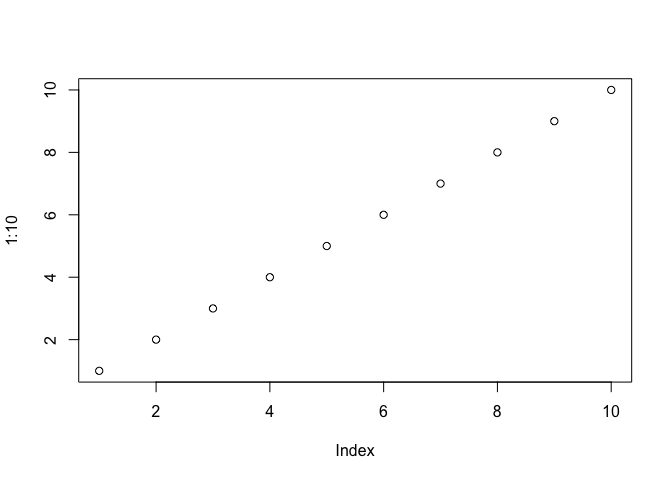

Class06
================
Lizzie (PID: 59010743)
10/15/2021

## Rmarkdown Tutorial

**bold text** *italic*

------------------------------------------------------------------------

Code:

``` r
plot(1:10)
```

<!-- --> \#\#
Function to Calculate Grade

``` r
# input student grades
student1 <- c(100, 100, 100, 100, 100, 100, 100, 90)  
student2 <- c(100, NA, 90, 90, 90, 90, 97, 80)  
student3 <- c(90, NA, NA, NA, NA, NA, NA, NA)
```

Find the minimum score using **min()** and where its position in the
vector using **which.min()**

``` r
which.min(student1)
```

    ## [1] 8

``` r
student1[-which.min(student1)]
```

    ## [1] 100 100 100 100 100 100 100

Find the mean of the vector with the lowest score removed.

``` r
mean(student1[-which.min(student1)])
```

    ## [1] 100

The above works if there are no NA’s in the vector. The is.na() function
returns a logical vector where the TRUE elements indicate and NA. A “!”
means not.

``` r
is.na(student2)
```

    ## [1] FALSE  TRUE FALSE FALSE FALSE FALSE FALSE FALSE

Replace the NAs with zero nad insert previous code

``` r
student2.prime <- student2
student2.prime[is.na(student2.prime)]=0
student2.prime
```

    ## [1] 100   0  90  90  90  90  97  80

``` r
mean(student2.prime[-which.min(student2.prime)])
```

    ## [1] 91

Check to see if it works with student 3

``` r
student3.prime <- student3
student3.prime[is.na(student3.prime)]=0
student3.prime
```

    ## [1] 90  0  0  0  0  0  0  0

``` r
mean(student3.prime[-which.min(student3.prime)])
```

    ## [1] 12.85714

What if one of the entries is as a string? Use **as.numeric()**

``` r
student4 <- c(100, NA, 90, "90", 90, 90, 97, 80)
x <- as.numeric(student4)
x[is.na(x)]=0
mean(x[-which.min(x)])
```

    ## [1] 91

Write the function

``` r
grade <- function(x){
  x <- as.numeric(x)
  x[is.na(x)]=0
  mean(x[-which.min(x)])
}
```

Test Function

``` r
grade(student1)
```

    ## [1] 100

## Now grade a whole class

First we read the gradebook from the class

``` r
gradebook <- "https://tinyurl.com/gradeinput"
scores <- read.csv(gradebook, row.names=1)
scores
```

    ##            hw1 hw2 hw3 hw4 hw5
    ## student-1  100  73 100  88  79
    ## student-2   85  64  78  89  78
    ## student-3   83  69  77 100  77
    ## student-4   88  NA  73 100  76
    ## student-5   88 100  75  86  79
    ## student-6   89  78 100  89  77
    ## student-7   89 100  74  87 100
    ## student-8   89 100  76  86 100
    ## student-9   86 100  77  88  77
    ## student-10  89  72  79  NA  76
    ## student-11  82  66  78  84 100
    ## student-12 100  70  75  92 100
    ## student-13  89 100  76 100  80
    ## student-14  85 100  77  89  76
    ## student-15  85  65  76  89  NA
    ## student-16  92 100  74  89  77
    ## student-17  88  63 100  86  78
    ## student-18  91  NA 100  87 100
    ## student-19  91  68  75  86  79
    ## student-20  91  68  76  88  76

Use the function **apply()** to grade all students with our **grade()**
function

``` r
ans <- apply(scores, 1, grade)
```

Q2: Who is the top scoring student?

``` r
which.max(ans)
```

    ## student-18 
    ##         18

Q3: Which homework was the toughest?

``` r
hw <- apply(scores, 2, mean)
hw
```

    ##  hw1  hw2  hw3  hw4  hw5 
    ## 89.0   NA 80.8   NA   NA

Remove the NAs

``` r
mask <- scores
mask[is.na(mask)]=0
mask
```

    ##            hw1 hw2 hw3 hw4 hw5
    ## student-1  100  73 100  88  79
    ## student-2   85  64  78  89  78
    ## student-3   83  69  77 100  77
    ## student-4   88   0  73 100  76
    ## student-5   88 100  75  86  79
    ## student-6   89  78 100  89  77
    ## student-7   89 100  74  87 100
    ## student-8   89 100  76  86 100
    ## student-9   86 100  77  88  77
    ## student-10  89  72  79   0  76
    ## student-11  82  66  78  84 100
    ## student-12 100  70  75  92 100
    ## student-13  89 100  76 100  80
    ## student-14  85 100  77  89  76
    ## student-15  85  65  76  89   0
    ## student-16  92 100  74  89  77
    ## student-17  88  63 100  86  78
    ## student-18  91   0 100  87 100
    ## student-19  91  68  75  86  79
    ## student-20  91  68  76  88  76

Q3: Which homework was the toughest?

``` r
worst <- apply(mask, 2, mean)
worst
```

    ##   hw1   hw2   hw3   hw4   hw5 
    ## 89.00 72.80 80.80 85.15 79.25

Q4: What score was the most predictive of overall score? Here we will
use the **cor()** function

``` r
cor(mask$hw1, ans)
```

    ## [1] 0.4250204

``` r
cor(mask$hw2, ans)
```

    ## [1] 0.176778

``` r
cor(mask$hw3, ans)
```

    ## [1] 0.3042561

``` r
cor(mask$hw4, ans)
```

    ## [1] 0.3810884

``` r
cor(mask$hw5, ans)
```

    ## [1] 0.6325982

Call for **cor()** function for every homework using the **apply()**
function. Hwk 5 is the most predictive.

``` r
apply(mask,2,cor,ans)
```

    ##       hw1       hw2       hw3       hw4       hw5 
    ## 0.4250204 0.1767780 0.3042561 0.3810884 0.6325982

Make a boxplot

``` r
boxplot(scores)
```

<!-- -->

``` r
# grade <-function(x, drop.lowest = TRUE){
# x <- as.numeric(x)
# x[is.na(x)]=0
# if (drop.lowest){
#   mean(x[-which.min(x)])
# } else{
#   mean(x)
# }
```
